# خواننده تلگرام

<!-- TOP_NAV START -->

<a href="https://github.com/boghsani-hub/aio-downloader/blob/main/telegram/content/archive_1.md" style="display:inline-block; padding:6px 12px; margin:0 4px; background-color:#2ea44f; color:white; text-decoration:none; border-radius:4px; font-weight:bold;">صفحه بعد</a>

<!-- TOP_NAV END -->

<!-- MSG START -->

---
📅 بروزرسانی: 1405/03/10 11:59
---

## VahidOOnLine — post 243016

  

نرگس فلاح، سرپرست پیشین اداره محیط زیست بندرانزلی به سایت رویداد ۲۴ گفت: «تالاب انزلی امروز از یک اکوسیستم آبی، در برخی نقاط به دشت و جنگل تبدیل شده است.»

او افزود: «آنچه امروز در انزلی رخ می‌دهد، حاصل دهه‌ها مدیریت ناهماهنگ و نگاه پروژه‌ای به محیط زیست است.»

او ادامه داد: ««تالاب انزلی مثل بیماری است که رگ‌های قلبش گرفته؛ ابتدا باید راه تنفسش باز شود و بعد سراغ برنامه‌های بلندمدت رفت.»
‌🏁 🇬🇧 IranintlTV

🤖 @VahidOOnLine

## VahidOOnLine — post 243015

  

♦️فداحسین مالکی عضو کمیسیون امنیت ملی و سیاست خارجی مجلس شورای اسلامی روز یکشنبه ۱۰ خرداد با اشاره به تحولات پس از برقراری آتش‌بس و روند مذاکرات میان ایران و آمریکا، گفت: «جمهوری اسلامی ایران از همان ابتدا نسبت به آتش‌بس و همچنین مذاکرات با آمریکا نگاه خوش‌بینانه‌ای نداشته است.»
او دلیل این مسئله را «‌بدعهدی‌های» آمریکا دانست و افزود: «سابقه بدعهدی‌های واشنگتن همچنان در ذهن مسئولان و مردم ایران باقی مانده و این بدبینی هرگز از بین نرفته است.»
فداحسین مالکی با تاکید بر اینکه «جمهوری اسلامی نه مذاکره را کنار گذاشته و نه به آن دل بسته است» درباره روند مذاکرات گفت: «آخرین گفتگوی جدی در این زمینه همزمان با سفر فرمانده ارتش پاکستان به ایران انجام شد. در جریان این مذاکرات، طرف پاکستانی بسته پیشنهادی آمریکا در خصوص مطالبات جمهوری اسلامی ایران را ارائه کرد و درباره جزئیات آن گفت‌و‌گو‌های مفصلی صورت گرفت.»
این نماینده مجلس اضافه کرد: «جمهوری اسلامی نسبت به ورود موضوعاتی همچون تنگه هرمز و غنی‌سازی به مذاکرات، ملاحظات جدی داشته است.»
‌🇸🇦 Indypersian

🤖 @VahidOOnLine

## VahidOOnLine — post 243014

  <a href="telegram/content/VahidOOnLine_243014_1780216186.mp4" target="_blank">🎬 Download video</a>

⭕️تنگه‌ای که قرن‌هاست قلب تپنده دریانوردی، تجارت و سیاست است؛ تنگه هرمز

📌پادکست

♦️در کرانه‌های جنوبی ایران، آنجا که خلیج همیشگی فارس به سوی آب‌های آزاد جهان آغوش می‌گشاید، تنگه‌ای قرار دارد که از قرن‌ها پیش تاکنون، قلب تپنده دریانوردی، تجارت و سیاست بوده و نبض اقتصاد جهان را در پهنای نیلگون خود به شماره انداخته است.

لینک پخش
‌🇸🇦 Indypersian

🤖 @VahidOOnLine

## VahidOOnLine — post 243013

  

بر اساس اطلاعات رسیده به ایران‌اینترنشنال، علی داوری، ۲۱ ساله، روز ۱۹ دی‌ماه در جریان اعتراضات در خیابان جی اصفهان، هنگامی که برای کمک به مجروحان رفته بود، با شلیک مستقیم گلوله به قلبش جان باخت.

به گفته یک منبع آگاه، پس از مجروح شدن علی، دو نفر او را به درمانگاهی در منطقه «خانه‌اصفهان» منتقل کردند، اما به پزشکان اجازه داده نشد او را درمان کنند.

این منبع گفت پس از آن، مردم، علی داوری را به بیمارستان منتقل کردند، اما شدت جراحات ناشی از اصابت گلوله به قلب او باعث شد جانش را از دست بدهد.

‌🏁 🇬🇧 IranintlTV

🤖 @VahidOOnLine

## VahidOOnLine — post 243012

  

اقتصادنیوز گزارش داد همزمان با افزایش پرداخت‌های اقساطی در ایران، خدمات ارتباطی نیز به جمع خریدهای قسطی پیوسته است. بر اساس این گزارش، همراه اول و ایرانسل امکان پرداخت مرحله‌ای قبض، بسته اینترنت و برخی خدمات اپراتوری را برای مشترکان فراهم کرده‌اند.
ایرانسل از سرویس اعتباری با بازپرداخت چهارماهه خبر داده و همراه اول نیز برای مشترکانی با بدهی بالاتر از سقف مشخص، امکان تقسیط فراهم کرده است.
‌🏁 🇬🇧 IranintlTV

🤖 @VahidOOnLine

## VahidOOnLine — post 243011

  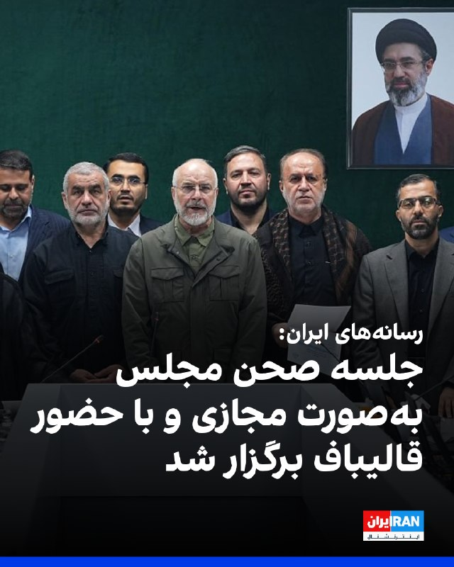

رسانه‌های ایران گزارش دادند نخستین جلسه سومین سال فعالیت مجلس دوازدهم به‌صورت مجازی برگزار شد و در آن ۱۸۷ نماینده به‌صورت مجازی و ۱۴ نماینده به‌صورت حضوری سوگند یاد کردند.
بنا بر این گزارش، این جلسه با حضور محمدباقر قالیباف و شماری از اعضای هیات رییسه مجلس برگزار شد.
‌🏁 🇬🇧 IranintlTV

🤖 @VahidOOnLine

## VahidOOnLine — post 243010

🗣روایت شما از زندگی پس از جنگ - یکشنبه ۱۰ خرداد

🔹دخترم مبتلا به بیماری سلیاک است. هزینه مواد غذایی بدون‌گلوتن، مکمل‌ها و آزمایش‌های ضروری بسیار بالا رفته و فشار زیادی به خانواده‌ها وارد می‌کند.

🔹گرونی بیداد می‌کنه، یه موتور معمولی شده ۴۰۰ تا ۵۰۰ میلیون تومان. ما جوان‌ها نباید موتور برامون آرزو شه.

🔹واقعا گرونی خسته‌مون کرده. چقدر باید کار کنیم و پول نداشته باشیم. نودل ۴۰ هزار تومانی شده ۱۰۸ هزار تومان.

🔹سه ماهه به پدرم حقوق ندادن و ما از پس‌اندازی که داشتیم استفاده می‌کنیم که چیز کمی ازش باقی مونده. سر کار هم بهش میگن همینه که هست و اگر نمی‌خواین، استعفا بدین.

🔹همین الان در خونه‌مون رو یک پسر خیلی جوان زد و گفت اومدم خونه‌تون رو تمیز کنم. رندوم در خونه‌ها رو می‌زد. دلم سوخت، کی این‌قدر کمبود شغل و فقر زیاد شد.

🔹این‌قدر اجناس گرون شده و حقوق‌ها کم هستن که من می‌ترسم یه کیک ساده بگیرم و از اون طرف یه جای دیگه کم بیارم. ما فقط یه زندگی عادی خواستیم.
‌🏁 🇬🇧 IranintlTV

🤖 @VahidOOnLine

## VahidOOnLine — post 243009

⭕️وزیر دفاع ژاپن انتقادهای چین را رد کرد؛ «ما تهدیدی برای جهان نیستیم»

♦️شینجیرو کویزومی، وزیر دفاع ژاپن، در نشست امنیتی «شانگری‌لا» در سنگاپور، انتقادهای چین از سیاست‌های دفاعی توکیو را رد کرد و گفت توصیف ژاپن به‌عنوان نمونه‌ای از «نظامی‌گری جدید» با واقعیت همخوانی ندارد.

زیر دفاع ژاپن بدون نام بردن از کشور چین افزود: «کشوری وجود دارد که زرادخانه عظیم هسته‌ای و بمب‌افکن‌های راهبردی در اختیار دارد، اما ژاپن هیچ‌کدام از این تسلیحات را ندارد. با این حال، ژاپن به نظامی‌گری جدید متهم می‌شود.»

کویزومی همچنین از افزایش توان نظامی چین و نبود شفافیت کافی در برنامه‌های دفاعی پکن ابراز نگرانی کرد و تأکید کرد ژاپن به تقویت توانمندی‌های دفاعی خود در حوزه‌هایی مانند هوش مصنوعی، سامانه‌های بدون سرنشین، دفاع سایبری و فضایی ادامه خواهد داد.
‌🇸🇦 Indypersian

🤖 @VahidOOnLine

## VahidOOnLine — post 243008

  <a href="telegram/content/VahidOOnLine_243008_1780216189.mp4" target="_blank">🎬 Download video</a>

در پی راه‌اندازی کارزار مردمی رشت از سوی ایران‌اینترنشنال، ویدیوهایی از آتش‌سوزی بازار این شهر در ۱۸ دی ۱۴۰۴ به دست ما رسیده است. در این شب ماموران اجازه مهار آتش به آتش‌نشان‌ها ندادند، معترضان در میان شعله‌های آتش گرفتار شدند و کسانی که راه فرار پیدا می‌کردند با گلوله ماموران کشته می‌شدند.
‌🏁 🇬🇧 IranintlTV

🤖 @VahidOOnLine

## VahidOOnLine — post 243007

  <a href="telegram/content/VahidOOnLine_243007_1780216191.mp4" target="_blank">🎬 Download video</a>

ویدیویی که به تازگی منتشرشده، لحظه حملات هوایی به بیت علی خامنه‌ای در محدود پاستور تهران را در نهم اسفند ۱۴۰۴ نشان می‌دهد.
‌🏁 🇬🇧 IranintlTV

🤖 @VahidOOnLine

## VahidOOnLine — post 243006

  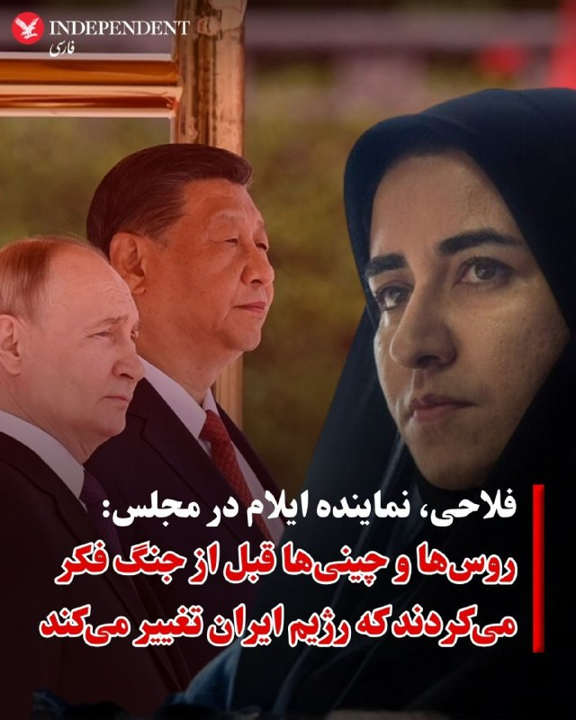

♦️سارا فلاحی، نماینده ایلام در مجلس شورای اسلامی با اشاره به جنگ ۴۰ روزه گفت: «حتی روسیه و چین قبل از شروع جنگ نسبت به توان ایستادگی ایران مردد بودند.»
 سارا فلاحی نماینده مجلس در گفتگویی با برنامه اینترنتی «پل حافظ» با اشاره به اینکه «روس‌ها و چینی‌ها قبل از جنگ فکر می‌کردند که رژیم ایران تغییر می‌کند» گفت: «توان نظامی بومی و داخلی ایران معادلات را تغییر داد.»
فلاحی مدعی شد که پوتین در جلسه‌ای که با حضور عباس عراقچی، وزیر خارجه جمهوری اسلامی برگزار شد، «صراحتاً گفته بود نیروهای مسلح شما ما را شگفت زده کردند».
به گفته این نماینده مجلس، روسیه و چین قبل از شروع جنگ و همزمان با حرکت ناوهای آمریکایی به سوی ایران، به توان ایستادگی ایران امید نداشتند و برای بستن قراردادهای نظامی مردد بودند.
‌🇸🇦 Indypersian

🤖 @VahidOOnLine

## VahidOOnLine — post 243005

  

عبدالحسین خسروپناه، دبیر شورای عالی انقلاب فرهنگی، در همایشی تحت عنوان «حکمت سیاسی ابراهیم رئیسی» گفت: «رئیسی اهل عقل، سکون و سکوت بود و در نهایت به عشق رسید.»

او افزود: «مقصود من از سکوت، سکوت عرفانی و سکون عرفانی است که کنایه از آرامش دارد و این نصیب هر کسی نمی‌شود.»

خسروپناه ادامه داد: «خیلی سلوک و آداب سلوک لازم است تا این سکون و سکوت حاصل گردد و رئیسی این ویژگی را داشت.»
‌🏁 🇬🇧 IranintlTV

🤖 @VahidOOnLine

## VahidOOnLine — post 243004

  

علی زینی‌وند، معاون سیاسی وزارت کشور گفت در حال حاضر سیاست رسمی نظام این است که در تریبون‌های رسمی و در جاهایی که نماینده سیاست رسمی نظام هستند، هیچ‌گونه صحبت «تندی» که انسجام را به هم بزند صورت نگیرد، ما هم به عنوان شورای امنیت کشور این را به کل ارکان ابلاغ کردیم.

او افزود: «صدا و سیما خودش باید محور انسجام باشد و در حال حاضر هم هست، در هر صورت قاعدتا هر حرکتی که انسجام را خدشه‌دار کند در این شرایط کار غیرمفیدی است و حتما باید پاسخگو باشد.»
‌🏁 🇬🇧 IranintlTV

🤖 @VahidOOnLine

## VahidOOnLine — post 243003

  <a href="telegram/content/VahidOOnLine_243003_1780216194.mp4" target="_blank">🎬 Download video</a>

⭕️مشاهده مین دریایی شناور در نزدیکی سواحل عمان در تنگه هرمز

♦️ویدیوی منتشرشده از آب‌های نزدیک سواحل عمان، یک مین دریایی شناور را در یکی از مسیرهای مورد استفاده کشتی‌های تجاری برای عبور از تنگه هرمز نشان می‌دهد.

مین‌گذاری در مسیر عبور کشتی‌های تجاری در تنگه هرمز، نگرانی‌ها درباره امنیت کشتیرانی در یکی از مهم‌ترین گذرگاه‌های انرژی جهان را افزایش داده است.

کارشناسان هشدار می‌دهند وجود مین‌های دریایی در مسیرهای تجاری می‌تواند خطر جدی برای کشتی‌ها و تجارت جهانی ایجاد کند.

تنگه هرمز محل عبور بخش قابل‌توجهی از صادرات نفت جهان است و هرگونه تهدید امنیتی در این منطقه می‌تواند بر بازارهای جهانی انرژی تاثیر بگذارد.
‌🇸🇦 Indypersian

🤖 @VahidOOnLine

## VahidOOnLine — post 243002

ویدیوهایی که تازه از شامگاه ۱۸ دی تهران به ایران‌اینترنشنال رسیده، جمعیت گسترده مردم معترض را در تجریش نشان می‌دهد. در برخی ویدیوها شلیک‌های پیاپی اسلحه و فریاد مردم به گوش می‌رسد.
‌🏁 🇬🇧 IranintlTV

🤖 @VahidOOnLine

## VahidOOnLine — post 243001

  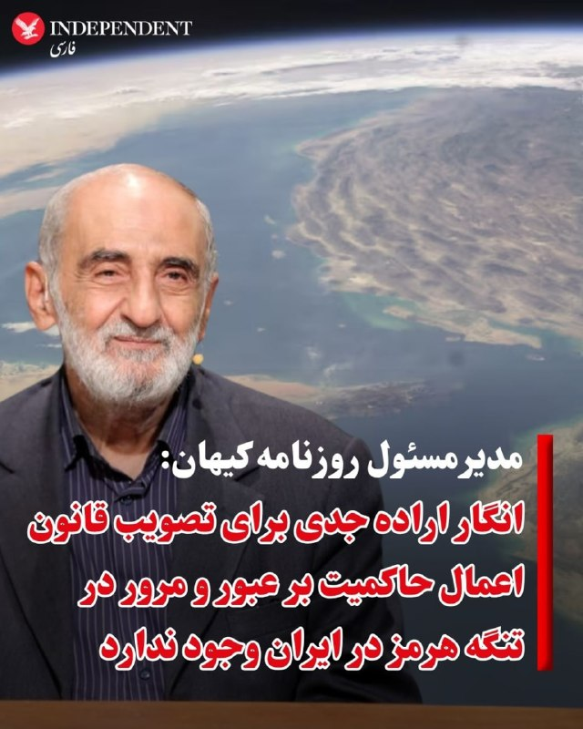

♦️حسین شریعتمداری، مدیرمسئول روزنامه کیهان روز یکشنبه در یادداشتی نوشت: «انگار اراده جدی برای تصویب قانون اِعمال حاکمیت قانونی بر عبور و مرور در تنگه هرمز در ایران وجود ندارد.»
شریعتمداری نوشت: «نزدیک به دو ماه است که نمایندگان مجلس شورای اسلامی از تصمیم جدی مجلس برای تهیه و تصویب رژیم حقوقی حاکم بر تنگه هرمز خبر می‌دهند ولی انجام این اقدام ضروری تاکنون به تاخیر افتاده است به‌گونه‌ای که انگار اراده‌ای جدی برای انجام آن وجود ندارد.‌»
او اضافه کرد: «تاخیر یادشده می‌تواند این تلقی را پدید آورد که ایران اسلامی در تصمیم خود برای اِعمال حاکمیت قانونی بر عبور و مرور در تنگه هرمز، با تردید روبه‌رو شده است.»
مدیرمسئول روزنامه کیهان در بخشی از این یادداشت تاکید کرده است که «ترامپ از همین تاخیر به نفع خواسته (بخوانید آرزوی‌) آمریکا برای گشایش تنگه هرمز استفاده می‌کند.»
‌🇸🇦 Indypersian

🤖 @VahidOOnLine

## VahidOOnLine — post 243000

  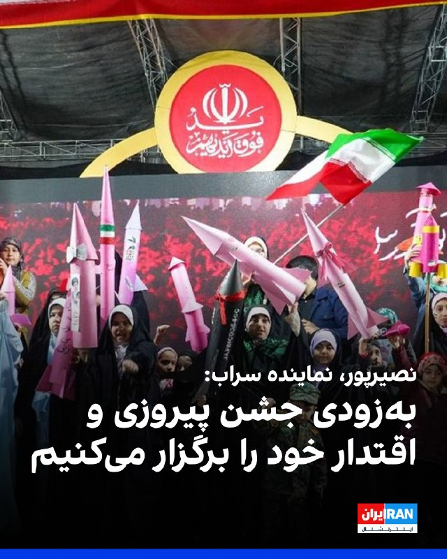

مجید نصیرپور، نماینده سراب در مجلس گفت: «اگر احیانا بار دیگر خیانتی نسبت به میز مذاکره صورت گیرد، نیروهای مسلح ما با پشتیبانی دولت، با تمام قدرت پاسخ لازم را خواهند داد.»

او افزود: «مطمئنم که به‌زودی جشن پیروزی و اقتدار خود را برگزار خواهیم کرد.»

این نماینده مجلس ادامه داد: «مذاکراتی که در شورای عالی امنیت ملی انجام می‌شود، تا زمانی که به تصویب رهبری نظام نرسد، قابل اجرا نیست.»
‌🏁 🇬🇧 IranintlTV

🤖 @VahidOOnLine

## VahidOOnLine — post 242999

  <a href="telegram/content/VahidOOnLine_242999_1780216197.mp4" target="_blank">🎬 Download video</a>

ویدیوی ارسال شده به ایران‌اینترنشنال نشان می‌دهد گروهی از ایرانیان شنبه ۹ خرداد در سن‌خوزه کالیفرنیا در آمریکا، علیه جمهوری اسلامی در خیابان‌های شهر کاروان خودرویی به راه انداختند و پرچم‌های شیروخورشید به دست گرفتند.
‌🏁 🇬🇧 IranintlTV

🤖 @VahidOOnLine

## VahidOOnLine — post 242998

  <a href="telegram/content/VahidOOnLine_242998_1780216198.mp4" target="_blank">🎬 Download video</a>

ویدیوهای رسیده به ایران‌اینترنشنال نشان می‌دهند گروهی از ایرانیان مقیم آلمان روز شنبه ۹ خرداد، علیه اعدام‌های جمهوری اسلامی و در حمایت از شاهزاده رضا پهلوی، در شهر هانوفر تجمع کردند.
‌🏁 🇬🇧 IranintlTV

🤖 @VahidOOnLine

## VahidOOnLine — post 242997

  

روزنامه خراسان، نزدیک به محمدباقر قالیباف، رییس مجلس در مقاله‌ای نوشت بعید است مذاکرات جمهوری اسلامی و آمریکا به نتیجه برسد و پیش‌‎بینی کرد جنگ ادامه خواهد داشت.

خراسان اظهارات و واکنش‌های دونالد ترامپ، رییس‌جمهور آمریکا را با هدف کنترل بازرهای مالی ارزیابی کرد.
این روزنامه ضمن اشاره به اظهارات اخیر ترامپ درباره رفع محاصره دریایی جمهوری اسلامی نوشت: «پست ترامپ، قبل از تعطیلات آخر هفته، موجی از خوش‌بینی به بازارهای جهانی تزریق کرد و قیمت نفت برنت را به حدود ۸۴ دلار رساند.»

این روزنامه نوشت نزدیکان رییس‌جمهور آمریکا با اظهارات «امیدوارکننده» او در آستانه تعطیلات آخر هفته با نوسان‌گیری در بازارهای مالی سودهای کلانی به‌دست آوردند.

نویسنده خراسان افزود: «توافقی اولیه و موقت محتمل است که البته آن هم نه مولود رسیدن به باوری برای حل تنش، بلکه بیشتر محصول اولویت‌ها و مدیریت تنش از سوی دو طرف است و بعید است که به توافقی جامع ختم شود.»
‌🏁 🇬🇧 IranintlTV

🤖 @VahidOOnLine

## WithYashar — post 12992

یاشار خیلی حرف های درست و حسابی میزنی دردش اینکه هنوز یکسری هستن که حرفاتو قبول ندارن چقدر باید هزینه بدیم تا همه بیدار شن؟

## WithYashar — post 12991

## WithYashar — post 12990

داداش ما باید فحشت بدم جواب بدی

## WithYashar — post 12989

## WithYashar — post 12988

## WithYashar — post 12987

درود یاشار جان احتمال داره دوباره متحد بشیم برا خیابونا

## WithYashar — post 12986

## WithYashar — post 12985

درود یاشار جان خسته نباشی♥️
این حرف که میگن مردمو مسلح کنن باعث جنگ داخلی و سوریه و عراق شدن میشه رو نظرتو میگی راجبش🙏🏻♥️

## WithYashar — post 12984

@withyashar SCARY MOVIE

## WithYashar — post 12983

درود

موافق پوریا زراعتی نیستم
جولانی تروریست بود
مردم ما معترض عادی‌ن
دست به اسلحه نیستن

برای متن نوشتن برای شاهزاده مخالف نیستم

## WithYashar — post 12982

## WithYashar — post 12981

## WithYashar — post 12980

## WithYashar — post 12979

## WithYashar — post 12978

## WithYashar — post 12977

  <a href="telegram/content/WithYashar_12977_1780216201.mp4" target="_blank">🎬 Download video</a>

پوریا زراعتی مجری اینترنشنال: اپوزیسیون ما رویا فروشی میکنه و وعده هاش دروغ بود

ما به کسی مثل جولانی نیاز داریم نه رهبران فعلی اپوزیسیون
@withyashar

## WithYashar — post 12976

ارتش اسرائیل: کنترل قلعه الشقیف در جنوب لبنان را به دست گرفتیم.
@withyashar

## WithYashar — post 12975

  <a href="telegram/content/WithYashar_12975_1780216202.mp4" target="_blank">🎬 Download video</a>

ترامپ: اصلاً نباید وارد ماجرای ایران می‌شدیم، اما...ما تا حد زیادی کاری به ارتش ایران نداشتیم، چون فکر می‌کنیم ارتش‌شون تا حدی میانه‌رو هست.
اما افراد دیگه‌ای هم دارن که میانه‌رو نیستن؛ اون‌ها رو از بین بردیم.
ببینید، دو تا موضوع وجود داره: اول اینکه تنگه باید فوراً باز باشه و رفت‌وآمد در اون آزاد باشه؛ هیچ عوارض یا هزینه‌ای نباید گرفته بشه.دوم اینکه ایران نباید سلاح هسته‌ای داشته باشه
همین. قضیه به همین سادگیه. بعدش هم ما از اونجا خارج می‌شیم.
ایران الان تو موقعیت خیلی بدیه؛ ولی احتمالاً بزرگ‌ترین سرمایه‌شون همین رسانه‌های فیک‌نیوزه.
@withyashar

## WithYashar — post 12974

ادعای اکسیوس: دو مقام آمریکایی گفتند، ترامپ خواهان این توافق است و انتظار دارد آن را به زودی نهایی کند، اما مصمم است چند نکته را که برای او اهمیت دارند، به‌ویژه در مورد مواد هسته‌ای ایران، تقویت کند

درخواست ترامپ دور جدیدی از رفت‌وآمدها (یا مذاکرات رفت‌وبرگشتی) بین طرفین را آغاز کرده است که ممکن است چند روز به طول بینجامد.
@withyashar

## WithYashar — post 12973

اسرائیل هیوم: ایالات متحده به نفتکش‌ها و کشتی‌های حمل گاز مایع قطر اجازه داده است پس از پرداخت پول به ایران، تنگه هرمز را ترک کنند
@withyashar

## mwarmonitor — post 9928

🔴ترامپ خواهان اعمال تغییراتی در توافق با ایران شد که فرستادگانش بر سر آن مذاکره کرده بودند

📝 نویسندگان: مارک کاپوتو، باراک راوید

🔰به گفته یک مقام ارشد دولت و یک منبع آگاه دیگر، پرزیدنت ترامپ در جریان نشست روز جمعه در «اتاق وضعیت» (Situation Room)، خواستار چندین اصلاحیه در توافقی شد که فرستادگانش با همتایان ایرانی خود به آن دست یافته بودند.

🔸چرا این موضوع اهمیت دارد؟
دو مقام آمریکایی گفتند ترامپ خواهان این توافق است و انتظار دارد به زودی آن را نهایی کند، اما اصرار دارد چند نکته را که برایش حائز اهمیت است – به ویژه در رابطه با مواد هسته‌ای ایران – تقویت کند. درخواست ترامپ دور جدیدی از رفت‌وبرگشت‌ها میان طرفین را آغاز کرده است که می‌تواند چندین روز به طول بینجامد.

نکات پشت پرده
ترامپ روز جمعه اعلام کرده بود که نشست اتاق وضعیت را برای بررسی این توافق برگزار می‌کند و به نظر می‌رسید سیگنال‌هایی مبنی بر تمایلش به پذیرش آن ارسال کرده است.
یک مقام کاخ سفید پس از این نشست به خبرنگاران گفت: «ترامپ تنها توافقی را امضا خواهد کرد که برای آمریکا خوب باشد، خطوط قرمز او را برآورده کند و تضمین کند که ایران هرگز نمی‌تواند به سلاح هسته‌ای دست یابد.»
مقامات ایرانی نیز به رسانه‌های دولتی خود گفتند که متن نهایی را هنوز تایید نکرده‌اند؛ این در حالی است که دو مقام آمریکایی اوایل هفته مدعی شده بودند تهران آماده امضاست و همه چیز به تصمیم ترامپ بستگی دارد.
در پشت صحنه چه گذشت؟
به گفته این دو منبع، ترامپ از تیم خود خواسته است تا تغییراتی در پیش‌نویس بندهای مربوط به برنامه هسته‌ای ایران ایجاد کنند.
در شکل فعلی، این یادداشت تفاهم (MOU) شامل تعهد ایران به عدم تلاش برای دستیابی به سلاح هسته‌ای است، اما فراتر از آن، امتیاز مشخص دیگری را در بر نمی‌گیرد.
این پیش‌نویس مقرر می‌کند که یک بازه زمانی ۶۰ روزه برای مذاکره درباره تعهدات هسته‌ای ایران و رفع تحریم‌ها از سوی آمریکا وجود خواهد داشت؛ به طوری که اولین موضوعات دستور کار، نحوه خلاص شدن از شر ذخایر اورانیوم غنی‌شده ایران و محدود کردن غنی‌سازی بیشتر خواهد بود.
جزئیات بیشتر
ترامپ می‌خواهد این بخش از توافق را اصلاح کند.
یک مقام ارشد دولت با اشاره به اورانیوم غنی‌شده گفت: «موضوع، جزئیات بیشتر در مورد نحوه دستیابی آمریکا به این مواد و زمان‌بندی آن است.»
منبع دوم نیز اعلام کرد که ترامپ خواستار اصلاح برخی عبارات پیرامون بازگشایی تنگه هرمز شده است.
این مقام آمریکایی گفت به ترامپ اطلاع داده شده که حدود سه روز طول می‌کشد تا ایرانی‌ها پاسخ دهند. این مقام ارشد دولت به کنایه گفت: «آن‌ها به معنای واقعی کلمه در غارها هستند و از ایمیل استفاده نمی‌کنند.»
اظهار نظرها
یک مقام ارشد دولت گفت: «توافق حاصل خواهد شد. اما اینکه چقدر فوری باشد، باید منتظر ماند و دید. ما حاضریم صبر کنیم تا رئیس‌جمهور آنچه را که می‌خواهد به دست آورد. ممکن است یک هفته طول بکشد، ممکن است کمتر یا بیشتر باشد. امیدواریم در اوایل هفته آینده به نتیجه‌ای برسیم.»
رسانه‌های دولتی ایران گزارش داده‌اند که توافق نزدیک است اما نهایی نشده و مدعی شده‌اند که ایران میلیاردها دلار از دارایی‌های بلوکه‌شده خود را دریافت خواهد کرد؛ ادعایی که کاخ سفید آن را تکذیب می‌کند.
کاخ سفید به درخواست برای اظهار نظر در این باره پاسخ نداد.

@mwarmonitor

## mwarmonitor — post 9927

🔴به گفته اسرائیل کاتس، وزیر دفاع اسرائیل، ارتش دفاعی اسرائیل دامنه عملیات خود را در لبنان گسترش داده، از رود لیتانی عبور کرده و یال بوفر را به تصرف درآورده است.

🔸اسرائیل کاتس گفت تصرف قلعه بوفر «پیام روشنی» برای دشمنان اسرائیل دارد و هشدار داد هر کسی که غیرنظامیان اسرائیلی را تهدید کند، «دارایی‌های راهبردی خود را یکی‌یکی از دست خواهد داد».

🔹کاتس افزود: «این کارزار هنوز به پایان نرسیده است» و تأکید کرد که اسرائیل همچنان مصمم است «قدرت حزب‌الله را در هم بشکند» و امنیت شمال اسرائیل را تضمین کند.

@mwarmonitor

## mwarmonitor — post 9926

🔸ارتش اسرائیل از کشته شدن یک سرباز خود در جنوب لبنان خبر داد.
🔹او دوازدهمین سرباز ارتش اسرائیل است که از زمان اجرای آنچه «آتش‌بس اسرائیل–لبنان» خوانده می‌شود در ۱۶ آوریل جان باخته است؛ که از این تعداد، ۹ نفر بر اثر حملات پهپادهای FPV حزب‌الله کشته شده‌اند.

📌همچنین این سرباز، ۹۵۰مین تلفات ارتش اسرائیل در تمامی جبهه‌ها از تاریخ ۷ اکتبر ۲۰۲۳ تاکنون به شمار می‌رود.

@mwarmonitor

## mwarmonitor — post 9925

🔴به گزارش نیویورک‌تایمز،‌ ترامپ شرایط یک چارچوب احتمالی برای توافقی به‌منظور پایان دادن به جنگ در ایران را سخت‌گیرانه‌تر کرده و این تغییرات پیشنهادی را برای بررسی دوباره به این کشور ارسال کرده است؛ پیشنهاد جدید و سخت‌گیرانه‌تر ممکن است با هدف تسریع روند مذاکرات ارائه شده باشد؛ به این معنا که با افزایش فشار بر ایران، این کشور را به پذیرش پیشنهاد قبلی وادار کند.
گزارش‌ها حاکی است که آن پیشنهاد قبلی برای تأیید نهایی به رهبر عالی ایران، مجتبی خامنه‌ای، ارسال شده است.به گفته سه مقام آگاه.

@mwarmonitor

## mwarmonitor — post 9924

  

✈️نمای نزدیک‌تری از بخش دم هواپیمای سوخت‌رسان KC-135 با شماره 63-8028 متعلق به نیروی هوایی ایالات متحده که هنگام حضور روی زمین در عربستان سعودی بر اثر ترکش‌های پهپاد/موشک بالستیک ایرانی دچار آسیب شده ولی کماکان در حال خدمت است.

@mwarmonitor

## FoxNewsTwitter — post 342440

  

Fox News (Twitter/X)

Graham Platner exchanged sexual texts with several women after marrying his wife two years ago, according to a report.

Platner’s campaign confirmed the text exchanges to Politico following a report from the Wall Street Journal that claimed his wife, Amy Gertner, told a campaign aide about the texts after he launched his Senate bid as they began looking into potential political liabilities.

She made the private revelation before Platner held a campaign rally last year supported by Sen. Bernie Sanders, I-Vt., but the aide decided the texts were a private matter for the couple, the campaign said, according to the newspaper.

"I confided deeply personal details about my marriage to someone I considered a friend," Gertner said in a statement to WSJ. "In the months since, I have had to watch as she spread malicious gossip to anyone who would take her call. I trusted this person with the most private chapter of our lives — the early days of our marriage before...

Перейти на оригинальный пост

## FoxNewsTwitter — post 342439

  <a href="telegram/content/FoxNewsTwitter_342439_1780216205.mp4" target="_blank">🎬 Download video</a>

Fox News (Twitter/X)

"The ballroom will be right here."

President Trump shows Lara Trump a behind-the-scenes look at construction for the White House ballroom, which he calls a gift to America from him and "great patriots."

"It will be the greatest facility of its kind ever built," the president says as he shows off what will be the ballroom entrance.

## FoxNewsTwitter — post 342438

  <a href="telegram/content/FoxNewsTwitter_342438_1780216206.mp4" target="_blank">🎬 Download video</a>

Fox News (Twitter/X)

"We’ve actually left their military alone — people would be surprised to hear that."

President Trump says Iran's military hasn't been hit as aggressively because it's "somewhat moderate" compared to other elements of the regime.

He argues that wiping out "everybody" could cause a country to be unable to rebuild for generations.

## FoxNewsTwitter — post 342437

  <a href="telegram/content/FoxNewsTwitter_342437_1780216208.mp4" target="_blank">🎬 Download video</a>

Fox News (Twitter/X)

A suspected drug-trafficking boat erupts into flames after being struck by U.S. forces in the eastern Pacific.

New video, released by U.S. Southern Command, shows the moment the vessel is hit during an operation carried out Friday.

SOUTHCOM says three "male narco-terrorists" were killed in the strike.

## FoxNewsTwitter — post 342436

‌Fox News (Twitter/X)

👉 Full story here:

## FoxNewsTwitter — post 342435

  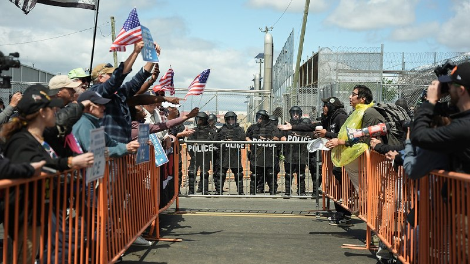

Fox News (Twitter/X)

Proud Boys and communist activists clash outside Newark ICE detention center as Gov. Sherrill admits 5 of 6 people arrested this week came from out of state. What started as a protest over detainee conditions has become a full-blown ideological battleground — with 'national extremist groups' on both sides driving the chaos, not local residents.

## FoxNewsTwitter — post 342434

  <a href="telegram/content/FoxNewsTwitter_342434_1780216210.mp4" target="_blank">🎬 Download video</a>

Fox News (Twitter/X)

BREAKING: New Jersey Gov. Mikie Sherrill speaks out after anti-ICE chaos outside Delaney Hall, says she refuses to "give ICE a pretext" to expand operations.

"Let me be clear: ICE engagement creates an incredibly dangerous situation. It makes the situation worse, and I refuse to back down in fighting the Trump administration."

"We know that people from outside the state have been interfering in the protest and escalating them."

"To the people coming from out of state to create chaos and dangerous situations: You should not be here."

## pm_afshaa — post 91924

  

بچه ها وقتی شما نبودین این جنده به مکرون میداد از اون ورم مکرون از جمهوری اسهالی حمایت میکرد

💧 Rainbet.com the #1 Non-KYC Crypto Casino & Sportsbook @rainbetcom

😁 @Pm_Afshaa

## pm_afshaa — post 91923

عرزشی ها شب گذشته در میدان انقلاب دست به تجمع زدن و شعار «با قاتلین رهبر، مذاکره حرامه» سر دادن..

💧 Rainbet.com the #1 Non-KYC Crypto Casino & Sportsbook @rainbetcom

😁 @Pm_Afshaa

## pm_afshaa — post 91922

  <a href="telegram/content/pm_afshaa_91922_1780216212.webm" target="_blank">🎬 Download video</a>

🔴اسراییل هیوم:
آمریکا به نفتکش‌ها و کشتی‌های حمل گاز مایع قطر اجازه داده که پس از پرداخت پول و عوارض به ایران، تنگه هرمز رو ترک کنن!

💧 Rainbet.com the #1 Non-KYC Crypto Casino & Sportsbook @rainbetcom

😁 @Pm_Afshaa

## pm_afshaa — post 91921

  <a href="telegram/content/pm_afshaa_91921_1780216212.webm" target="_blank">🎬 Download video</a>

🔴نیویورک تایمز:
ترامپ تمام خواسته‌های ایران رو رد کرده و یک پیشنهاد متقابل سخت‌تر به تهران ارسال کرده‌ که باعث بن بست کامل مذاکرات شده.

💧 Rainbet.com the #1 Non-KYC Crypto Casino & Sportsbook @rainbetcom

😁 @Pm_Afshaa

## pm_afshaa — post 91920

  <a href="telegram/content/pm_afshaa_91920_1780216213.webm" target="_blank">🎬 Download video</a>

🔴ترامپ به فاکس نیوز:
ما به یک توافق بسیار خوب با ایران نزدیک شدیم و اگه برای ما منصفانه نباشه، به وزارت دفاع (جنگ) برمی‌گردیم.

ما به آرامی و پیوسته آنچه را که از تهران میخوایم به دست میاریم و اگر این اتفاق نیفته، درگیری رو به روشی متفاوت پایان خواهیم داد.

💧 Rainbet.com the #1 Non-KYC Crypto Casino & Sportsbook @rainbetcom

😁 @Pm_Afshaa

## pm_afshaa — post 91919

شاهزاده رضا پهلوی در اودسا:
اکنون که اینترنت تا حدی دوباره وصل شده است، شما مستقیماً از مردم ایران خواهید شنید و واکنش آن‌ها به مداخله‌ای که رخ داده است را خواهید دید.

مردم ایران جشن می‌گرفتند از اینکه نیروهای دفاعی اسرائیل و تا حدی نیروی هوایی آمریکا در ضربه زدن به زیرساخت‌های رژیم مداخله کردند. مردم خیابان‌هایی در ایران را به نام رئیس‌جمهور ترامپ نامگذاری کرده‌اند.

این ملتی است که این موضوع را از دیدگاه مداخله‌ای کاملاً انسانی برای محافظت از جان‌های بیشتر می‌بیند. برای ما، این یک مداخله آزادی‌بخش بود.

مردم ایران از آنچه فکر می‌کنید باهوش‌ترند و تفاوت بین زمانی که کشور مورد حمله قرار می‌گیرد و زمانی که رژیم هدف قرار می‌گیرد را به خوبی تشخیص می‌دهند

💧 Rainbet.com the #1 Non-KYC Crypto Casino & Sportsbook @rainbetcom

😁 @Pm_Afshaa

## pm_afshaa — post 91918

🔴شاهزاده رضا پهلوی در اودسا:
اسرائیل می‌داند تا زمانی که این رژیم سر کار است، تهدیدی وجودی برای آن محسوب می‌شود. امروز، کشورهای منطقه می‌بینند که این رژیم در حمله به آن‌ها تردید نکرده

💧 Rainbet.com the #1 Non-KYC Crypto Casino & Sportsbook @rainbetcom

😁 @Pm_Afshaa

## pm_afshaa — post 91917

🔴شاهزاده رضا پهلوی در اودسا:
40هزار ایرانی برای تنگه هرمز یا توافق هسته‌ای جان نداده‌اند.

ما باید به خفه کردن رژیم ادامه دهیم تا بتوانیم منابع مالی، تأمین و پرداخت مزدوران آن را قطع کنیم. زیرا ممکن است فروپاشی اقتصادی رژیم نیز منجر به پایان آن شود، نه فقط فشار نظامی خارجی.

اما بهترین راه برای جلوگیری از حضور نیروهای خارجی در میدان، کمک به مردم ایران برای ایفای این نقش است، به شرطی که حمایت اضافی لازم را به آنها بدهید

💧 Rainbet.com the #1 Non-KYC Crypto Casino & Sportsbook @rainbetcom

😁 @Pm_Afshaa

## pm_afshaa — post 91916

  <a href="telegram/content/pm_afshaa_91916_1780216213.webm" target="_blank">🎬 Download video</a>

🔴نیویورک تایمز: میان ترامپ و جی‌ دی ونس، معاون اول او شکاف گسترده ای افتاده است و ترامپ به نظرات و سیاست معاون اول خود در قبال ایران تاخته است.

💧 Rainbet.com the #1 Non-KYC Crypto Casino & Sportsbook @rainbetcom

😁 @Pm_Afshaa

## pm_afshaa — post 91915

  <a href="telegram/content/pm_afshaa_91915_1780216214.webm" target="_blank">🎬 Download video</a>

🔴ترامپ:
یکی باید برای پاپ توضیح بده که شهردار شیکاگو کاملاً بی‌فایده است و اینکه ایران نمیتونه سلاح هسته‌ای داشته باشه.

💧 Rainbet.com the #1 Non-KYC Crypto Casino & Sportsbook @rainbetcom

😁 @Pm_Afshaa

## pm_afshaa — post 91914

  <a href="telegram/content/pm_afshaa_91914_1780216214.webm" target="_blank">🎬 Download video</a>

🔴خبرنگار الحدث:
درگیری‌های شدید بین حزب‌الله و نیروهای اسرائیلی در داخل شهرک دبین در جنوب لبنان.

💧 Rainbet.com the #1 Non-KYC Crypto Casino & Sportsbook @rainbetcom

😁 @Pm_Afshaa

## VahidOnline — post 75809

  

آکسیوس، ترجمه ماشین:
رئیس‌جمهور ترامپ در جلسه‌ای که روز جمعه در اتاق وضعیت برگزار شد، خواستار چند اصلاح در توافقی شد که فرستادگانش با همتایان ایرانی خود به آن رسیده بودند؛ این را یک مقام ارشد دولت و منبع دومی که در جریان موضوع قرار گرفته بود، گفته‌اند.
...
مقام‌های ایرانی به رسانه‌های دولتی گفتند که آن‌ها نیز متن نهایی را تأیید نکرده‌اند؛ هرچند دو مقام آمریکایی پیش‌تر در طول هفته مدعی شده بودند که تهران آماده امضاست و همه چیز به تصمیم ترامپ بستگی دارد.

به گفته این دو منبع، ترامپ از تیم خود خواست تغییراتی در پیش‌نویس مربوط به بندهای برنامه هسته‌ای ایران ایجاد کنند.

در شکل فعلی، این تفاهم‌نامه شامل تعهد ایران به دنبال نکردن سلاح هسته‌ای است، اما امتیاز مشخص دیگری فراتر از آن در آن نیامده است.

در این متن آمده است که یک بازه ۶۰ روزه برای مذاکره درباره تعهدات هسته‌ای ایران و کاهش تحریم‌ها از سوی آمریکا وجود خواهد داشت؛ نخستین موضوعات در دستور کار نیز چگونگی تعیین تکلیف ذخایر اورانیوم غنی‌شده ایران و محدود کردن غنی‌سازی بیشتر خواهد بود.

ترامپ می‌خواهد تلاش کند این بخش را اصلاح کند.

یک مقام ارشد دولت گفت: «موضوع، جزئیات بیشتر درباره این است که آمریکا چگونه مواد را دریافت می‌کند و زمان‌بندی آن چگونه خواهد بود»؛ منظور او اورانیوم غنی‌شده بود.

منبع دوم گفت ترامپ همچنین می‌خواهد برخی از عبارت‌ها درباره بازگشایی تنگه هرمز را اصلاح کند.

این مقام آمریکایی گفت به ترامپ گفته شده است حدود سه روز طول می‌کشد تا ایرانی‌ها با پاسخ برگردند. این مقام ارشد دولت گفت: «آن‌ها عملا در غارها هستند و از ایمیل استفاده نمی‌کنند.»

این مقام ارشد دولت گفت: «توافقی در کار خواهد بود. اینکه چقدر قریب‌الوقوع است، باید دید. ما حاضریم صبر کنیم تا رئیس‌جمهور آنچه را خواسته به دست بیاورد. ممکن است یک هفته طول بکشد. ممکن است کمتر باشد. ممکن است بیشتر باشد. امیدواریم در آغاز هفته چیزی داشته باشیم.»
axios

📡 @VahidOnline

## VahidOnline — post 75808

  

روابط‌عمومی سپاه بامداد یکشنبه، ۱۰ خردادماه، اعلام کرد یک پهپاد «ام‌کیو۱» (MQ1) ارتش آمریکا را منهدم کرده است.

خبرگزاری فارس نوشت: «این پهپاد با ورود به آب‌های سرزمینی ایران قصد انجام عملیات خصمانه داشت که بلافاصله در رصد و هدف موشک‌های پدافند سپاه قرار گرفت و سرنگون شد».
@VahidOOnLine

📡 @VahidOnline

## IranIntlTV — post 339844

  

🔻ﺣﺰب ﻣﺸﺮوﻃﻪ اﯾﺮان (ﻟﯿﺒﺮال دﻣﻮﮐﺮات) در اعلامیه‌ای ﻣﻨﻊ ورود ﭘﺮﭼﻢ ﺷﯿﺮ و ﺧﻮرﺷﯿﺪ ﺑﻪ ورزﺷﮕﺎه‌ﻫﺎی ﺟﺎم‌ﺟﻬﺎﻧﯽ ٢٠٢۶ را محکوم کرد و آن را «بی‌اﺣﺘﺮاﻣﯽ ﺑﻪ ﻫﻮﯾﺖ ﺗﺎرﯾﺨﯽ، ﻣﻠﯽ و ﻓﺮﻫﻨﮕﯽ ﻣﻠﺖ اﯾﺮان» دانست: «از فیفا اﻧﺘﻈﺎر دارﯾﻢ ﮐﻪ ﺑﻪ اﺻﻮل ﺑﯽ ﻃﺮﻓﯽ، آزادی ﺑﯿﺎن و اﺣﺘﺮام ﺑﻪ ﻫﻮﯾﺖ ﻣﻠﺖﻫﺎ ﭘﺎﯾﺒﻨﺪ ﺑﺎﺷﺪ.»

🔹ﺣﺰب ﻣﺸﺮوﻃﻪ اﯾﺮان (ﻟﯿﺒﺮال دﻣﻮﮐﺮات) گفته که «ﺑﺎ ﻧﮕﺮاﻧﯽ ﻋﻤﯿﻖ» ﮔﺰارش‌ﻫﺎی ﻣﺮﺑﻮط ﺑﻪ ﻣﺤﺪودﯾﺖ ﯾﺎ ﻣﻨﻊ ورود ﭘﺮﭼﻢ ﺗﺎرﯾﺨﯽ ﺷﯿﺮ و ﺧﻮرﺷﯿﺪ اﯾﺮان ﺑﻪ ورزﺷﮕﺎه‌ﻫﺎی ﺟﺎم ﺟﻬﺎﻧﯽ ﻓﻮﺗﺒﺎل را دﻧﺒﺎل ﻣﯽ‌ﮐﻨﺪ.

🔹دو هفته پیش، وبسایت اتلتیک به نقل از منابعی، گزارش داد که راهنمای رسمی فیفا برای ورزشگاه‌ها در جام جهانی، ممنوعیت این پرچم خواهد بود.

🔹ﺣﺰب ﻣﺸﺮوﻃﻪ اﯾﺮان در اعلامیه‌ اعتراضی خود به این تصمیم فیفا نوشته: «ﭘﺮﭼﻢ ﺷﯿﺮ و ﺧﻮرﺷﯿﺪ، ﻧﻤﺎد ﭼﻨﺪ ﺻﺪ ﺳﺎﻟﻪ ﻣﻠﺖ اﯾﺮان و ﺑﺨﺸﯽ ﺟﺪاﯾﯽ ﻧﺎﭘﺬﯾﺮ از ﺗﺎرﯾﺦ، ﺗﻤﺪن و ﻫﻮﯾﺖ ﻫﺰاران ﺳﺎﻟﻪ ﻣﻠﯽ اﯾﺮاﻧﯿﺎن اﺳﺖ. در ﺳﺎلﻫﺎی اﺧﯿﺮ، ده ﻫﺎ ﻫﺰ ار ﺗﻦ از ﻓﺮزﻧﺪان اﯾﺮان در راه آزادی، ﻋﺪاﻟﺖ و رﻫﺎﯾﯽ از اﺳﺘﺒﺪاد ﺟﺎن ﺧﻮد را از دﺳﺖ داده‌اﻧﺪ.»

🔹جزییات بیشتر را در سایت بخوانید.

@iranintltvsport

## IranIntlTV — post 339843

  

نرگس فلاح، سرپرست پیشین اداره محیط زیست بندرانزلی به سایت رویداد ۲۴ گفت: «تالاب انزلی امروز از یک اکوسیستم آبی، در برخی نقاط به دشت و جنگل تبدیل شده است.»

او افزود: «آنچه امروز در انزلی رخ می‌دهد، حاصل دهه‌ها مدیریت ناهماهنگ و نگاه پروژه‌ای به محیط زیست است.»

او ادامه داد: ««تالاب انزلی مثل بیماری است که رگ‌های قلبش گرفته؛ ابتدا باید راه تنفسش باز شود و بعد سراغ برنامه‌های بلندمدت رفت.»
https://iranintl.com/202605312955

## IranIntlTV — post 339842

  

بر اساس اطلاعات رسیده به ایران‌اینترنشنال، علی داوری، ۲۱ ساله، روز ۱۹ دی‌ماه در جریان اعتراضات در خیابان جی اصفهان، هنگامی که برای کمک به مجروحان رفته بود، با شلیک مستقیم گلوله به قلبش جان باخت.

به گفته یک منبع آگاه، پس از مجروح شدن علی، دو نفر او را به درمانگاهی در منطقه «خانه‌اصفهان» منتقل کردند، اما به پزشکان اجازه داده نشد او را درمان کنند.

این منبع گفت پس از آن، مردم، علی داوری را به بیمارستان منتقل کردند، اما شدت جراحات ناشی از اصابت گلوله به قلب او باعث شد جانش را از دست بدهد.

https://iranintl.com/202605313073

## IranIntlTV — post 339841

  <a href="telegram/content/IranIntlTV_339841_1780216217.mp4" target="_blank">🎬 Download video</a>

ایرانیان ساکن ملبورن با برگزاری تجمعی در مرکز این شهر، یاد جان‌باختگان اعتراضات را گرامی داشتند و بر حمایت از زندانیان سیاسی و مخالفت با اعدام و سرکوب تاکید کردند. شرکت‌کنندگان این تجمع را در راستای همبستگی با مردم ایران و ادامه مسیر دادخواهی عنوان کردند.

گزارش علیرضا محبی، خبرنگار ایران‌اینترنشنال
@iranintltv

## IranIntlTV — post 339840

  

اقتصادنیوز گزارش داد همزمان با افزایش پرداخت‌های اقساطی در ایران، خدمات ارتباطی نیز به جمع خریدهای قسطی پیوسته است. بر اساس این گزارش، همراه اول و ایرانسل امکان پرداخت مرحله‌ای قبض، بسته اینترنت و برخی خدمات اپراتوری را برای مشترکان فراهم کرده‌اند.
ایرانسل از سرویس اعتباری با بازپرداخت چهارماهه خبر داده و همراه اول نیز برای مشترکانی با بدهی بالاتر از سقف مشخص، امکان تقسیط فراهم کرده است.
https://iranintl.com/202605312783

## IranIntlTV — post 339839

  <a href="telegram/content/IranIntlTV_339839_1780216219.mp4" target="_blank">🎬 Download video</a>

ایرانیان ساکن ملبورن با برگزاری تجمعی در مرکز این شهر، یاد جان‌باختگان اعتراضات دی‌ماه را گرامی داشتند. یکی از شرکت‌کنندگان با در دست داشتن پلاکاردی به یاد جان‌باختگان «انقلاب ملی» به علیرضا محبی، خبرنگار ایران‌اینترنشنال، گفت صدای دادخواهی خانواده‌های جاویدنامان هستیم.
@iranintltv

## IranIntlTV — post 339838

  

رسانه‌های ایران گزارش دادند نخستین جلسه سومین سال فعالیت مجلس دوازدهم به‌صورت مجازی برگزار شد و در آن ۱۸۷ نماینده به‌صورت مجازی و ۱۴ نماینده به‌صورت حضوری سوگند یاد کردند.
بنا بر این گزارش، این جلسه با حضور محمدباقر قالیباف و شماری از اعضای هیات رییسه مجلس برگزار شد.
https://iranintl.com/202605317783

## IranIntlTV — post 339837

🗣روایت شما از زندگی پس از جنگ - یکشنبه ۱۰ خرداد

🔹دخترم مبتلا به بیماری سلیاک است. هزینه مواد غذایی بدون‌گلوتن، مکمل‌ها و آزمایش‌های ضروری بسیار بالا رفته و فشار زیادی به خانواده‌ها وارد می‌کند.

🔹گرونی بیداد می‌کنه، یه موتور معمولی شده ۴۰۰ تا ۵۰۰ میلیون تومان. ما جوان‌ها نباید موتور برامون آرزو شه.

🔹واقعا گرونی خسته‌مون کرده. چقدر باید کار کنیم و پول نداشته باشیم. نودل ۴۰ هزار تومانی شده ۱۰۸ هزار تومان.

🔹سه ماهه به پدرم حقوق ندادن و ما از پس‌اندازی که داشتیم استفاده می‌کنیم که چیز کمی ازش باقی مونده. سر کار هم بهش میگن همینه که هست و اگر نمی‌خواین، استعفا بدین.

🔹همین الان در خونه‌مون رو یک پسر خیلی جوان زد و گفت اومدم خونه‌تون رو تمیز کنم. رندوم در خونه‌ها رو می‌زد. دلم سوخت، کی این‌قدر کمبود شغل و فقر زیاد شد.

🔹این‌قدر اجناس گرون شده و حقوق‌ها کم هستن که من می‌ترسم یه کیک ساده بگیرم و از اون طرف یه جای دیگه کم بیارم. ما فقط یه زندگی عادی خواستیم.

## IranIntlTV — post 339836

  <a href="telegram/content/IranIntlTV_339836_1780216221.mp4" target="_blank">🎬 Download video</a>

در پی راه‌اندازی کارزار مردمی رشت از سوی ایران‌اینترنشنال، ویدیوهایی از آتش‌سوزی بازار این شهر در ۱۸ دی ۱۴۰۴ به دست ما رسیده است. در این شب ماموران اجازه مهار آتش به آتش‌نشان‌ها ندادند، معترضان در میان شعله‌های آتش گرفتار شدند و کسانی که راه فرار پیدا می‌کردند با گلوله ماموران کشته می‌شدند.

## IranIntlTV — post 339835

  <a href="telegram/content/IranIntlTV_339835_1780216222.mp4" target="_blank">🎬 Download video</a>

پاری‌سن‌ژرمن با پیروزی برابر آرسنال در ضربات پنالتی، برای دومین سال پیاپی قهرمان لیگ قهرمانان اروپا شد. اما جشن هواداران در برخی نقاط پاریس به ناآرامی و درگیری انجامید و پلیس فرانسه از بازداشت بیش از ۳۲۰ نفر و استفاده از گاز اشک‌آور خبر داد. درگیری‌ها عمدت اطراف شانزه‌لیزه و مناطق مرکزی شهر رخ داد.

گفت‌وگو با احسان اکبری، عضو تحریریه ایران‌اینترنشنال
@iranintltv

## IranIntlTV — post 339834

  <a href="telegram/content/IranIntlTV_339834_1780216224.mp4" target="_blank">🎬 Download video</a>

ویدیویی که به تازگی منتشرشده، لحظه حملات هوایی به بیت علی خامنه‌ای در محدود پاستور تهران را در نهم اسفند ۱۴۰۴ نشان می‌دهد.

## IranIntlTV — post 339833

  <a href="telegram/content/IranIntlTV_339833_1780216225.mp4" target="_blank">🎬 Download video</a>

ایرانیان مقیم ملبورن استرالیا در یکی دیگر از آخر هفته‌های اعتراضی ایرانیان خارج از کشور، با حضور در مرکز این شهر و در حمایت و همبستگی با مردم ایران، سرود «ای‌ایران» را هم‌خوانی کردند.
گزارش علیرضا محبی، خبرنگار ایران‌اینترنشنال
@iranintltv

## IranIntlTV — post 339832

  

عبدالحسین خسروپناه، دبیر شورای عالی انقلاب فرهنگی، در همایشی تحت عنوان «حکمت سیاسی ابراهیم رئیسی» گفت: «رئیسی اهل عقل، سکون و سکوت بود و در نهایت به عشق رسید.»

او افزود: «مقصود من از سکوت، سکوت عرفانی و سکون عرفانی است که کنایه از آرامش دارد و این نصیب هر کسی نمی‌شود.»

خسروپناه ادامه داد: «خیلی سلوک و آداب سلوک لازم است تا این سکون و سکوت حاصل گردد و رئیسی این ویژگی را داشت.»
https://iranintl.com/202605312204

## IranIntlTV — post 339831

  <a href="telegram/content/IranIntlTV_339831_1780216227.mp4" target="_blank">🎬 Download video</a>

ایرانیان ساکن ملبورن با برگزاری تجمعی در مرکز این شهر، یاد جان‌باختگان اعتراضات دی‌ماه را گرامی داشتند. یکی از شرکت‌کنندگان در گفت‌وگو با علیرضا محبی، خبرنگار ایران‌اینترنشنال، با اشاره به حمایت از مردم داخل ایران، تاکید کرد که هر هفته در تجمعات شرکت می‌کند تا صدای خانواده‌های جان‌باختگان باشد.
@iranintltv

## IranIntlTV — post 339830

  

علی زینی‌وند، معاون سیاسی وزارت کشور گفت در حال حاضر سیاست رسمی نظام این است که در تریبون‌های رسمی و در جاهایی که نماینده سیاست رسمی نظام هستند، هیچ‌گونه صحبت «تندی» که انسجام را به هم بزند صورت نگیرد، ما هم به عنوان شورای امنیت کشور این را به کل ارکان ابلاغ کردیم.

او افزود: «صدا و سیما خودش باید محور انسجام باشد و در حال حاضر هم هست، در هر صورت قاعدتا هر حرکتی که انسجام را خدشه‌دار کند در این شرایط کار غیرمفیدی است و حتما باید پاسخگو باشد.»
https://iranintl.com/202605317197

## IranIntlTV — post 339828

ویدیوهایی که تازه از شامگاه ۱۸ دی تهران به ایران‌اینترنشنال رسیده، جمعیت گسترده مردم معترض را در تجریش نشان می‌دهد. در برخی ویدیوها شلیک‌های پیاپی اسلحه و فریاد مردم به گوش می‌رسد.

## IranIntlTV — post 339826

  

مجید نصیرپور، نماینده سراب در مجلس گفت: «اگر احیانا بار دیگر خیانتی نسبت به میز مذاکره صورت گیرد، نیروهای مسلح ما با پشتیبانی دولت، با تمام قدرت پاسخ لازم را خواهند داد.»

او افزود: «مطمئنم که به‌زودی جشن پیروزی و اقتدار خود را برگزار خواهیم کرد.»

این نماینده مجلس ادامه داد: «مذاکراتی که در شورای عالی امنیت ملی انجام می‌شود، تا زمانی که به تصویب رهبری نظام نرسد، قابل اجرا نیست.»
https://iranintl.com/202605318925

## IranIntlTV — post 339825

  <a href="telegram/content/IranIntlTV_339825_1780216230.mp4" target="_blank">🎬 Download video</a>

ویدیوی ارسال شده به ایران‌اینترنشنال نشان می‌دهد گروهی از ایرانیان شنبه ۹ خرداد در سن‌خوزه کالیفرنیا در آمریکا، علیه جمهوری اسلامی در خیابان‌های شهر کاروان خودرویی به راه انداختند و پرچم‌های شیروخورشید به دست گرفتند.

## IranIntlTV — post 339824

  <a href="telegram/content/IranIntlTV_339824_1780216232.mp4" target="_blank">🎬 Download video</a>

ویدیوهای رسیده به ایران‌اینترنشنال نشان می‌دهند گروهی از ایرانیان مقیم آلمان روز شنبه ۹ خرداد، علیه اعدام‌های جمهوری اسلامی و در حمایت از شاهزاده رضا پهلوی، در شهر هانوفر تجمع کردند.

## IranIntlTV — post 339823

  

روزنامه خراسان، نزدیک به محمدباقر قالیباف، رییس مجلس در مقاله‌ای نوشت بعید است مذاکرات جمهوری اسلامی و آمریکا به نتیجه برسد و پیش‌‎بینی کرد جنگ ادامه خواهد داشت.

خراسان اظهارات و واکنش‌های دونالد ترامپ، رییس‌جمهور آمریکا را با هدف کنترل بازرهای مالی ارزیابی کرد.
این روزنامه ضمن اشاره به اظهارات اخیر ترامپ درباره رفع محاصره دریایی جمهوری اسلامی نوشت: «پست ترامپ، قبل از تعطیلات آخر هفته، موجی از خوش‌بینی به بازارهای جهانی تزریق کرد و قیمت نفت برنت را به حدود ۸۴ دلار رساند.»

این روزنامه نوشت نزدیکان رییس‌جمهور آمریکا با اظهارات «امیدوارکننده» او در آستانه تعطیلات آخر هفته با نوسان‌گیری در بازارهای مالی سودهای کلانی به‌دست آوردند.

نویسنده خراسان افزود: «توافقی اولیه و موقت محتمل است که البته آن هم نه مولود رسیدن به باوری برای حل تنش، بلکه بیشتر محصول اولویت‌ها و مدیریت تنش از سوی دو طرف است و بعید است که به توافقی جامع ختم شود.»
https://iranintl.com/202605314559

## reutersworldchannel — post 151526

  

The great Indo-Pacific hedge - deeper defence ties as US doubts grow and China ascends

Caught between China's rapid military rise and growing doubts about the U.S. ​focus on a region it has long dominated, Indo-Pacific nations are racing to arm themselves, and each other.

At Asia's premier defence forum ‌on Saturday, U.S. Defense Secretary Pete Hegseth pressed regional partners to shoulder more of the security burden. Yet, he faced persistent concerns that U.S. priorities may be drifting, with conflict in Iran competing for attention. read more

## FarsiVOA — post 219148

🔺جمهوری چک احتمالاً به هدف هزینه دفاعی ناتو نمی‌رسد؛ افزایش فشار بر ناتو

▪️نخست‌وزیر جمهوری چک می‌گوید کشورش احتمالاً امسال به هدف ناتو برای رساندن هزینه‌های نظامی به دو درصد تولید ناخالص داخلی نخواهد رسید.

▪️آندری بابیش در گفت‌وگو با فایننشال‌تایمز گفت دولتش «تمام تلاش خود را» برای تحقق تعهدات ناتو انجام می‌دهد، اما با کسری بودجه ناشی از هزینه‌های دولت پیشین روبه‌رو است.

▪️ناتو در نشست لاهه در سال ۲۰۲۵ توافق کرد اعضا تا سال ۲۰۳۵ سالانه پنج درصد تولید ناخالص داخلی خود را برای دفاع و امنیت اختصاص دهند؛ سه‌ونیم درصد برای نیازهای اصلی دفاعی و یک‌ونیم درصد برای حوزه‌هایی مانند زیرساخت، امنیت سایبری، آمادگی غیرنظامی و تقویت صنایع دفاعی.

⬇️ بیشتر بخوانید:
https://ir.voanews.com/a/czech-republic-likely-to-miss-nato-defence-spending-target-pm-tells-ft/8155755.html

## FarsiVOA — post 219147

🔺آیا جنگ عامل اصلی دو برابر شدن کسری گاز ایران است؟

▪️معاون رئیس‌جمهوری ایران می‌گوید آسیب به زیرساخت‌های گاز ایران در جنگ ۳۹ روزه، کسری گاز کشور را بیش از دو برابر کرده است.

▪️به گفته اسماعیل سقاب اصفهانی، با احتساب کسری ۴۵ میلیارد متر مکعبی گاز در سال گذشته، در حال حاضر با ناترازی ۱۰۰ میلیارد متر مکعبی گاز مواجه هستیم.

▪️این رقم عظیم کسری گاز، معادل تقریباً دو برابر کل مصرف گاز ترکیه است. ایران دومین دارنده بزرگ ذخایر گازی جهان، به خاطر تاخیر در توسعه پروژه‌های گازی، هدررفت گسترده انرژی و عدم توسعه انرژی‌های جایگزین با بحران شدید کسری گاز مواجه است.

▪️وابستگی بسیار زیاد به سوخت گاز به همراه رشد اندک تولید باعث شده کسری گاز ایران هر سال افزایش یابد.

⬇️ بیشتر بخوانید:
https://ir.voanews.com/a/is-war-the-main-factor-in-iran-s-doubling-of-gas-deficit/8155754.html

## FarsiVOA — post 219146

  

نیروی انتظامی تهران کافه‌ای در خیابان ولیعصر را که در آن برنامه‌های موسیقی اجرا می‌شد، به بهانه آن چه «فعالیت‌های مروج فرقه‌های انحرافی» خواند، پلمب کرد.

مرکز اطلاع‌رسانی پلیس جمهوری اسلامی در اطلاعیه‌ای نوشت: «این کافه با برگزاری برنامه‌هایی با ظاهر موسیقی غربی، بستری برای حرکات نابهنجار، و آنچه که ماموران توصیف کرده‌اند "تحرکات شیطانی" فراهم آورده بود.»

نیروی انتظامی جمهوری اسلامی نام این کافه را ذکر نکرد اما ادعا کرد که «مشتریان این کافه، شامل دختران و پسران جوان، در وضعیتی غیرطبیعی و با حرکاتی عجیب و غریب، که از آن به عنوان “شیطانی” یاد شده، مشاهده گردیدند.»

پیشتر نیز بسیاری از کافه‌ها و اماکن کسب و کار به اتهام‌های مشابه پلمب شده‌ بودند اما جمهوری اسلامی سرکوب‌ شهروندان را از زمان اعتراضات دی‌ماه گذشته تاکنون شدت بیشتری داده است.

موج تازه اعدام‌ها، صدور احکام سنگین و بازداشت‌ها نگرانی فعالان و نهادهای حقوق بشری را برانگیخته است.
@FarsiVOA

## FarsiVOA — post 219145

  

معاون رئیس‌جمهوری ایران می‌گوید آسیب به زیرساخت‌های گاز ایران در جنگ ۳۹ روزه، کسری گاز کشور را بیش از دو برابر کرده است.

اسماعیل سقاب اصفهانی در ادامه گفت طی جنگ اخیر، زیرساخت‌های گاز کشور با کاهش ۵۵ میلیارد متر مکعبی مواجه شد و تولید سالانه از ۲۹۷ میلیارد به ۲۴۲ میلیارد متر مکعب رسید.

به گفته او، با احتساب کسری ۴۵ میلیارد متر مکعبی گاز در سال گذشته، در حال حاضر با ناترازی ۱۰۰ میلیارد متر مکعبی گاز مواجه هستیم.

این رقم عظیم کسری گاز، معادل تقریباً دو برابر کل مصرف گاز ترکیه است. ایران دومین دارنده بزرگ ذخایر گازی جهان است، اما به خاطر تاخیر در توسعه پروژه‌های گازی، هدررفت گسترده انرژی و عدم توسعه انرژی‌های جایگزین با بحران شدید کسری گاز مواجه است.

او همچنین از کسری روزانه ۳۰ میلیون لیتری بنزین خبر داد.
@FarsiVOA

## FarsiVOA — post 219144

  

دادستان عمومی و انقلاب مرکز استان مرکزی از تشکیل ۷۵ پرونده قضایی و صدور دستور توقیف اموال افرادی خبر داد که بنا بر ادعای او با شبکه‌های «معاند» خارج از کشور «ارتباط مستقیم داشته‌» و «تلاش داشتند تا فضای آرام جامعه را ملتهب کنند.»

بر اساس این اعلام، پرونده‌ها در دادسرای اراک و شعب تخصصی در حال رسیدگی است و دارایی‌های متهمان با هدف توقیف و ضبط «به نفع ملت» بررسی می‌شود. دادستان مرکز استان مرکزی مدعی شد این افراد با اقدامات «ضدامنیتی» و همکاری با «دشمنان»، در پی «التهاب‌آفرینی در جامعه» بوده‌اند.

این اعلام در ادامه موج تازه برخوردهای قضایی با افراد متهم به همکاری با رسانه‌ها و شبکه‌های خارج از کشور مطرح می‌شود.

روز گذشته نیز مقام‌های قضایی از توقیف اموال ۷۴ نفر در استان گلستان و ۳۴ نفر در خراسان جنوبی با اتهام‌های مشابه خبر داده بودند. در این گزارش‌ها، حساب‌های بانکی، خودروها و اموال ثبتی از جمله دارایی‌های مشمول توقیف اعلام شده‌اند. جزئیات مستقلی در این باره منتشر نشده است.
@FarsiVOA

## FarsiVOA — post 219143

  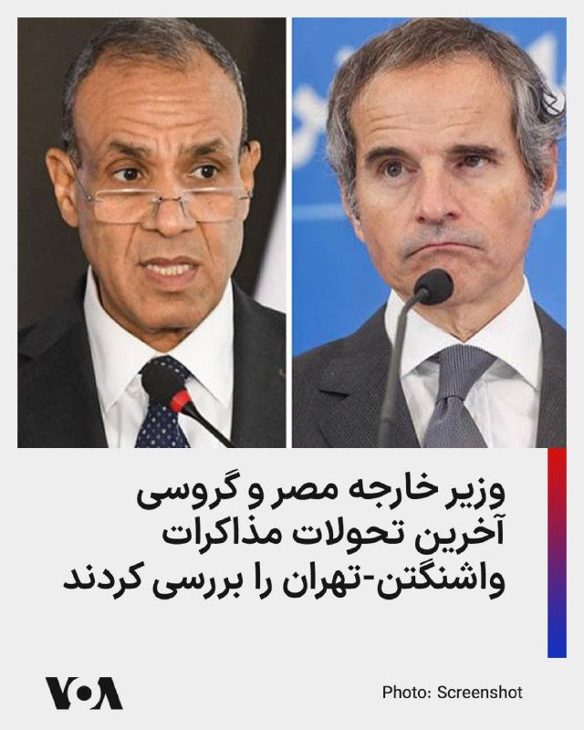

بدر عبدالعاطی، وزیر خارجه مصر و رافائل گروسی، مدیرکل آژانس بین‌المللی انرژی اتمی، در یک تماس تلفنی تحولات منطقه‌ای و آخرین تحولات مذاکرات واشنگتن-تهران را مورد بحث قرار دادند.

بر اساس بیانیه وزارت خارجه مصر، این تماس شامل بررسی آخرین تحولات مسیر مذاکرات میان ایالات متحده و حکومت ایران و تلاش‌ها برای دستیابی به توافقی بود که «نگرانی‌های همه طرف‌ها را در نظر بگیرد».

وزیر خارجه مصر بر «ضرورت افزایش تلاش‌های دیپلماتیک و حمایت از روند رسیدن به توافقی میان دو طرف آمریکایی و ایرانی» تأکید کرد؛ تفاهمی که بتواند به «کاهش تنش و جلوگیری از تشدید بحران کمک کرده و امنیت و ثبات منطقه‌ای و بین‌المللی را تقویت کند».

همچنین دو طرف همچنین نتایج نشست یازدهم کنفرانس بازنگری معاهده عدم اشاعه سلاح‌های هسته‌ای را که در نیویورک برگزار شد، بررسی کردند.

در این تماس، وزیر خارجه مصر ابراز تأسف کرد که این کنفرانس نتوانست به توافقی درباره سند نهایی دست یابد و تأکید کرد که مصوبات کنفرانس‌های بازنگری قبلی همچنان معتبر هستند.
@FarsiVOA

## FarsiVOA — post 219142

  

ارتش اسرائیل اعلام کرد که یک سرباز این نیرو در حمله پهپادی حزب‌الله در جنوب لبنان در شامگاه شنبه کشته شده است.

در گزارش ارتش اسرائیل، این سرباز کشته‌شده، گروهبان یکم مایکل تیوکین، ۲۱ ساله، از واحد شناسایی تیپ گیواتی و اهل اشکلون، معرفی شده است.

ارتش اسرائیل اعلام کرد که این حمله حدود ساعت ۱۰:۳۰ شامگاه شنبه رخ داد و در جریان آن، یک پهپاد که توسط حزب‌الله هدایت می‌شد، به موضعی که نیروهای تیپ گیواتی در آن مشغول فعالیت بودند، اصابت کرد.

در نتیجه انفجار، چهار سرباز دیگر نیز به‌طور سطحی زخمی شدند که آنان برای درمان به بیمارستان منتقل شدند.
@FarsiVOA

## FarsiVOA — post 219141

🔺اکسیوس و نیویورک‌تایمز: ترامپ شروط توافق احتمالی با تهران را سخت‌گیرانه‌تر کرده است

▪️اکسیوس و نیویورک‌تایمز گزارش دادند دونالد ترامپ خواستار سخت‌گیرانه‌تر شدن شروط چارچوب توافق احتمالی با جمهوری اسلامی شده و نسخه اصلاح‌شده را برای بررسی به تهران فرستاده است.

▪️اکسیوس نوشت ترامپ از تیم خود خواسته چند بند از متنی را که فرستادگانش با طرف‌های ایرانی روی آن کار کرده بودند، اصلاح کنند؛ به‌ویژه بندهای مربوط به برنامه هسته‌ای و مواد هسته‌ای ایران.

▪️نیویورک‌تایمز نیز گزارش داد ترامپ از کندی پاسخ جمهوری اسلامی به پیشنهادهای آمریکا ناراضی بوده و نسبت به بخش‌هایی از توافق که می‌تواند به آزادسازی دارایی‌های ایران مربوط باشد، نگرانی داشته است.

⬇️ بیشتر بخوانید:
https://ir.voanews.com/a/trump-tightens-terms-of-potential-deal-with-iran/8155753.html

## FarsiVOA — post 219140

Farsi VOA pinned an audio file

## FarsiVOA — post 219139

  <a href="https://t.me/farsivoa/219139" target="_blank">📎 Download file</a>

🔴📢‌ پادکست خبری شنبه ۹ خرداد ۱۴۰۵

🛜در صورتی که با مشکل اینترنت مواجه هستید میتوانید اخبار صدای آمریکا را از نسخه‌های پادکست خبری ما روزانه دنبال کنید و یا اخبار را از نسخه سبک وب‌سایت ما پیگیر باشید:
https://ir.voanews.com/lite

📡بروزترین فرکانسهای ماهواره‌ای را نیز میتوانید از صفحه زیر پیگیری کنید:
https://ir.voanews.com/satellite

🔔دیگر شبکه‌های اجتماعی ما را هم را هم از لینک زیر دنبال کنید:
https://linktr.ee/voafarsi

ما را به اشتراک بگذارید
@farsivoa

## FarsiVOA — post 219138

  

آژانس بین‌المللی انرژی اتمی اعلام کرد که یک پهپاد به ساختمان توربین نیروگاه هسته‌ای زاپوریژیا در جنوب شرقی اوکراین اصابت کرده است.

این نهاد وابسته به سازمان ملل متحد یکشنبه اعلام کرد که از سوی این نیروگاه هسته‌ای مطلع شده که این حمله باعث ایجاد حفره‌ای در دیوار ساختمان نیروگاه شده است.

رافائل گروسی، مدیرکل آژانس بین‌المللی انرژی اتمی، نگرانی شدید خود را درباره این حادثه ابراز کرد و گفت: «حمله به تأسیسات هسته‌ای مانند بازی کردن با آتش است.»

آژانس در پیامی در شبکه ایکس اعلام کرد که تیم این نهاد در این نیروگاه تحت کنترل روسیه درخواست دسترسی کرده است تا ساختمان توربین آسیب‌دیده را از نزدیک بررسی کند.
@FarsiVOA

## FarsiVOA — post 219137

ارتش ایالات متحده اعلام کرد در حمله‌ای تازه به یک شناور در شرق اقیانوس آرام، سه مرد کشته شدند؛ حمله‌ای که دومین مورد از این نوع در دو روز گذشته به شمار می‌رود.

فرماندهی جنوبی ارتش آمریکا روز شنبه در پیامی در شبکه ایکس گفت اطلاعات به‌دست‌آمده نشان می‌داد این شناور در مسیرهای مورد استفاده برای قاچاق مواد مخدر در شرق اقیانوس آرام حرکت می‌کرد و در عملیات قاچاق مواد مخدر نقش داشت.

این فرماندهی افراد کشته‌شده را «نارکوتروریست» خواند و اعلام کرد در جریان این عملیات هیچ نیروی آمریکایی آسیب ندیده است.

این حمله دومین عملیات مشابه ارتش آمریکا در دو روز گذشته است. رویترز نوشته این حمله تازه‌ترین مورد از مجموعه حملاتی است که طی ماه‌های اخیر علیه شناورهای مظنون به ارتباط با قاچاق مواد مخدر انجام شده است.
@FarsiVOA

## FarsiVOA — post 219136

  

⚡️دونالد ترامپ، رئیس‌جمهوری آمریکا، در مصاحبه‌ای با لارا ترامپ از فاکس‌نیوز که از او پرسید «یک توافق خوب» با جمهوری اسلامی چگونه است؟ گفت «خب، اول از همه هیچ توافقی آن‌قدر خوب نیست که رسانه‌ها آن را خوب پوشش دهند. اما ما در حال دستیابی به یک توافق عالی هستیم...؛ در غیر این صورت دوباره برمی‌گردیم و از طریق اقدام نظامی کار را تمام می‌کنیم.»
آقای ترامپ گفت: «اما رسیدن به توافق سریع‌تر خواهد بود. احتمالاً از نظر انسانی هم بهتر است. جنبه مثبتی هم دارد؛ جان افراد زیادی را نجات می‌دهد، چه از طرف مقابل باشند و چه از هر طرف دیگر.»
او افزود: «ما به یک توافق بسیار خوب نزدیک شده‌ایم و اگر بتوانیم آن را نهایی کنیم، عالی است. در غیر این صورت، دوباره سراغ «وزارت جنگ» می‌رویم، همان‌طور که ما آن را می‌نامیم. و این رویکرد بسیار موفق بوده است. ونزوئلا را دیدید؛ آن یک پیروزی یک‌روزه بود و این مورد هم عملاً همین حالا یک پیروزی محسوب می‌شود. ما اساساً نیروهای نظامی آن‌ها را شکست داده‌ایم.»
آقای ترامپ گفت: «من ترجیح می‌دهم به توافق برسیم، زیرا می‌توانیم بلافاصله پس از امضای توافق، تنگه را بازگشایی کنیم.»

@FarsiVOA

## FarsiVOA — post 219135

🔺رئيس‌جمهوری آمریکا: با ارتش جمهوری اسلامی تا حدی کاری نداشتیم چون فکر می‌کنیم تا حدودی میانه‌رو است

▪️دونالد تراامپ، رئیس‌جمهوری آمریکا گفت جمهوری اسلامی باید تنگه هرمز را باز کند و نباید سلاح هسته‌ای داشته باشد. آقای ترامپ در مصاحبه‌ای تلویزیونی با لارا ترامپ که شنبه‌شب از فاکس‌نیوز پخش شد گفت که او برای توافق با جمهوری اسلامی «هیچ عجله‌ای» ندارد.

⬇️ بیشتر بخوانید:
https://ir.voanews.com/a/8155752.html
@FarsiVOA

## FarsiVOA — post 219134

⚡️روز جهانی «گرسنگی»
@FarsiVOA

## FarsiVOA — post 219133

  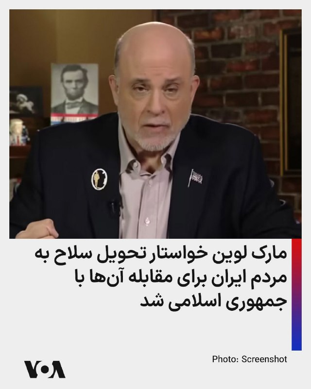

⚡️مارک لوین، مفسر مشهور آمریکایی و حقوق‌دان، شنبه‌شب در شوی تلویزیونی خود در فاکس‌نیوز، بار دیگر خواستار مسلح شدن مردم ایران برای مقابله با جمهوری اسلامی شد. آقای لوین گفت مردم ایران با «دستان خالی» نمی‌توانند جلوی مسلسل بایستند. دونالد ترامپ، رئيس جمهوری آمریکا، روز شنبه در تروت‌سوشال، از مخاطبان خود خواسته بود که شوی امشب مارک‌ لوین را تماشا کنند. آقای لوین در بخش دیگری از این برنامه، با سفیر سابق اسرائيل در آمریکا، مایکل اورن مصاحبه کرد. آقای اورن گفت برنامه موشک‌های بالیستیک جمهوری اسلامی تهدیدی موجودیتی برای اسرائيل بوده است و باید با آن مقابله شود.
@FarsiVOA

## FarsiVOA — post 219132

🔺فرستاده پیشین ترامپ: در صورت شکست مذاکرات با جمهوری اسلامی گزینه نظامی همچنان پابرجاست

▪️مورگان اورتگاس، معاون فرستاده ویژه پیشین رئیس‌جمهوری آمریکا در امور خاورمیانه، روز شنبه گفت دونالد ترامپ، رئیس‌جممهوری آمریکا همچنان به دنبال دستیابی به یک توافق دیپلماتیک با جمهوری اسلامی است، اما در صورت شکست مذاکرات، او گزینه‌های نظامی را حفظ خواهد کرد.

⬇️ بیشتر بخوانید:
https://ir.voanews.com/a/8155751.html
@FarsiVOA

## FarsiVOA — post 219129

⚡️سنتکام روز شنبه تصاویری از تعمیرکاران هواپیماهای مستقر روز ناوهای هواپیمابر و کشتی‌های جنگی ایالات متحده را منتشر کرد و گفت عملیات پروازی «پایدار» کار آسانی نیست و تعمیرکاران ماهر شبانه‌روز از «آمادگی» هواپیماها اطمینان حاصل می‌کنند. ستاد فرماندهی مرکزی آمریکا اعلام کرد که یک هواگرد آمریکایی روز جمعه با شلیک یک موشک هل‌فایر، یک کشتی را که با بی‌اعتنایی به هشدارها تلاش داشت محاصره دریایی بنادر ایران را نقض کند،‌ از کار انداخت.
@FarsiVOA

## DW_Farsi — post 125332

🔶 یک سرباز اسرائیلی در حمله پهپادی حزب‌الله کشته شد

گزارش‌ها حاکی است که سرباز ارتش اسرائیل که شب گذشته در حمله پهپادی حزب‌الله در جنوب لبنان کشته شد، تنها فرزند خانواده بود و در سال ۲۰۲۰ همراه با مادرش از اوکراین به اسرائیل مهاجرت کرده بود.

مایکل تیوکین، گروهبان یکم ۲۱ ساله از یگان شناسایی «تیپ گیواتی» و ساکن اشکلون، زمانی کشته شد که یک پهپاد دید اول شخص ((FPV که حزب‌الله آن را هدایت می‌کرد، به موضعی اصابت کرد که نیروهای اسرائیلی در آن مشغول عملیات بودند.

در لبنان در حال حاضر آتش‌بسی برقرار است، اما این آتش‌بس از سوی حزب‌الله مورد حمایت جمهوری اسلامی رد شده و دو طرف بار دیگر به‌طور روزانه به یکدیگر حمله می‌کنند.

در تازه‌ترین تحولات پنتاگون اعلام کرد که میزبان هیئت‌های اسرائیل و لبنان بوده و گفت‌وگوهای نظامی "سازنده‌ای" میان طرفین انجام شده است.

روز گذشته ارتش اسرائیل پس از چند حمله از سوی حزب‌الله لبنان، از ساکنان ۱۰ روستای این کشور خواست تا خانه‌های خود را تخلیه کنند. یک سخنگوی ارتش اسرائيل گفت، این اقدام در پاسخ به نقض مداوم آتش‌بس از سوی حزب‌الله صورت گرفت است.

@dw_farsi

## DW_Farsi — post 125331

  

📸 عکس روز: دفاع از عنوان قهرمانی

در مسابقه فینال لیگ قهرمانان باشگاه‌های اروپا تیم پاری‌سن‌ژرمن در یک بازی نفس‌گیر سرانجام موفق شد در ضربات پنالتی تیم آرسنال را با نتیجه ۴ بر ۳ شکست دهد. بازی در وقت قانونی و اضافی با نتیجه یک بر یک به پایان رسید و سرانجام ضربات پنالتی قهرمان این دوره را مشخص کرد.

@dw_farsi

## DW_Farsi — post 125330

🔶 اکسیوس: ترامپ خواستار چند اصلاحیه در متن توافق با ایران شده است

وبسایت خبری اکسیوس از قول یک مقام ارشد ایالات متحده و یک منبع آگاه گزارش داد که دونالد ترامپ، رئیس جمهور آمریکا در جریان نشست اتاق وضعیت در کاخ سفید، خواسته که چند اصلاحیه در توافق با جمهوری اسلامی انجام شود.

به گزارش اکسیوس با وجود آن که ترامپ خواستار توافق است و انتظار دارد توافق به‌زودی نهایی شود، اما خواهان آن است که چند بند مهم، به‌ خصوص درباره مواد اتمی در ایران، تقویت شود.

آکسیوس همچنین گزارش داده که در متن کنونی یک بازه ۶۰ روزه برای انجام مذاکره در خصوص تعهدات اتمی جمهوری اسلامی و کاهش تحریم‌ها پیش‌بینی شده است و نخستین موضوعات بر سر سرنوشت ذخایر اورانیوم غنی‌شده در ایران و نیز محدود کردن غنی‌سازی بیشتر خواهد بود.

در همین حال، نیویورک‌تایمز از سه مقام ایالات متحده نقل کرده که ترامپ، پیش‌شرط‌های چارچوب احتمالی توافق با ایران را سخت‌تر کرده و تغییرات پیشنهادی خود را به منظور بازبینی دوباره به تهران فرستاده است.

نیویورک‌تایمز در گزارش خود آورده که هنوز مشخص نیست که چه تغییراتی در متن توافق صورت گرفته اما ترامپ، در خصوص بخش‌هایی از توافق احتمالی، از جمله آزادسازی منابع مالی برای جمهوری اسلامی، نگرانی‌هایی دارد.

طبق گزارش نیویورک‌تایمز، ترامپ از طول کشیدن پاسخ جمهوری اسلامی به پیشنهادهای ایالات متحده ناراضی است و ارائه پیشنهاد سخت‌گیرانه‌تر او، احتمالا با هدف افزایش فشار بر حکومت ایران و تسریع روند مذاکرات انجام شده است.

@dw_farsi

## DW_Farsi — post 125329

🔶 سپاه پاسداران: یک پهپاد MQ-1 آمریکا را ساقط کردیم

روابط‌ عمومی سپاه پاسداران انقلاب اسلامی با صدور بیانیه‌ای مدعی شد که یک پهپاد MQ-1 آمریکا را بامداد یکشنبه ۱۰ خرداد بر فراز آب‌های سرزمینی ایران ساقط کرده است.

در بیانیه سپاه پاسداران آمده است که این پهپاد، "با ورود به آب‌های سرزمینی ایران" قصد داشت "عملیات خصمانه" انجام دهد اما "بلافاصله در رصد و هدف موشک‌های پدافند نوین سپاه قرار گرفت و سرنگون شد".

ارتش آمریکا تا لحظه تنظیم این خبر واکنشی به ادعای سپاه نشان نداده است.

درگیری‌های پراکنده به رغم آتش‌بس همچنان در تنگه هرمز ادامه دارد. ارتش ایران روز شنبه نهم خرداد (۳۰ مه) در اطلاعیه‌ای اعلام کرده بود که در بامداد همین روز یک فروند پهپاد اوربیتر اسرائيل را رهگیری و منهدم کرده است. به گفته ارتش، این پهپاد "تحت شبکه یکپارچه قرارگاه مشترک پدافند هوایی کشور در منطقه قشم" مورد اصابت قرار گرفت و منهدم شد.

در رویدادی دیگر کشتی فله‌بر "لیان استار" (Lian Star) که با پرچم گامبیا حرکت می‌کرد شب هشتم خرداد (۲۹ مه) هشدارهای متعدد نیروهای آمریکایی را هنگام تلاش برای ورود به یک بندر ایرانی نادیده گرفت.

فرماندهی مرکزی ایالات متحده آمریکا (سنتکام) در همین زمینه در پیام رسان ایکس نوشت: «پس از آنکه خدمه کشتی از تبعیت از دستورات خودداری کردند، یک هواپیمای آمریکایی با شلیک یک موشک AGM-114 Hellfire به اتاق موتور کشتی، آن را از کار انداخت. این کشتی دیگر به سمت ایران در حرکت نیست.»

@dw_farsi

## DW_Farsi — post 125328

🔶 ترامپ: توافق را ترجیح می‌دهم، اما آماده بازگشت به عملیات نظامی هستیم

دونالد ترامپ، رئیس‌ جمهور آمریکا در مصاحبه تلویزیونی با شبکه فاکس‌نیوز با بیان این که آمریکا "به یک توافق خیلی خوب" با جمهوری اسلامی نزدیک است گفت که توافق با حکومت ایران را ترجیح می‌دهد، "اما برای بازگشت به عملیات نظامی نیز آمادگی دارد."

او همزمان در بخش دیگری از گفت‌وگوی خود تاکید کرد: «در صورتی که به مطالبات خود نرسیم، در ایران به روشی دیگر به آن پایان خواهیم داد.»

ترامپ افزود ایالات متحده آمریکا یا به توافق خوبی دست خواهد یافت یا از طریق نظامی کار را در ایران تمام خواهد کرد. او با تاکید بر این که چنین چیزی "آهسته اما قطعا" رخ خواهد داد، بار دیگر گفت که ایالات متحده، نیروی دریایی و نیروی هوایی ایران را "به کلی" نابود کرده، اما تا حد زیادی "از هدف قرار دادن ارتش خودداری کرده است".

هنوز مشخص نیست که مقصود ترامپ از بیان این اظهارات به طور دقیق چیست. او در مصاحبه با فاکس نیوز به این نکته اشاره کرد که آمریکا، در جریان حملات، تا حدی کاری به ارتش ایران نداشته، چون ارتش ایران "تا اندازه‌ای میانه‌رو" است و آمریکا قصد نداشته تمامی ساختار نظامی ایران را نابود کند.

رئیس جمهور آمریکا در بخش دیگری از اظهارات خود افزود که آمریکا "شکل‌های مختلفی از رهبری" حکومت ایران را از بین برده اما از تجربه عراق، آموخته چرا که نابودی کامل ساختارها ممکن است به مدت دهه‌ها مانع بازسازی یک کشور شود.

ترامپ در ادامه با اشاره به برنامه اتمی جمهوری اسلامی مدعی شد که جمهوری اسلامی نه تنها با این موافقت کرده که سلاح اتمی نسازد، بلکه توافق کرده که از طرق دیگر از جمله خریداری نیز به آن دست پیدا نکند. رئیس جمهور آمریکا این امر را "تغییری مهم" در جریان مذاکرات خواند.

@dw_farsi

## Persian_Trend_Official — post 15375

  <a href="telegram/content/Persian_Trend_Official_15375_1780216240.mp4" target="_blank">🎬 Download video</a>

جنگ شهری در پاریس پس از قهرمانی پاری‌سن‌ژرمن!

براساس گزارش گاردین، در این درگیری‌ها که ۶ ساعت طول کشید، بیش از ۵۰ مغازه تخریب و غارت شد و حدود ۵۰ نفر زخمی و مجروح شدند. ۴۱۶نفر بازداشت شدند.
.
🔹لوران نونز، وزیر کشور، گزارش داد که غارت فروشگاه‌ها، غارت اموال و درگیری با نیروهای امنیتی در تقریباً ۱۵ شهر رخ داده است.

🔹️ خیابان شانزه لیزه به عنوان داغ‌ترین نقطه نامگذاری شد، جایی که گروهی از هواداران تلاش کردند به یک ایستگاه پلیس حمله کنند.

👺Phantom

📌 @persian_trend_official
پرشین ترند | متفاوت‌ترین کانال نظامی

## Persian_Trend_Official — post 15374

  <a href="telegram/content/Persian_Trend_Official_15374_1780216242.mp4" target="_blank">🎬 Download video</a>

یک کافه در تهران پلمب شد؛ استناد پلیس به ادعاهایی درباره «تحرکات شیطانی»

پلیس نظارت بر اماکن عمومی تهران از پلمب یک کافه در محدوده خیابان ولیعصر خبر داد. این اقدام بر اساس ادعاهایی درباره آنچه «تحرکات شیطانی» و «رفتارهای نابهنجار» مشتریان عنوان شده، صورت گرفته است.

👺Phantom

📌 @persian_trend_official
پرشین ترند | متفاوت‌ترین کانال نظامی

## Persian_Trend_Official — post 15373

  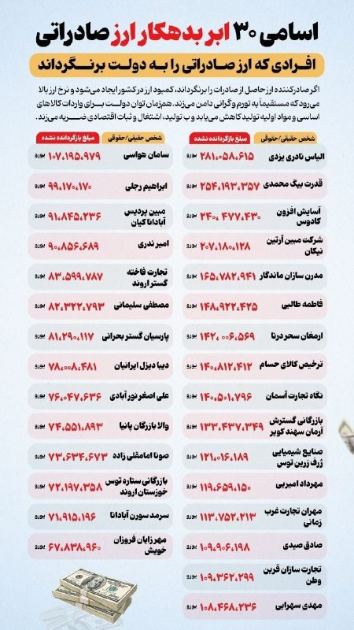

🏦 اسامی 30 ابر بدهکار ارز صادراتی منتشر شد.........

👺Phantom

📌 @persian_trend_official
پرشین ترند | متفاوت‌ترین کانال نظامی

## Persian_Trend_Official — post 15372

  <a href="telegram/content/Persian_Trend_Official_15372_1780216243.webm" target="_blank">🎬 Download video</a>

🔻جایزه صلح ترامپ!

🇺🇸ترامپ تصویری از مدال جایزه صلح ترامپ را در صفحه مجازی خود رونمایی کرده است.

👺Phantom

📌 @persian_trend_official
پرشین ترند | متفاوت‌ترین کانال نظامی

## Persian_Trend_Official — post 15371

  <a href="telegram/content/Persian_Trend_Official_15371_1780216243.mp4" target="_blank">🎬 Download video</a>

🇺🇸 ترامپ: ما به ارتش ایران آسیب نزدیم

ادعای ترامپ در مصاحبه با فاکس نیوز: ما ارتش آنها را تا حد زیادی دست نخورده باقی گذاشتیم و به آنها آسیب نزدیم زیرا معتقدیم ارتش آنها نسبتاً میانه‌رو است.

آنها افراد دیگری دارند که میانه‌رو نیستند؛ ما آنها را حذف کردیم.

👺Phantom

📌 @persian_trend_official
پرشین ترند | متفاوت‌ترین کانال نظامی

## Persian_Trend_Official — post 15370

  

🔹حنظله این‌بار خبر از هک کردن مرکز هولوکاست را می دهد.

بیش از ۲ میلیون سند افشا شد.

🔹در یک عملیات سایبری بی‌سابقه و چندلایه، به‌ «مرکز ملی حمایت از قربانیان هولوکاست» (k-shoa.org)، که نماد قربانی‌ بودن یهودیان، در تاریخ بوده است، به‌طور کامل توسط تیم هکری حنظله مورد نفوذ قرار گرفت.

🔹تمام پایگاه‌های داده، اسناد طبقه‌بندی‌شده، ایمیل‌های محرمانه و مکاتبات حساس این مرکز به‌طور کامل استخراج و منتشر شده‌اند.

🔹اکنون بیش از ۲ میلیون سند فوق‌محرمانه با حجمی بیش از یک ترابایت به‌صورت آزاد برای دانلود در وب‌سایت حنظله در دسترس قرار گرفته است.

👺Phantom

📌 @persian_trend_official
پرشین ترند | متفاوت‌ترین کانال نظامی

## Persian_Trend_Official — post 15369

  

🤑اسپیس‌ایکس رسماً با قراردادی ۴ میلیارد دلاری به پروژه «گنبد طلایی» آمریکا پیوست

🔹نیروی فضایی آمریکا (USSF) قرارداد جدیدی به ارزش ۴.۱۶ میلیارد دلار را به اسپیس‌ایکس واگذار کرده تا شبکه‌ای از ماهواره‌های ردیاب اهداف هوایی را برای پنتاگون توسعه دهد. این سامانه بخشی از برنامه‌های دفاعی جدید آمریکا و همچنین پروژه «گنبد طلایی» (Golden Dome) محسوب می‌شود. ظاهراً قرار است نخستین ماهواره‌های عملیاتی این پروژه تا سال ۲۰۲۸ وارد مدار زمین شوند.
🔹این قرارداد در قالب برنامه SB-AMTI منعقد شده؛ پروژه‌ای که برای ردیابی مداوم اهداف متحرک از مدار زمین شکل گرفته است. مقامات نظامی آمریکا معتقدند با پیشرفت سامانه‌های ضد دسترسی و پدافندی کشورهای رقیب مانند چین و روسیه، اتکا به هواپیماهای شناسایی سنتی دیگر کافی نخواهد بود؛ بنابراین بخشی از مأموریت‌های رصد و رهگیری باید به فضا منتقل شود.

👺Phantom

📌 @persian_trend_official
پرشین ترند | متفاوت‌ترین کانال نظامی

## Persian_Trend_Official — post 15368

نمایش شناور تندرو هجومی ۲۷ رجب در تجمع هواداران جمهوری اسلامی در میدان انقلاب

👺Phantom

📌 @persian_trend_official
پرشین ترند | متفاوت‌ترین کانال نظامی

## Persian_Trend_Official — post 15367

  <a href="telegram/content/Persian_Trend_Official_15367_1780216246.webm" target="_blank">🎬 Download video</a>

ترامپ به مخاطب نامعلوم: شما دارید گیج و سردرگم میشوید!

👺Phantom

📌 @persian_trend_official
پرشین ترند | متفاوت‌ترین کانال نظامی

## Persian_Trend_Official — post 15366

  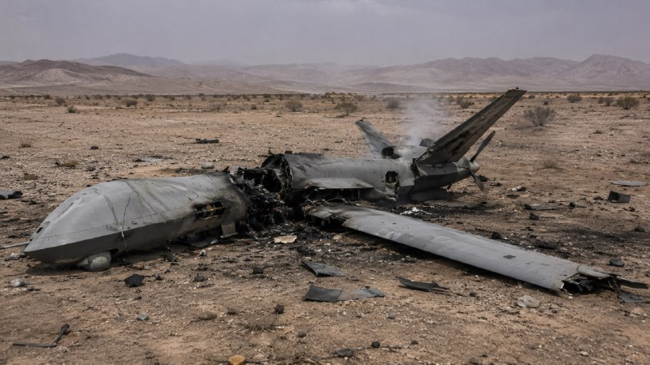

پهپاد سرنگون‌شده MQ-1 احتمالاً اماراتی بوده است

پس از اعلام سرنگونی یک فروند پهپاد MQ-1 Predator توسط ایران، گمانه‌زنی‌ها درباره مالکیت این پهپاد بالا گرفته است. با توجه به اینکه نیروی هوایی آمریکا این پهپاد را از سال ۲۰۱۸ از خدمت عملیاتی خارج کرده و MQ-1 را با MQ-9 Reaper جایگزین کرده است، احتمال آمریکایی بودن مستقیم این پهپاد پایین‌تر ارزیابی می‌شود.
در میان کاربران شناخته‌شده باقی‌مانده این خانواده پهپادی، امارات متحده عربی یکی از گزینه‌های جدی است؛ به‌ویژه اینکه ابوظبی نسخه صادراتی Predator XP را در اختیار داشته و این پهپادها برای مأموریت‌های شناسایی، مراقبت مرزی و پایش دریایی طراحی شده‌اند. به همین دلیل، اگر پهپاد ساقط‌شده واقعاً از خانواده MQ-1 باشد، یکی از محتمل‌ترین سناریوها، تعلق آن به امارات یا استفاده از بسترهای مرتبط با امارات در منطقه است.
این موضوع از نظر سیاسی و نظامی اهمیت زیادی دارد؛ چون اگر منشأ پهپاد اماراتی تأیید شود، ماجرا فقط یک حادثه پدافندی ساده نخواهد بود، بلکه می‌تواند نشان‌دهنده ورود مستقیم برخی بازیگران خلیج فارس به چرخه شناسایی و جمع‌آوری اطلاعات علیه ایران باشد.

📌 @persian_trend_official
پرشین ترند | متفاوت‌ترین کانال نظامی

## Persian_Trend_Official — post 15365

کانال رسمی پرشین ترند pinned «دوستان خوبم اتفاق مهمی بود میتونید توی دایرکت مسیج بدید. البته دقت کنید سلام و احوال پرسی نباشه ! من احتمالا نمیتونم پاسخ بدم چون تعداد پیام ها زیاده اما میخونم . ویدیو جالبی دیدید با یک توضیح بفرستید یا اگر خبر مهمی اتفاق افتاد میتونید برام ارسال کنید …»

## Persian_Trend_Official — post 15364

دوستان خوبم اتفاق مهمی بود میتونید توی دایرکت مسیج بدید.
البته دقت کنید سلام و احوال پرسی نباشه !
من احتمالا نمیتونم پاسخ بدم چون تعداد پیام ها زیاده اما میخونم .
ویدیو جالبی دیدید با یک توضیح بفرستید
یا اگر خبر مهمی اتفاق افتاد میتونید برام ارسال کنید
یا عکسی از یک اتفاق مهم بود بفرستید

البته دقت کنید از کانال های دیگه فروارد نکنید اگر خودتون اورجینال عکسی داشتی و ارزش خبری داشت حتما استفاده میکنم

از توجه شما متشکرم
الیاس فرخ

## Persian_Trend_Official — post 15363

## Persian_Trend_Official — post 15362

  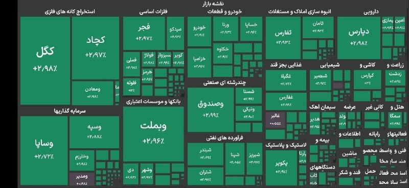

شاخص کل بورس تهران در دومین روز هفته فعالیت خود را با رشد ۸۱ هزار واحدی آغاز کرد و به تراز ۴ میلیون و ۲۳۴ هزار واحد رسید.

📌 @persian_trend_official
پرشین ترند | متفاوت‌ترین کانال نظامی

## Persian_Trend_Official — post 15361

  

ترامپ در تروث‌سوشال: کتابخانه ریاست جمهوری اوباما

پ.ن : روزی یک لگد به بایدن یا اوباما نزنه خوابش نمیبره 😄

📌 @persian_trend_official
پرشین ترند | متفاوت‌ترین کانال نظامی

## Persian_Trend_Official — post 15360

  <a href="telegram/content/Persian_Trend_Official_15360_1780216248.mp4" target="_blank">🎬 Download video</a>

استونی به‌دلیل کاهش شدید نرخ تولد پسران، ناچار خواهد شد زنان را نیز به خدمت نظامی اجباری فرا بخواند. در سال‌های اخیر، شمار بیشتری از کشورهای اروپایی در حال حرکت به‌سوی سربازگیری از زنان در ارتش هستند. 📌 @persian_trend_official پرشین ترند | متفاوت‌ترین کانال…

## Persian_Trend_Official — post 15359

  

استونی به‌دلیل کاهش شدید نرخ تولد پسران، ناچار خواهد شد زنان را نیز به خدمت نظامی اجباری فرا بخواند.

در سال‌های اخیر، شمار بیشتری از کشورهای اروپایی در حال حرکت به‌سوی سربازگیری از زنان در ارتش هستند.

📌 @persian_trend_official
پرشین ترند | متفاوت‌ترین کانال نظامی

## Persian_Trend_Official — post 15358

  <a href="telegram/content/Persian_Trend_Official_15358_1780216249.webm" target="_blank">🎬 Download video</a>

📑بولتن خبری ۲۴ ساعت گذشته

۱۰خرداد۱۴۰۵

💬تهیه شده در تحریریه پرشین ترند

⚔️ ترامپ مدعی شد واشنگتن به توافقی «بسیار خوب» با ایران نزدیک شده و بازگشایی هرمز بخش مهمی از این توافق خواهد بود

⚔️ صداوسیما جزئیاتی از متن غیررسمی «تفاهم اسلام‌آباد» منتشر کرد؛ دسترسی ایران به ۱۲ میلیارد دلار دارایی بلوکه‌شده و نقش محوری تهران در مدیریت تردد هرمز از مفاد ادعایی آن است

⚔️ گروسی: پیشرفت قابل توجهی در پرونده هسته‌ای ایران حاصل شده و آژانس از روند مذاکرات حمایت می‌کند

⚔️ نماینده مجلس: عمان موافقت اولیه خود را با طرح مدیریت ایران بر تنگه هرمز اعلام کرده است

⚔️ قرارگاه خاتم‌الانبیا: مدیریت تنگه هرمز با اقتدار کامل توسط نیروهای مسلح ایران اعمال می‌شود

⚔️سپاه از عبور ۲۰ کشتی از تنگه هرمز در قالب «کریدور اقتدار» خبر داد

⚔️ ارتش از انهدام یک فروند پهپاد اوربیتر اسرائیلی در منطقه قشم خبر داد

⚔️ محسن رضایی: ترامپ برای سومین بار به دیپلماسی خیانت کرده و همچنان به دنبال اهداف دیگری است

⚔️کشتی فله‌بر ایرانی موفق به عبور از محاصره دریایی آمریکا و رسیدن به سواحل کشور شد

⚔️قانون ساماندهی پهپادهای غیرنظامی وارد مرحله اجرا شد؛ استفاده‌کنندگان ملزم به دریافت مجوز و گواهینامه خواهند بود

⚔️ دو عضو گروهک تروریستی پاک در عملیات نیروهای امنیتی در کرمانشاه کشته شدند

⚔️ ارتش اسرائیل چندین هشدار فوری تخلیه برای ساکنان روستاها و شهرک‌های جنوب لبنان صادر کرد

⚔️ یک منبع نظامی لبنانی مدعی شد نیروهای اسرائیلی از رودخانه لیتانی عبور کرده و به حومه نبطیه رسیده‌اند

⚔️ حزب‌الله ویدئویی از هدف قرار دادن یک تانک مرکاوا با پهپاد انتحاری منتشر کرد

⚔️کانال ۱۲ اسرائیل از برگزاری نشست امنیتی اضطراری نتانیاهو و مقامات ارشد درباره تشدید تنش در جبهه شمالی خبر داد

⚔️ نخست‌وزیر لبنان تأکید کرد مذاکرات جاری تضمینی برای موفقیت ندارد اما کم‌هزینه‌ترین گزینه پیش روی کشور است

⚔️ ترکیه اعلام کرد حل بحران تنگه هرمز حتی از پرونده هسته‌ای ایران نیز مهم‌تر است

⚔️ مقام قطری از بررسی دریافت عوارض موقت و محدود در تنگه هرمز برای کمک به بازگشت کشتیرانی عادی خبر داد

⚔️ عمان از مشاهده یک جسم شناور مشکوک به مین دریایی در آب‌های سرزمینی خود خبر داد

⚔️ ترامپ: تنها تضمین مورد نظر من جلوگیری از دستیابی ایران به سلاح هسته‌ای است و ایرانی‌ها عملاً این موضوع را پذیرفته‌اند

⚔️ وزیر دفاع آمریکا تأکید کرد محاصره دریایی ایران همچنان به قوت خود باقی است

⚔️ سنتکام از توقیف کشتی تجاری Lian Star در دریای عمان پس از بی‌توجهی به ۲۰ هشدار خبر داد

⚔️ آسوشیتدپرس: آمریکا یک کشتی تجاری دیگر را نیز هنگام تلاش برای عبور از محاصره دریایی متوقف کرده است

⚔️ بلومبرگ: حمله موشکی ایران به پایگاه علی‌السالم کویت موجب آسیب به دو پهپاد MQ-9 و زخمی شدن ۵ آمریکایی شد

⚔️ رئیس مجلس نمایندگان آمریکا تأیید کرد ترامپ در جریان حادثه کویت قرار گرفته است

⚔️ مدعی شد جنگنده F-15E آمریکا که ماه گذشته بر فراز ایران سقوط کرد احتمالاً با موشک دوش‌پرتاب ساخت چین هدف قرار گرفته است

⚔️ وال‌استریت ژورنال: عربستان از واشنگتن خواسته امارات را برای توقف حملات علیه ایران تحت فشار قرار دهد

⚔️ هگست: روابط واشنگتن و اسلام‌آباد در حال ورود به مرحله‌ای جدید از همکاری است

⚔️ فرودگاه مونیخ پس از مشاهده یک پهپاد ناشناس برای چند ساعت تعطیل شد و هزاران مسافر تحت تأثیر قرار گرفتند

⚔️ اوکراین ویدئوی انهدام دو فروند هواپیمای گشت دریایی توپولوف-۱۴۲ و یک سامانه اسکندر روسیه را منتشر کرد

⚔️ تصاویر منتشرشده از رژه نظامی ارمنستان نشان می‌دهد جنگنده‌های سوخو-۳۰ این کشور به بمب‌های هدایت‌شونده یاسین مجهز شده‌اند

⚔️ تصاویری از بقایای یک سامانه پدافندی سوم خرداد سپاه که در جنگ اخیر منهدم شده بود منتشر شد

⚔️ ارتش آمریکا یک قایق مظنون به قاچاق مواد مخدر را در شرق اقیانوس آرام هدف قرار داد؛ هر سه سرنشین کشته شدند

⚔️ پروازهای باری مشکوک امارات به اتیوپی در ماه مه به رکورد ۴۴ پرواز رسید

👺Phantom

📌 @persian_trend_official
پرشین ترند | متفاوت‌ترین کانال

## RadioFarda — post 157734

ترامپ خواستار «تغییراتی با شرایط سخت‌تر» در متن تفاهم‌نامه با ایران شده است

🔸دونالد ترامپ، رئیس‌جمهور آمریکا، می‌گوید از جمهوری اسلامی تضمین‌هایی گرفته است که ایران سلاح هسته‌ای تولید نخواهد کرد. همزمان گزارش‌هایی منتشر شده از این که او تفاهم‌نامه را با شرایطی «سخت‌تر» دوباره به تهران فرستاده است.

🔸هرگونه تغییر در متنن پیشنهادی تفاهم‌نامه می‌تواند توافق برای پایان رسمی جنگ در خاورمیانه و بازگشایی مسیر دریایی تنگه هرمز را، پس از هفته‌ها تلاش برای دستیابی به توافق در میانهٔ لحن‌های تند و درگیری‌های پراکنده، باز هم به تأخیر بیندازد.

🔸چند رسانه در آمریکا از جمله روزنامه نیویورک تایمز و وب‌سایت اکسیوس خبر داده‌اند که رئیس جمهور آمریکا در آخرین جلسه خود درباره مذاکرات با جمهوری اسلامی خواستار اعمال تغییراتی در متن تفاهم‌نامه با تهران شده است.

🔸اکسیوس بامداد یک‌شنبه، دهم خردادماه، نوشت که انتظار می‌رود که تفاهم‌نامه بین واشینگتن و تهران خیلی زود نهایی شود، اما دونالد ترامپ تمایل دارد که «چند نکته که از نظر او حائز اهمیت بیشتر است» تقویت شود، از جمله در مورد اورانیوم غنی‌شده ایران.

🔸جلسه دونالد ترامپ با مشاوران ارشدش در روز جمعه، هشتم خردادماه، که طبق وعده او قرار بود نتیجه چند هفته مذاکره را روشن کند پس از بیش از دو ساعت بدون اعلام نتیجه به پایان رسید.

🔸 گزارش کامل را در وب‌سایت رادیوفردا بخوانید.

@RadioFarda

## RadioFarda — post 157733

دونالد ترامپ، رئیس‌جمهور آمریکا، می‌گوید از جمهوری اسلامی تضمین‌هایی گرفته است که ایران سلاح هسته‌ای تولید نخواهد کرد. همزمان گزارش‌هایی منتشر شده از این که او تفاهم‌نامه را با شرایطی «سخت‌تر» دوباره به تهران فرستاده است.
https://www.radiofarda.com/a/33769377.html

## RadioFarda — post 157732

  

🔸سفارت ایران در کپنهاگ، پایتخت دانمارک، روز شنبه به گزارش بسیار منفی سازمان اطلاعات این کشور درباره فعالیت‌های جمهوری اسلامی در اروپا پاسخ داد.

🔸سفارت ایران در بیانیه‌ خود نوشته است: اتهامات مطرح‌شده علیه جمهوری اسلامی ایران در ارزیابی اخیر سازمان اطلاعات و امنیت دانمارک (PET) «عمدتاً بر ارزیابی‌ها و ادعاهای کلی استوار است، نه بر شواهد و مدارک مستند و غیرقابل‌انکار».

🔸این سفارتخانه در ادمه می‌گوید که جمهوری اسلامی «همواره و به‌طور رسمی هرگونه دخالت در فعالیت‌های ادعایی در خاک دانمارک را رد کرده است».

🔸سازمان اطلاعات دانمارک روز جمعه، هشتم خردادماه، در بیانیه‌ای اعلام کرد که ایران، در پی تحولات جهانی اخیر، در حال حاضر نقش پررنگ‌تری در تهدید تروریستی علیه این کشور اسکاندیناوی ایفا می‌کند.

🔸رئیس سازمان امنیت و اطلاعات ملی دانمارک گفت که سطح کلی تهدید از طرف ایران برای کشورش همچنان چهار از مقیاسی پنج درجه‌ای است، اما در عین حال تأکید کرد که در سال‌های اخیر ماهیت این تهدیدها «به‌طور قابل‌توجهی تغییر کرده است».

@RadioFarda

## RadioFarda — post 157731

  

🔸به گزارش رسانهٔ «اسرائیل هیوم»، ده‌ها نفتکش حامل نفت و گاز طبیعی مایع در هفتهٔ گذشته از تنگهٔ هرمز عبور کردند؛ برخی از آن‌ها با همراهی نیروی دریایی آمریکا، آن هم پس از آن‌که ایران و سپاه پاسداران عبور آن‌ها را تأیید کردند و در برخی موارد برای این عبور پول دریافت کردند.
🔸این روزنامه اسرائیلی این مطلب را روز یک‌شنبه دهم خرداد به نقل از سه منبع دیپلماتیک و اطلاعاتی که نخواسته‌اند نامشان فاش شود، منتشر کرد.

🔸این گزارش می‌گوید بسیاری از این شناورها حامل نفت و گاز قطر بودند و به سوی شرق آسیا، عمدتاً هند و چین، یا اروپا حرکت می‌کردند.

@RadioFarda

## RadioFarda — post 157730

  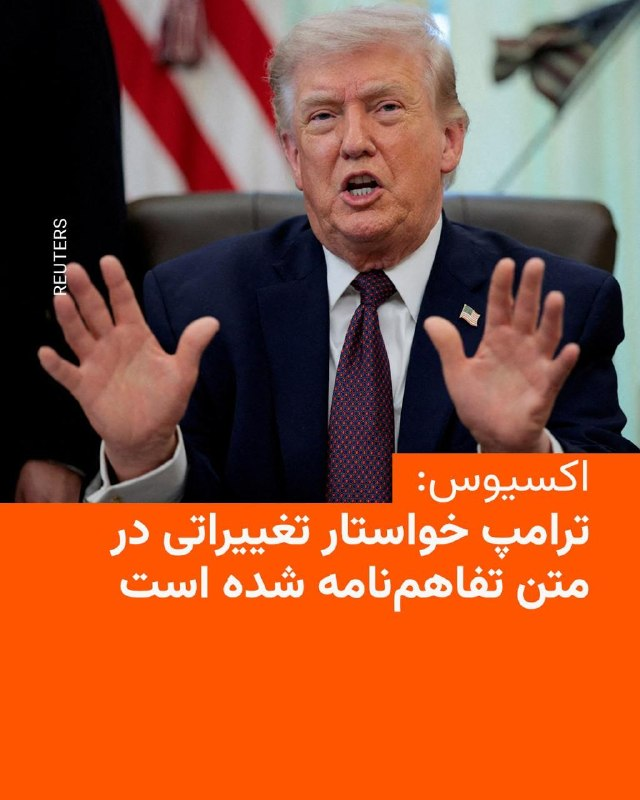

🔸چند رسانه در آمریکا از جمله وب‌سایت اکسیوس خبر داده‌اند که رئیس جمهور آمریکا در آخرین جلسه خود درباره مذاکرات با جمهوری اسلامی خواستار اعمال تغییراتی در متن تفاهم‌نامه با تهران شده است.

🔸اکسیوس بامداد یک‌شنبه، دهم خردادماه، نوشت که انتظار می‌رود که تفاهم‌نامه بین واشینگتن و تهران خیلی زود نهایی شود، اما دونالد ترامپ تمایل دارد که «چند نکته که از نظر او حائز اهمیت بیشتر است» تقویت شود، از جمله در مورد اورانیوم غنی‌شده ایران.

🔸جلسه دونالد ترامپ با مشاوران ارشدش در روز جمعه گذشته که طبق وعده او قرار بود نتیجه چند هفته مذاکره را روشن کند پس از بیش از دو ساعت بدون اعلام نتیجه به پایان رسید.

🔸بامداد شنبه، ۹ خردادماه، روزنامه نیویورک تایمز به نقل از یک مقام ارشد دولت که به نامش اشاره نکرد نوشت که ترامپ در این جلسه به نتیجه‌ای درباره تفاهم‌نامه با تهران نرسیده است.
@RadioFarda

## IranianMinds — post 21114

  

🔴نیویورک تایمز:

ترامپ خواسته‌های ایران رو رد کرده و یک پیشنهاد متقابل سخت‌تر به ایران ارسال کرده!

+باز شروع شد

@IranianMinds

## IranianMinds — post 21113

  

هیئت رئیسه مجلس جمهوری اسلامی

تو قیافه های اینارو ببین خدایی
یکی از یکی وحشتناک تر

@IranianMinds

## IranianMinds — post 21112

حزب‌الله فروخته شد. جمهوری اسلامی در ظاهر هنوز از حزب‌الله دفاع می‌کند و مدام از لزوم در نظر گرفتن لبنان در مذاکرات حرف می‌زند؛ اما واقعیت پشت پرده چیز دیگری است. اگر قرار بود حمایتی در کار باشد، امروز حزب‌الله در این وضعیت قرار نداشت. آنچه می‌بینیم بیشتر…

## IranianMinds — post 21111

🔴 ارتش اسرائیل منطقه تاریخی کوه بو فور در جنوب لبنان را تصرف کرد @IranianMinds

## IranianMinds — post 21107

🔴 ارتش اسرائیل منطقه تاریخی کوه بو فور در جنوب لبنان را تصرف کرد

@IranianMinds

## IranianMinds — post 21106

  <a href="telegram/content/IranianMinds_21106_1780216252.mp4" target="_blank">🎬 Download video</a>

🔴 آزادی بیانِ بیش از اندازه این بلارو سر کشورا میاره چون تروریستِ مارکسیست/چپ معنی آزادی رو نمیفهمه

یارو معلوم نیس از کدوم خراب شده پاشده رفته آلمان و اون کشور پذیرفتتش بعد توی همون کشور داره شعار Fuck Germany میده

@IranianMinds

## IranianMinds — post 21105

🔴 یسرائیل کاتز، وزیر دفاع اسرائیل: ارتش دفاعی اسرائیل دامنه عملیات خودش رو تو لبنان گسترش داده، از رود لیتانی عبور کرده و یال بوفر رو به تصرف درآورده.

@IranianMinds

## IranianMinds — post 21104

  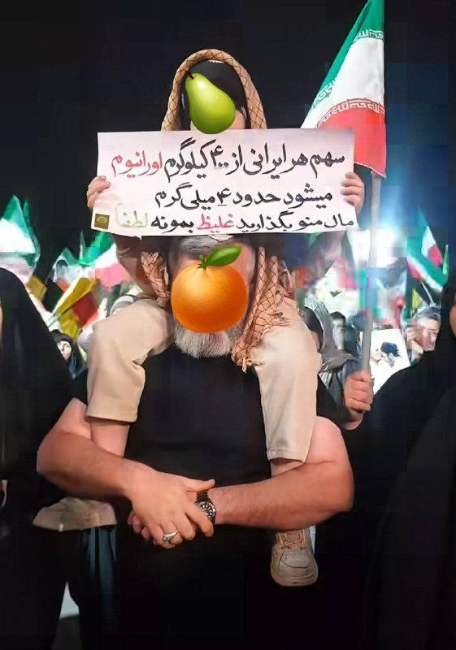

وضعیت یه جوریه که ملت ایران ول کن هم بشن این ارزشیا دهن جمهوری اسلامیو میخان سرویس کنن

@IranianMinds

## IranianMinds — post 21103

🔴سخنگوی کمیسیون امنیت ملی خیلی خشنو ددی طورانه گفت :

محاصره دریایی یا با زور یا با مذاکره پایان خواهد یافت

@IranianMinds

## IranianMinds — post 21102

مهدی محمدی، مشاور قالیباف:

توافق صرفاً یک تاکتیک برای خرید زمان و منابع است نه استراتژی صلح‌ طلبانه

+ یکم دیر فهمیدید عزیز

@IranianMinds

## IranianMinds — post 21101

🔴 دیشب پرچم‌ به‌دستا تو میدون انقلاب شعار « با قاتلین رهبر، مذاکره حرامه » سر دادن.

+ بخدا ماهم موافقیم باهاتون

@IranianMinds

## IranianMinds — post 21100

  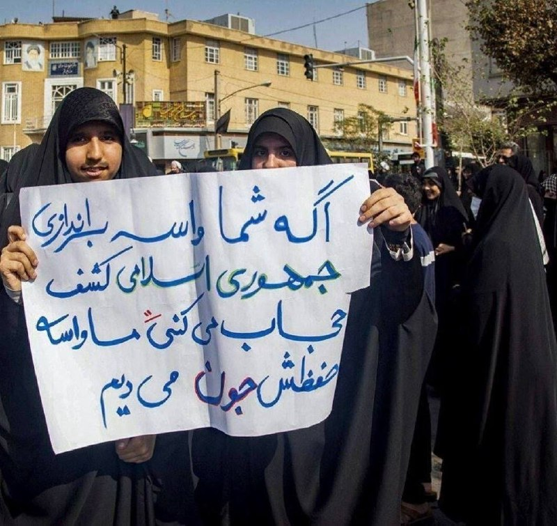

حله داداش قبولت داریم

@IranianMinds

## IranianMinds — post 21099

  

💡 میخوای یاد بگیری چطوری با همین گوشی تو دستت از پیش بینی فوتبال سود کنی؟ سیگنال ضریب بالا و کم ریسک میخوای؟ فرصتو از دست نده همین الان عضو کانال VIP یونی بت شو👇

➖➖➖➖➖
🎁کسب درامد از پیش بینی فوتبال راحته اگ این کانال داشته باشی چون کارش بلده ae9:
https://t.me/+YwYFluMQ5-kyNmY8
https://t.me/+YwYFluMQ5-kyNmY8

## IranianMinds — post 21098

  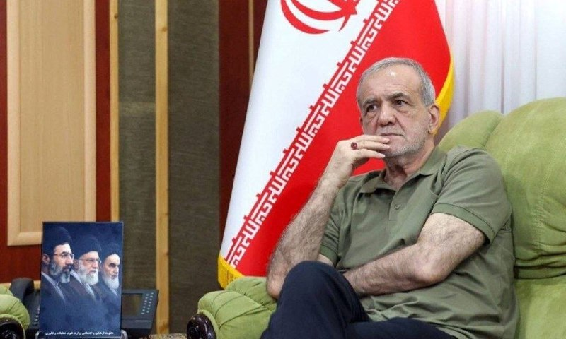

🔴 پزشکیان:

در مصرف برق صرفه‌جویی کنید، کولر روشن نکنید.

@IranianMinds

## IranianMinds — post 21097

  <a href="telegram/content/IranianMinds_21097_1780216255.mp4" target="_blank">🎬 Download video</a>

🔴 قایق تندرو هم آوردن تو میدون انقلاب😂

@IranianMinds

## IranianMinds — post 21096

  

🔴پست ترامپ:

@IranianMinds

## IranianMinds — post 21095

  <a href="telegram/content/IranianMinds_21095_1780216257.mp4" target="_blank">🎬 Download video</a>

@IranianMinds

## BBCPersian — post 282483

🔻حتی اگر چشم‌اندازی برای برقراری صلح میان ایران و آمریکا وجود داشته باشد، تهران با گسترش جنگ به سطح منطقه، اکنون با فضایی خصمانه در خلیج فارس روبه‌رو است.

به طور خاص امارات متحده عربی بیشترین آسیب را از حملات موشکی و پهپادی ایران دیده است که در واکنش به حملات آمریکا و اسرائیل به ایران در ۲۸ فوریه انجام شد. امارات اکنون از دیگر شرکای خود در خلیج فارس فاصله گرفته و موضعی تقابلی‌تر در برابر جمهوری اسلامی در پیش گرفته است.

با وجود آتش‌بس شکننده‌ای که در ماه آوریل برقرار شد و تلاش دیگر کشورهای خلیج فارس برای جلوگیری از آغاز دوباره جنگ، خصومت میان ایران و امارات به مجامع دیپلماتیک بین‌المللی نیز کشیده شده و حتی ممکن است به اقدامات نظامی پنهانی نیز منجر شده باشد.

بیشتر بخوانید:
https://trib.al/BympRd5
📸Getty/BBC
@BBCPersian

## BBCPersian — post 282482

🔻توقیف اموال «۷۵ نفر» در استان مرکزی به دستور مقامات قضایی

دادستان اراک از صدور دستور قضایی برای توقیف اموال «۷۵ نفر» در استان مرکزی خبر داده است.

حجت‌اله درودگر از این افراد به عنوان « همکاران و مرتبطین مستقیم با شبکه‌های معاند خارج از کشور» نام برده است.

پس از جنگ اخیر، قوه قضائیه ایران شمار زیادی را با عنوان «همکاری» یا «همراهی» یا ارتباط با رسانه‌های «معاند» بازداشت و با روندهای دادرسی نامشخص، آنها را به زندان انداخته است یا از حقوق محروم و اموالشان را توقیف و مصادره کرده است.

از زمان اعتراضات دی‌ماه و کشتار معترضان، شمار زیادی از شهروندان ایرانی در خارج از کشور در تجمعات اعتراضی در شهرهای مختلف شرکت کردند که این اعتراضات در هفته‌های منتهی به جنگ و بعد از آن هم ادامه یافت.

قوه قضائیه پس از جنگ آمریکا و اسرائیل با ایران، با استناد به قانون «تشدید مجازات جاسوسی» معترضان و مخالفان را به «همراهی با دشمن» متهم کرد.

اما این توقیف‌ها به موضوع جنگ محدود نیست؛ در زمان اعتراضات دی‌ماه هم اموال بعضی از چهره‌های شناخته شده در داخل ایران ضبط شد.

فعالان مجازی حامی جمهوری اسلامی در جریان جنگ اخیر، اقدام به فراخوان‌هایی برای معرفی مخالفان جمهوری اسلامی که آنها را «حامی جنگ» نامیدند، کردند.

https://trib.al/XacbgQK
@BBCPersian

## BBCPersian — post 282481

🔻در پی حمله آمریکا به یک قایق مظنون به قاچاق مواد مخدر، سه نفر کشته شدند

ارتش آمریکا اعلام کرد در حمله به یک قایق مظنون به قاچاق مواد مخدر در شرق اقیانوس آرام، سه نفر کشته شدند. این حمله در چارچوب کارزار گسترده واشنگتن علیه گروه‌هایی انجام شده که آمریکا آن‌ها را به «قاچاق مواد مخدر و تروریسم» مرتبط می‌داند.

این حمله به دنبال مجموعه ای از حملات مشابه صورت گرفته که طی هفته‌های گذشته قایق‌ها و شناورها را در مسیرهای اصلی قاچاق بین آمریکای جنوبی و آمریکای شمالی هدف قرار داده است.

منتقدان می‌گویند این حملات ادامه رویکردی است که از سال گذشته تاکنون صدها کشته بر جای گذاشته و همچنان پرسش‌هایی را درباره شواهد،‌ پاسخگویی و قوانین بین‌المللی مطرح می‌کند.

در مقابل، مقام‌های آمریکایی استدلال می‌کنند که این حملات باعث اختلال در فعالیت کارتل‌های مواد مخدر شده و به حفظ امنیت منطقه‌ای کمک می‌کند.

https://trib.al/XacbgQK
@BBCPersian

## BBCPersian — post 282480

🔻اسرائیل:‌ با عبور از رود لیتانی در حال گسترش عملیات خود در جنوب لبنان هستیم

ارتش اسرائیل اعلام کرده است که پس از عبور نیروهای زمینی از رود لیتانی، در حال گسترش دامنه عملیات خود به مناطق بیشتری در جنوب لبنان است.

پیش از این پیشروی، نیروی هوایی اسرائیل حملات گسترده‌ای را علیه اهداف حزب‌الله در شمال این رودخانه انجام داد.

ارتش همچنین اعلام کرد یکی از سربازانش در حمله پهپادی حزب‌الله کشته شده است.

در همین حال، نواف سلام، نخست‌وزیر لبنان، اسرائیل را به دنبال کردن «سیاست زمین سوخته» متهم کرد و گفت که این کشور با تخریب نظام‌مند شهرها و روستاهای جنوب لبنان، غیرنظامیان را مجبور به فرار می‌کند.

آقای سلام گفت که افزایش حملات هوایی اسرائیل نه امنیت ایجاد می‌کند و نه ثبات به همراه دارد.

قرار است هفته آینده در واشنگتن، مذاکرات بیشتری با میانجی‌گری آمریکا میان اسرائیل و لبنان برگزار شود.

https://trib.al/XacbgQK
@BBCPersian

## BBCPersian — post 282479

🔻شهرداری تهران: پرونده بازسازی خانه‌های آسیب دیده از جنگ تا تیرماه بسته می‌شود

سخنگوی شهرداری تهران گفته است که پرونده بازسازی خانه‌های آسیب دیده در جنگ تا تیرماه بسته می‌شود.

عبدالمطهر محمدخانی گفته است که در بازسازی واحدهایی که نیازمند تخریب و نوسازی هستند، حدود «۴۰ درصد» پیشرفت حاصل شده است.

او همچنین با اشاره به این که در جریان جنگ به «۵۱ هزار واحد مسکونی» خسارات وارد شد، گفت که بازسازی واحدهایی که نیاز به تعمیرات جزیی داشتند تا «۹۷درصد» پیشرفت داشته است و احتمالا تا پایان هفته جاری پرونده آن‌ها بسته می شود.

به گفته آقای محمدخانی مسئولیت عمده بازسازی به شهرداری تهران داده شده است.

سخنگوی شهرداری تهران با اشاره به این که برای خروج خانواده‌ها از هتل‌ها، مهلت یا زمان مشخصی تعیین نشده است، گفت که در زمان اوج جنگ بیش از «۲۳۰۰ خانواده» در اسکان اضطراری بودند و در حال حاضر این رقم به «۱۶۲۹ خانواده» رسیده است.

https://trib.al/XacbgQK
@BBCPersian

## BBCPersian — post 282472

🖊علی رمضانیان، روزنامه‌نگار اقتصادی

🔻فقر در ایران دیگر تنها در حاشیه شهرها یا روستاهای دورافتاده دیده نمی‌شود، بلکه نشانه‌های آن را می‌توان در خیابان‌های اصلی تهران، واگن‌های مترو، صف‌های داروخانه، بازارهای محلی، مدارس، خانه‌های اجاره‌ای و در سبک زندگی طبقه متوسط مشاهده کرد.

آنچه در سال‌های گذشته از آن با عنوان «فشار اقتصادی» یاد می‌شد، اکنون برای میلیون‌ها شهروند ایرانی به وضعیتی دائمی و فرساینده بدل شده است. این بحران پس از جنگ آمریکا و اسرائیل با ایران، رکود عمیق اقتصادی، قطعی گسترده اینترنت و جهش تورمی، ابعاد تازه و نگران‌کننده‌تری پیدا کرده است.

زیر لایه ظاهری زندگی روزمره، شبکه‌ای از فقر، بدهکاری، بیکاری، ناامیدی و فرسایش معیشتی در حال گسترش است. بسیاری از خانواده‌ها دیگر نه برای «پیشرفت»، بلکه صرفا برای «زنده ماندن» تلاش می‌کنند.

بیشتر بخوانید:

📸 Getty/ EPA
@BBCPersian

## BBCPersian — post 282471

  

🔻 در پی درگیری میان هواداران فوتبال و پلیس در سراسر فرانسه پس از پیروزی پاری‌سن‌ژرمن در فینال لیگ قهرمانان اروپا مقابل آرسنال، بیش از ۴۰۰ نفر بازداشت شدند.

هزاران نیروی پلیس برای کنترل ناآرامی‌هایی که خدمات اتوبوس، قطار و شبکه ریلی را در پاریس، پایتخت، مختل کرده بود، به کار گرفته شدند.

هواداران با آتش‌بازی و نورافشانی این پیروزی را جشن گرفتند و در جریان درگیری‌ها چندین مأمور پلیس زخمی شدند. پلیس برای متفرق کردن جمعیت در مرکز شهر پاریس از گاز اشک‌آور استفاده کرد.

این پیروزی، دومین قهرمانی پیاپی پاری‌سن‌ژرمن بود، اما در عین حال برای دومین سال متوالی نیز جشن‌های مرتبط با فوتبال در فرانسه به خشونت کشیده شد.

بیشتر بخوانید:

https://trib.al/4fUVfpa
📸 Getty Images
@BBCPersian

## Dirty_Kids — post 390614

  <a href="telegram/content/Dirty_Kids_390614_1780216259.mp4" target="_blank">🎬 Download video</a>

ویدئو بسیار با کیفیت و ساخته شده توسط AI، لحظه هولناکی را بازسازی کرده است که در آن، حرارت چند میلیون درجه‌ای بمب اتمی آمریکا در کسری از ثانیه، 10 ها هزار انسان را تبخیر کرد و از آن‌ها تنها سایه‌ای سیاه بر دیوارهای شهر باقی گذاشت.

@Dirty_Kids 👻

## Dirty_Kids — post 390613

  <a href="telegram/content/Dirty_Kids_390613_1780216261.mp4" target="_blank">🎬 Download video</a>

اوضاع خراب بوده تو قطعی اینترنت، ملت مجبور بودن اینجوری افشاگری کنن:

@Dirty_Kids 👻

## Dirty_Kids — post 390612

  <a href="telegram/content/Dirty_Kids_390612_1780216263.mp4" target="_blank">🎬 Download video</a>

شوک شدم از دیدن این ویدیو ،این خانوم مورگان فتحی، تیک تاکر آمریکایی توی لس آنجلس هست که همسرش ایرانیه، سازنده کلاه گیسه، میگه توی چند ماه گذشته یه مقدار خیلی عظیمی موی ایرانی وارد بازار آمریکا شده، اتفاقات دی ماه رو توضیح میده که ج.ا ازجسد قربانیان پول درمیاره.
و این موها😔

@Dirty_Kids 👻

## Dirty_Kids — post 390611

  <a href="telegram/content/Dirty_Kids_390611_1780216265.mp4" target="_blank">🎬 Download video</a>

کامنت برتر امروز و جواب خیلی قانع‌کننده‌ی سندی

@Dirty_Kids 👻

## Dirty_Kids — post 390610

  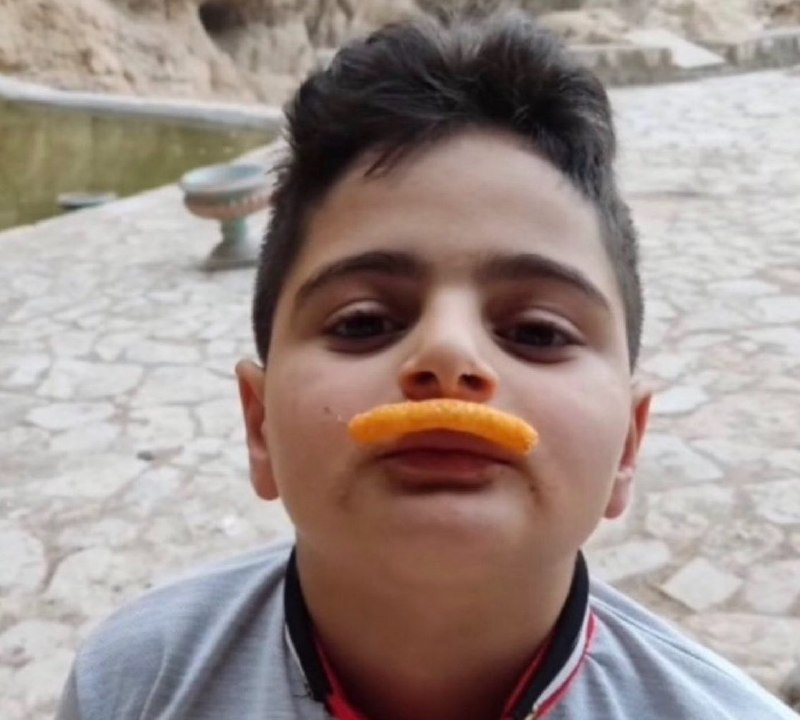

سیاسی نیستی؟، کیان پیر فلک هم نبود.

@Dirty_Kids 👻

## Dirty_Kids — post 390609

  <a href="telegram/content/Dirty_Kids_390609_1780216267.webm" target="_blank">🎬 Download video</a>

☢️خفن ترین و‌ قدیمی ترین  انالیزور  ایران ینی دکتر بت 
👍 
🔴مسابقات جذاب جام جهانی به زودی شروع میشه بیا توی کانال دکتر بت و باهاش همراه شو و پول در بیار
💵 رایگان بهترین شرط هارو براتون میذاره حتی هزار تومن هم دریافت نمیکنه روزانه میتونی از پیش بینی فوتبال باهاش…

## Dirty_Kids — post 390608

  <a href="telegram/content/Dirty_Kids_390608_1780216267.webm" target="_blank">🎬 Download video</a>

☢️خفن ترین و‌ قدیمی ترین  انالیزور  ایران ینی دکتر بت 
👍

🔴مسابقات جذاب جام جهانی به زودی شروع میشه بیا توی کانال دکتر بت و باهاش همراه شو و پول در بیار
💵

رایگان بهترین شرط هارو براتون میذاره
حتی هزار تومن هم دریافت نمیکنه
روزانه میتونی از پیش بینی فوتبال باهاش پول در بیاری 👌
A9

🌟اگ اهل پیش بینی فوتبالی این کانال اصلا از دست ندین
👇

✅https://t.me/+4_ADqwB9e-QwYjlk

✅https://t.me/+4_ADqwB9e-QwYjlk

## Dirty_Kids — post 390607

  

#بخوابیم

@Dirty_Kids 👻

## Dirty_Kids — post 390606

  <a href="telegram/content/Dirty_Kids_390606_1780216268.mp4" target="_blank">🎬 Download video</a>

دوتا دختر خیلی شیک و تمیز از یه بوتیک تو نازی‌آباد یه لباس می‌دزدن

@Dirty_Kids 👻

## Dirty_Kids — post 390605

  <a href="telegram/content/Dirty_Kids_390605_1780216269.mp4" target="_blank">🎬 Download video</a>

یک ویدیو که هر بار دیدنش، چیزی از روح آدم را کم می‌کند…
۱۹ دی، شاهین‌شهر اصفهان

@Dirty_Kids 👻

## Dirty_Kids — post 390604

  <a href="telegram/content/Dirty_Kids_390604_1780216270.mp4" target="_blank">🎬 Download video</a>

من هرشب:

هندزفری 🔞

@Dirty_Kids 👻

## Dirty_Kids — post 390603

میدونستید آقا سیدمجتبی تنها گونه جانوری هست که بجای حمله به قاتل پدر و همسر و بچه‌ش، تمام سعیشو میکنه باهاش توافق کنه؟

@Dirty_Kids 👻

## Dirty_Kids — post 390602

  <a href="telegram/content/Dirty_Kids_390602_1780216271.mp4" target="_blank">🎬 Download video</a>

توی سریال "بدنام" دختره به پسره میگه ساز دهنیت باحاله؟ اونم میگه آره، دختره هم میگه پس بریم تو اتاق صدای ساز دهنیمون همسایه‌ها رو بی‌خواب نکنه😂😂

@Dirty_Kids 👻

## Dirty_Kids — post 390601

  

‏کانفیگی که برام فرستادی دیگه کار نمی‌کنه، یکی دیگه می‌فرستی؟

@Dirty_Kids 👻

## Dirty_Kids — post 390600

  

چرا حضرت اقا جواب نمیدن؟ خدای نکرده اتفاق بدی براشون افتاده؟؟

@Dirty_Kids 👻

## Dirty_Kids — post 390599

  

عرزشیا میخوان انتقام آمریکا رو از مردم بگیرن!

توییت زده: مردم جرعت دارن بیان خیابون، یه جوری قتل عام میکنیم که مراد ویسی تا چند سال طول بکشه اسم همه جاوید نام هارو بخونه!

@Dirty_Kids 👻

## Dirty_Kids — post 390597

  <a href="telegram/content/Dirty_Kids_390597_1780216273.mp4" target="_blank">🎬 Download video</a>

از وقتی اینترنت وصل شده مردم خیلی با فالووراشون احساس راحتی میکنن، رسما تو گالری ملتیم:

@Dirty_Kids 👻

## Dirty_Kids — post 390596

انقدر با لباس تکراری میرم سرکار هرکی تو مسیر منو میبینه دژاوو میشه.

@Dirty_Kids 👻

## Dirty_Kids — post 390595

  

خیلی کیری میشد شبیه گداها میشد

+ اینجا برعکس لباس‌شان که شخصی بود مادرشان عمومی بود 💔

@Dirty_Kids 👻

## Hranews — post 113261

  

در پی کشته‌شدن میثم و مجتبی ویسی، دو برادر پیرو آئین یارسان، مراسم بزرگداشت آنان روز گذشته در محله دره‌دریژ کرمانشاه برگزار شد. این دو شهروند روز پنجشنبه ۷ خردادماه در پی تیراندازی نیروهای اطلاعات سپاه در شهرستان دالاهو جان خود را از دست دادند. بی‌بی‌سی فارسی به نقل از یک منبع نزدیک به خانواده ویسی نوشت که «پیکر آنان تاکنون به خانواده تحویل داده نشده است.» این دو برادر در ارتباط با اعتراضات سراسری ۱۴۰۴ تحت تعقیب نهادهای امنیتی قرار داشتند.

سجاد و شایان ویسی، دو عضو دیگر این خانواده که در جریان همان اعتراضات بازداشت شده‌اند، با اتهام محاربه مواجه شده و در خطر صدور احکام سنگین قرار دارند. عدم انتشار اطلاعات درباره وضعیت حقوقی و دسترسی این افراد به وکیل، بر نگرانی‌ها درباره روند رسیدگی قضایی و رعایت حقوق متهمان افزوده است.

↘️
@hranews_bot تماس ✉️ -  @Hranews  کانال هرانا 🆑

## Hranews — post 113260

  

حبس بدون تصمیم؛ تداوم بلاتکلیفی فخرالدین جعفرآقایی در زندان زاهدان

❗️
❗️
❗️
❗️
❗️– فخرالدین جعفرآقایی، شهروند ساکن زابل، ۵۴ روز است که بازداشت شده و همچنان به صورت بلاتکلیف در زندان زاهدان نگهداری می‌شود.

به گزارش خبرگزاری هرانا، ارگان خبری مجموعه فعالان حقوق بشر در ایران، فخرالدین جعفرآقایی کماکان در بازداشت به‌ سر می‌برد.

یک منبع مطلع نزدیک به خانواده این شهروند ضمن تایید این خبر به هرانا گفت: “با وجود گذشت ۵۴ روز از زمان بازداشت، فخرالدین جعفرآقایی کماکان به صورت بلاتکلیف در زندان زاهدان محبوس است. علت بازداشت این شهروند فعالیت او در فضای مجازی پیش از جنگ اخیر عنوان شده است. همچنین، علیرغم پیگیری‌های مکرر خانواده وی، تاکنون دادگاهی برای او تشکیل نشده و امکان آزادی موقت با وثیقه نیز برای این شهروند فراهم نشده است.”

ادامه مطلب

#فخرالدین_جعفرآقایی

↘️
@hranews_bot تماس ✉️ -  @Hranews  کانال هرانا 🆑

## Hranews — post 113259

دستور توقیف اموال ۷۵ شهروند در استان مرکزی صادر شد

❗️
❗️
❗️
❗️
❗️– دادستان عمومی و انقلاب مرکز استان مرکزی از صدور دستور #توقیف_اموال ۷۵ نفر در این استان به دلیل آنچه «همکاری با رسانه‌های معاند» عنوان کرده، خبر داد.

ادامه مطلب

↘️
@hranews_bot تماس ✉️ -  @Hranews  کانال هرانا 🆑

## Hranews — post 113258

یک کافه در تهران پلمب شد؛ استناد پلیس به ادعاهایی درباره «تحرکات شیطانی»

❗️
❗️
❗️
❗️
❗️ – پلیس نظارت بر اماکن عمومی تهران از #پلمب یک کافه در محدوده خیابان ولیعصر خبر داد. این اقدام بر اساس ادعاهایی درباره آنچه «تحرکات شیطانی» و «رفتارهای نابهنجار» مشتریان عنوان شده، صورت گرفته است.

ادامه مطلب

↘️
@hranews_bot تماس ✉️ -  @Hranews  کانال هرانا 🆑

## Hranews — post 113257

فروزان نوجوان از زندان ارومیه آزاد شد

❗️
❗️
❗️
❗️
❗️ – فروزان نوجوان (اسلامی)، مدرس زبان انگلیسی و اهل ارومیه، روز گذشته با تودیع وثیقه از زندان این شهرستان آزاد شد.

ادامه مطلب

#فروزان_نوجوان
#فروزان_اسلامی

↘️
@hranews_bot تماس ✉️ -  @Hranews  کانال هرانا 🆑

## alonews — post 123873

  <a href="telegram/content/alonews_123873_1780216275.webm" target="_blank">🎬 Download video</a>

👈سپاه: طی شبانه روز گذشته ۲۸ فروند کشتی اعم از نفتکش، کانتینر بر و سایر کشتی های تجاری پس از کسب مجوز با هماهنگی و تامین امنیت نیروی دریایی سپاه از تنگه هرمز عبور کردند.

✅ @AloNews خبر جنگ

## alonews — post 123872

  <a href="telegram/content/alonews_123872_1780216275.webm" target="_blank">🎬 Download video</a>

👈تردد خودروهای پلاک مناطق آزاد در سراسر کشور مجاز شد

🔴 بر اساس ابلاغیه رئیس پلیس راهور، محدودیت تردد خودروهای پلاک مناطق آزاد در سطح کشور تا اطلاع ثانوی برداشته شد.

🔴مطابق این ابلاغیه، خودروهای دارای پلاک مناطق آزاد کیش، قشم، اروند، چابهار و ماکو می‌توانند تا اطلاع ثانوی در تمامی جاده‌ها و محورهای کشور تردد کنند.

🔴 طبق اعلام پلیس راهور، این مجوز تا زمان عادی شدن شرایط و صدور اطلاعیه‌های بعدی معتبر خواهد بود.

✅ @AloNews خبر جنگ

## alonews — post 123871

  <a href="telegram/content/alonews_123871_1780216275.webm" target="_blank">🎬 Download video</a>

👈منابع آمریکایی به خبرگزاری فرانسه:
ترامپ به دنبال توافق صلحی با ایران است که «خطوط قرمز او را برآورده کند»

 
🔴منابع آمریکایی که نام‌شان فاش نشده به خبرگزاری فرانسه گفتند که توافق صلح منتظر امضای دونالد ترامپ است، اما او پس از جلسه اتاق وضعیت کاخ سفید در روز جمعه هیچ تصمیمی نگرفت.

🔴یک مقام کاخ سفید که نامش فاش نشده است، گفت: رئیس جمهور فقط توافقی را امضا خواهد کرد که برای آمریکا خوب باشد و خطوط قرمز او را برآورده کند. ایران هرگز نمی‌تواند سلاح هسته‌ای داشته باشد.

🔴ترامپ گفت اولویت‌های او برای هرگونه توافقی شامل موافقت ایران با عدم توسعه سلاح‌های هسته‌ای و بازگشایی تنگه هرمز است.

✅ @AloNews خبر جنگ

## alonews — post 123870

  <a href="telegram/content/alonews_123870_1780216275.webm" target="_blank">🎬 Download video</a>

👈بی‌بی‌سی: صدها نفر پس از جشن‌های دیوانه‌وار لیگ قهرمانان در فرانسه دستگیر شدند

🔴درگیری بین هواداران فوتبال و پلیس در سراسر فرانسه منجر به بیش از ۴۰۰ دستگیری پس از پیروزی پاری سن ژرمن (PSG) در فینال لیگ قهرمانان مقابل آرسنال شده است.

🔴هزاران افسر برای مهار ناآرامی‌هایی که خدمات اتوبوس، قطار و راه‌آهن را در پایتخت پاریس مختل کرده بود، مستقر شدند.

✅ @AloNews خبر جنگ

## alonews — post 123869

  <a href="telegram/content/alonews_123869_1780216275.webm" target="_blank">🎬 Download video</a>

👈رسانه‌های اسرائیلی گزارش می‌دهند که آمریکا به اسرائیل اجازه داده است تا فراتر از جنوب لبنان عملیات و حمله انجام دهد.

✅ @AloNews خبر جنگ

## alonews — post 123868

  <a href="telegram/content/alonews_123868_1780216275.webm" target="_blank">🎬 Download video</a>

👈میدل ایست نیوز: سرمایه‌گذاری میلیارد دلاری چین در عمان

🔴دولت عمان با جذب یک پروژه استراتژیک یک میلیارد دلاری برای تولید مواد مورد استفاده در باتری‌های لیتیوم، گام بلندی برای ورود به زنجیره جهانی تأمین انرژی‌های پاک برداشت.

✅ @AloNews خبر جنگ

## alonews — post 123867

  <a href="telegram/content/alonews_123867_1780216276.mp4" target="_blank">🎬 Download video</a>

👈 تصویری از کافه‌ مروج شیطان‌پرستی در خیابان ولیعصر تهران که توسط پلیس پلمب شد

✅ @AloNews خبر جنگ

## alonews — post 123866

  <a href="telegram/content/alonews_123866_1780216276.webm" target="_blank">🎬 Download video</a>

👈فرمانده انتظامی خراسان شمالی: ۲۱۵ تن برنج احتکارشده، ۴۸ تن آهن‌آلات و میلگرد و یک‌ونیم تن آرد در استان کشف و ۴ نفر در این رابطه دستگیر شدند

✅ @AloNews خبر جنگ

## alonews — post 123865

  <a href="telegram/content/alonews_123865_1780216277.webm" target="_blank">🎬 Download video</a>

👈الجزیره: روابط روسیه و ایران آنطور که به نظر می‌رسد نیست / هدف مسکو تضمین عدم انزوا، فرسایش یا شکست استراتژیک ایران است

✅ @AloNews خبر جنگ

## alonews — post 123864

  <a href="telegram/content/alonews_123864_1780216277.webm" target="_blank">🎬 Download video</a>

👈سنتکام: «پس از آنکه خدمه کشتی از تبعیت از دستورات خودداری کردند، یک هواپیمای آمریکایی با شلیک یک موشک AGM-114 Hellfire به اتاق موتور کشتی، آن را از کار انداخت. این کشتی دیگر به سمت ایران در حرکت نیست.»

✅ @AloNews خبر جنگ

## alonews — post 123863

  <a href="telegram/content/alonews_123863_1780216277.webm" target="_blank">🎬 Download video</a>

👈پزشکیان: همچنان در برخی عرصه‌ها با فاصله‌هایی نسبت به کشور‌های پیش‌رو و حتی برخی همسایگان مواجه هستیم

🔴فشار‌ها و چالش‌هایی که امروز جامعه با آن مواجه است، ساده و تک بعدی نیستند و راهکار‌های آن‌ها نیز ساده نیست

🔴مدیریت نباید به حلقه‌ای محدود از مدیران و تصمیم‌گیران منحصر شود

🔴نباید در جایگاه تماشاگر و خارج از گود باقی ماند؛ حل مشکلات کشور با نظاره‌گری امکان‌پذیر نیست

✅ @AloNews خبر جنگ

## alonews — post 123862

  <a href="telegram/content/alonews_123862_1780216277.mp4" target="_blank">🎬 Download video</a>

👈ترامپ: اگر به ایران حمله نکرده بودیم، از سلاح هسته‌ای استفاده می‌کرد و دیگر نه اسرائیل و نه خاورمیانه وجود نداشت

✅ @AloNews خبر جنگ

## alonews — post 123861

  <a href="telegram/content/alonews_123861_1780216278.mp4" target="_blank">🎬 Download video</a>

👈دونالد ترامپ : اگر عجله کنید، توافق خوبی نخواهید بست. اما به آرامی و پیوسته، فکر می‌کنم داریم به آنچه می‌خواهیم می‌رسیم — و اگر به آنچه می‌خواهیم نرسیم، به روش دیگری به آن پایان خواهیم داد

✅ @AloNews خبر جنگ

## alonews — post 123860

  <a href="telegram/content/alonews_123860_1780216280.mp4" target="_blank">🎬 Download video</a>

👈 دونالد ترامپ درباره ایران: ببینید، دو چیز میخواهیم:

🔴1ـ تنگه باید فوراً باز و آزاد باشد، بدون عوارض.

🔴2ـ اینکه آنها نمی‌توانند سلاح هسته‌ای داشته باشند.

🔴همین است؛ خیلی ساده است. سپس ما از آنجا خارج خواهیم شد.

✅ @AloNews خبر جنگ

## alonews — post 123859

  <a href="telegram/content/alonews_123859_1780216281.webm" target="_blank">🎬 Download video</a>

👈ترامپ در تلاش است جنگ ایران را تقریباً تمام شده و کاملاً موفق نشان دهد، اما روایت او با واقعیت همخوانی ندارد و پس از سال‌ها تحمیل نسخه خود از وقایع، اکنون با بحرانی مواجه است که با داستانش در تضاد است، طبق گزارش نیویورک تایمز.

🔴 در بهترین حالت، تغییر رهبری رخ داده است، اما ارائه آن به عنوان یک تغییر مثبت توسط طرفداران جنگ نادرست است.

✅ @AloNews خبر جنگ

## alonews — post 123858

  <a href="telegram/content/alonews_123858_1780216282.webm" target="_blank">🎬 Download video</a>

👈آکسیوس به نقل از منابع: درخواست های اخیر ترامپ جرقه دور جدیدی از رفت و آمد بین واشنگتن و تهران را زده است

✅ @AloNews خبر جنگ

## alonews — post 123857

  <a href="telegram/content/alonews_123857_1780216282.webm" target="_blank">🎬 Download video</a>

👈 یکی از مقامات کاخ سفید، به آکسیوس: آماده ایم یک هفته یا بیشتر منتظر بمانیم تا اطمینان حاصل کنیم که رئیس جمهور به خواسته های خود از ایران می رسد. 
✅ @AloNews خبر جنگ

## alonews — post 123856

  <a href="telegram/content/alonews_123856_1780216282.webm" target="_blank">🎬 Download video</a>

👈 یکی از مقامات کاخ سفید، به آکسیوس:
آماده ایم یک هفته یا بیشتر منتظر بمانیم تا اطمینان حاصل کنیم که رئیس جمهور به خواسته های خود از ایران می رسد.

✅ @AloNews خبر جنگ

## alonews — post 123855

  <a href="telegram/content/alonews_123855_1780216282.webm" target="_blank">🎬 Download video</a>

👈بورس برای دومین روز متوالی سبزه

✅ @AloNews خبر جنگ

## alonews — post 123854

  <a href="telegram/content/alonews_123854_1780216282.webm" target="_blank">🎬 Download video</a>

👈ترامپ در Truth Social: «دارید گیج می‌شوید»

🔴دونالد ترامپ در پیامی کوتاه در شبکه اجتماعی Truth Social نوشت:
«You’re getting discombobulated»
که میتوان آن را به «دارید گیج و سردرگم میشوید» ترجمه کرد.

🔴ترامپ توضیح بیشتری درباره مخاطب یا منظور این پیام ارائه نکرده است.

✅ @AloNews خبر جنگ

---
📅 بروزرسانی: 1405/03/10 00:09
---

## VahidOOnLine — post 242952

  

عباس گلرو، عضو کمیسیون امنیت ملی مجلس گفت: «در حال سوال اصلی این است که آیا می‌توان به آمریکا اعتماد کرد، پاسخ روشن است، خیر. آیا می‌توان با آمریکا به تفاهم پایدار رسید، پاسخ این نیز خیر است.»

او افزود: «ما همه سرنشین یک کشتی هستیم و باید به تصمیم‌های اتخاذشده در ساختار نظام اعتماد داشته باشیم.»

او ادامه داد: «هیچ مقطعی را به اندازه امروز، زمان برافراشته بودن پرچم جمهوری اسلامی در منطقه و جهان ندیده‌ام.»
‌🏁 🇬🇧 IranintlTV

🤖 @VahidOOnLine

## VahidOOnLine — post 242951

  <a href="telegram/content/VahidOOnLine_242951_1780173555.mp4" target="_blank">🎬 Download video</a>

سعید آجرلو، عضو تیم رسانه‌ای مذاکره‌کننده جمهوری اسلامی، گفت در صورت تایید متن نهایی تفاهم‌ [با آمریکا]، گفت‌وگوهای ۶۰ روزه درباره جزئیات آغاز می‌شود. او افزود اگر طرف مقابل به تعهداتش، از جمله درباره ۱۲ میلیارد دلار، عمل نکند، جمهوری اسلامی می‌تواند از توافق خارج شود.
‌🏁 🇬🇧 IranintlTV

🤖 @VahidOOnLine

## VahidOOnLine — post 242950

  

علی شیرازی، رییس سازمان عقیدتی سیاسی انتظامی گفت: «بر عهد خود برای تداوم راه ولایت و مطالبه انتقام سخت از عاملان به شهادت رساندن رهبرمان پایبندیم.»

او افزود: «نهادهای مسئول باید پیگیری حقوقی و بین‌المللی این جنایت را در اولویت قرار داده و حکم الهی برای قاتلان امام شهید را در ملاعام اجرا کنند.»

شیرازی ادامه داد: «ملت ما تا زمان قصاص قاتلان امام خود و خروج کامل استکبار از منطقه، میدان‌های مبارزه را ترک نخواهند کرد.»
‌🏁 🇬🇧 IranintlTV

🤖 @VahidOOnLine

## VahidOOnLine — post 242949

  

نشریه هیل نوشت ثبات واقعی در خلیج فارس مستلزم از بین بردن توانایی رژیم ایران برای تهدید تجارت جهانی، اعمال فشار بر همسایگان و گروگان گرفتن بازارهای انرژی است. هر چیزی کمتر از این، صرفا وقفه‌ای کوتاه پیش از رویارویی بسیار خطرناک‌تری خواهد بود.

آریل کوهن، پژوهشگر شورای آتلانتیک و نویسنده این تحلیل نوشته نقشه راهبردی خاورمیانه در حال تغییر است و به نظر می‌رسد نفوذ آمریکا در این منطقه رو به کاهش باشد.

او با اشاره به نزدیک شدن تهران و واشینگتن به یک توافق نوشته است برای کسانی که دهه‌هاست این منطقه را مطالعه می‌کنند، این وضعیت نمونه‌ای از «ربودن شکست از آغوش پیروزی» به نظر می‌رسد.

او در ادامه نوشته است تعیین اهداف روشن جنگی، پیش‌شرط ضروری پیروزی نظامی است. همان‌گونه که رییس‌جمهوری و وزیر خارجه آمریکا اعلام کرده‌اند، اهداف واشینگتن در این درگیری روشن بود: جلوگیری از دستیابی جمهوری اسلامی به سلاح هسته‌ای، تضعیف توان موشک‌های بالستیک ایران، و برچیدن یا دست‌کم تضعیف شبکه نیروهای نیابتی که تهران برای اعمال نفوذ در خاورمیانه ایجاد کرده است؛ از حماس در غزه و حزب‌الله در لبنان گرفته تا حوثی‌ها در یمن.
https://iranin
‌🏁 🇬🇧 IranintlTV

🤖 @VahidOOnLine

## VahidOOnLine — post 242948

  

♦️تیم فوتبال پاری‌سن‌ژرمن با پیروزی برابر آرسنال در فینال لیگ قهرمانان اروپا، برای دومین فصل متوالی عنوان قهرمانی این رقابت‌ها را به دست آورد.
این دیدار در وقت‌های قانونی و اضافه با تساوی ۱-۱ به پایان رسید؛ جایی که کای هاورتز در دقیقه ۵ آرسنال را پیش انداخت، اما عثمان دمبله در دقیقه ۶۵ از روی نقطه پنالتی کار را به تساوی کشاند تا بازی به وقت‌های اضافه کشیده شود.
در نهایت، سرنوشت قهرمان در ضربات پنالتی مشخص شد و پاری‌سن‌ژرمن با نتیجه ۴ بر ۳ به پیروزی رسید تا جام را بالای سر ببرد.
این نخستین بار از سال ۲۰۱۶ بود که فینال لیگ قهرمانان اروپا به وقت‌های اضافه کشیده می‌شد؛ دیداری که با هیجان بالا و رقابت نزدیک دو تیم، به یکی از به‌یادماندنی‌ترین فینال‌های سال‌های اخیر تبدیل شد.
‌🇸🇦 Indypersian

🤖 @VahidOOnLine

## VahidOOnLine — post 242947

  

منوچهر متکی، نماینده تهران در مجلس، در یک برنامه تلویزیونی گفت که آمریکایی‌ها هیچ نشانه‌ای از پذیرفتن شروط جمهوری اسلامی از خود نشان نداده‌اند.

متکی اضافه کرد: «علاوه بر آمریکا، کشورهای عربستان سعودی و امارات متحده عربی هم باید به ما غرامت بپردازند.»

او ادامه داد: «ترامپ ممکن است در میانه ۶۰ روز هم بازی دربیارود. یکی از محورهای اصلی ما در مذاکرات، دریافت غرامت است.»

او افزود: «پاکستانی‌ها باید مراقب باشند، شاید آمریکا کاری را که با پادشاه پیشین عمان انجام داد با پاکستان هم انجام دهد. در آن زمان خواستند عمان نامه‌ای به جمهوری اسلامی تحویل دهد و بعد ادعا کردند که ما چنین نامه‌ای ندادیم.
‌🏁 🇬🇧 IranintlTV

🤖 @VahidOOnLine

## VahidOOnLine — post 242946

  <a href="telegram/content/VahidOOnLine_242946_1780173560.mp4" target="_blank">🎬 Download video</a>

♦️گزارش‌های متعددی از شنیده شدن صدایی مهیب در ماساچوست آمریکا، که شهروندان در فضای مجازی آن را «شبیه به انفجار» توصیف کرده‌اند منتشر شده است. بر اساس این گزارش‌ها و تصاویر دوربین‌های مداربسته که این لحظه را ثبت کرده‌اند، صدای «انفجارمانند» در بخش‌های مختلف شهرستان بوستون در ایالت ماساچوست شنیده شده است. به گزارش «میرور» همزمان با شنیده شدن این صدا که حدود ساعت ۲:۳۰ به وقت ساحل شرقی آمریکا رخ داد، سامانه‌های ماهواره‌ای هواشناسی، یک نور لحظه‌ای بزرگ را نیز در همان محدوده ثبت کردند. هنوز منابع رسمی جزئیاتی درباره این حادثه اعلام نکرده‌اند.

روز گذشته نیز حادثه مشابهی در کارولینای جنوبی رخ داد. شبکه ان‌بی‌سی گزارش داد که صدها نفر در این ایالت صدای انفجاری که به «بمب صوتی» شباهت داشت را شنیدند. با این حال، سازمان زمین‌شناسی آمریکا اعلام کرد که این صدا ناشی از زمین‌لرزه نبوده و ناسا نیز اعلام کرد که پرتاب موشک یا سقوط شهاب‌سنگ نیز اتفاق نیفتاده است.
‌🇸🇦 Indypersian

🤖 @VahidOOnLine

## VahidOOnLine — post 242945

  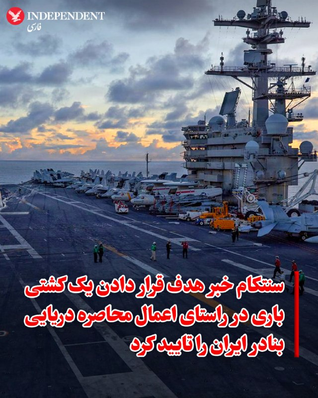

♦️ فرماندهی مرکزی آمریکا (سنتکام)، روز شنبه نهم خرداد با انتشار بیانیه‌ای رسمی تایید کرد که نیروهای ارتش این کشور در دریای عمان، یک کشتی باری با پرچم گامبیا را که قصد داشت محاصره دریایی بنادر ایران را بشکند، هدف قرار داده و زمین‌گیر کرده‌اند.

بر اساس این بیانیه، نیروهای سنتکام کشتی تجاری «لیان استار» (M/V Lian Star) را در حال حرکت به سمت یکی از بنادر ایران رصد کرده و بیش از ۲۰ بار به آن هشدار دادند که در حال نقض محاصره دریایی ایالات متحده است. در پی بی‌توجهی خدمه کشتی به این هشدارهای مکرر، یک جنگنده آمریکایی با شلیک یک فروند موشک «هل‌فایر» به اتاق موتور کشتی، این شناور را از کار انداخت و مانع از ادامه مسیر آن به سمت ایران شد.

سنتکام در پایان اشاره کرد که با وجود برقراری آتش‌بس با ایران، نیروهای آمریکایی برای اجرای کامل محاصره دریایی، تاکنون ۵ کشتی تجاری را زمین‌گیر کرده و ۱۱۶ کشتی دیگر را مجبور به تغییر مسیر کرده‌اند.
‌🇸🇦 Indypersian

🤖 @VahidOOnLine

## VahidOOnLine — post 242944

  

حبیب‌الله سیاری، معاون هماهنگ‌کننده ارتش جمهوری اسلامی گفت: «امروز نیروی دریایی و دیگر نیروهای نظامی کشور از پیشرفته‌ترین تجهیزات منطبق با فناوری‌های نوین برخوردار هستند.»

او افزود: «دشمن بداند هر گونه تعرض به خاک کشور پاسخ محکم‌تر از گذشته دریافت خواهد کرد.»
‌🏁 🇬🇧 IranintlTV

🤖 @VahidOOnLine

## VahidOOnLine — post 242943

  

سنتکام، فرماندهی مرکزی ایالات متحده آمریکا، اعلام کرد که نیروهای ارتش آمریکا پنج‌شنبه ۸ خرداد، کشتی ام‌وی لیان استار با پرچم گامبیا را که در حال حرکت به سوی یکی از بنادر ایران بود، با شلیک موشک به موتور آن از کار انداختند.

سنتکام افزود که بیش از ۲۰ بار به این کشتی هشدار و اطلاع داده شده بود که در حال نقض محاصره اعمال‌شده از سوی ایالات متحده است.

فرماندهی مرکزی ایالات متحده نوشت: «پس از آن که خدمه «لیان استار» از تبعیت از دستورات خودداری کردند، یک جنگنده آمریکایی با شلیک یک موشک هلفایر به اتاق موتور کشتی، آن را از کار انداخت. این کشتی دیگر به مسیر خود به سمت ایران ادامه نمی‌دهد.»

سنتکام در پایان نوشت: «نیروهای آمریکایی اعلام کردند که تاکنون پنج کشتی تجاری را از کار انداخته و مسیر ۱۱۶ کشتی دیگر را برای اجرای کامل محاصره تغییر داده‌اند؛ این اقدامات در حالی انجام می‌شود که آتش‌بس با جمهوری اسلامی همچنان برقرار است.»
‌🏁 🇬🇧 IranintlTV

🤖 @VahidOOnLine

## VahidOOnLine — post 242942

  

سایت هرانا گزارش داد سپیده قلیان، زندانی سیاسی، پس از پایان دوران محکومیت خود از زندان وکیل‌آباد مشهد آزاد شد. قلیان که در جریان مراسم هفتم خسرو علی‌کردی، وکیل دادگستری جان‌باخته، دستگیر شده بود، با انتشار پستی در اینستاگرام، تصویری از حضور خود بر سر مزار خسرو علی‌کردی منتشر کرد.

قلیان در این پست نوشت: «با خودم قرار گذاشته‌ام از هرچه خسته می‌شوم بشوم، اما از رسیدن به آزادی و حمل کردن این سنگ‌های سخت حقیقت «نه». برای همین رفتار داعش‌گونه جمهوری اسلامی در مراسم خسرو نباید و نمی‌تواند بگذارد که سنگ نیمه‌ تمامم در آذر ۱۴۰۱ را، زمین بگذارم.»
‌🏁 🇬🇧 IranintlTV

🤖 @VahidOOnLine

## VahidOOnLine — post 242941

  

♦️ آسمان شب یکشنبه‌شب، دهم خرداد، میزبان یک رویداد نجومی نادر به نام «ریزماه آبی» (Blue Micromoon) خواهد بود؛ پدیده‌ای که در آن، ماه کامل در دورترین فاصله خود از زمین قرار می‌گیرد و کوچک‌تر و کم‌نورتر از همیشه دیده می‌شود. علاوه بر این، ستاره درخشان «قلب‌العقرب» (Antares) نیز در این نمایش آسمانی حضور خواهد داشت.

ماه آبی زمانی رخ می‌دهد که دو ماه کامل در یک ماه میلادی شکل بگیرند (نخستین ماه کامل این ماه در ۱ مه دیده شد). از سوی دیگر، به دلیل مدار بیضوی ماه، این بار قمر زمین در فاصله ۴۰۶,۱۳۵ کیلومتری قرار دارد که باعث می‌شود ۶ درصد کوچک‌تر و ۱۰ درصد کم‌نورتر از یک ماه کامل معمولی به نظر برسد. برخلاف نامش، این ماه تغییر رنگ نخواهد داد.

نکته جذاب‌تر این رویداد، پدیده «اختفا» برای رصدگران نیم‌کره جنوبی (مانند استرالیا، نیوزیلند، شیلی و آرژانتین) است؛ جایی که ریزماه آبی برای مدتی کوتاه از مقابل ستاره غول‌پیکر سرخ «قلب‌العقرب» در صورت فلکی کژدم عبور کرده و آن را پنهان می‌کند. در سایر نقاط جهان، این ستاره سرخ در تمام طول شب در کنار ماه کامل قابل رویت خواهد بود.
‌🇸🇦 Indypersian

🤖 @VahidOOnLine

## VahidOOnLine — post 242940

  

صداوسیمای جمهوری اسلامی در گزارشی درباره تفاهم احتمالی بین تهران و واشینگتن با عنوان «جزئیات غیررسمی»، اعلام کرد آمریکا متعهد شده در طول ۶۰ روز امکان دسترسی جمهوری اسلامی به ۱۲ میلیارد دلار از دارایی‌ها را به‌گونه‌ای فراهم کند که این منابع قابلیت انتقال و هزینه‌کرد در بانک‌های مقصد را بدون محدودیت داشته باشد.

این گزارش افزود که بر اساس این تفاهم، جمهوری اسلامی مرجع انحصاری تشخیص ماهیت شناورهای عبوری است و هر شناوری که محموله آن تهدیدآمیز شناخته شود یا بهره‌بردار نهایی آن در «خصومت» با جمهوری اسلامی باشد، به عنوان کشتی تجاری شناخته نشده و اجازه عبور از مسیرهای تعریف‌شده را ندارد.

صدا و سیما تاکید کرد که این رونوشت هنوز در حکم یک تفاهم غیررسمی است چون مسیر آن همچنان در چرخه بررسی، مذاکره و بازبینی قرار دارد.
‌🏁 🇬🇧 IranintlTV

🤖 @VahidOOnLine

## VahidOOnLine — post 242939

  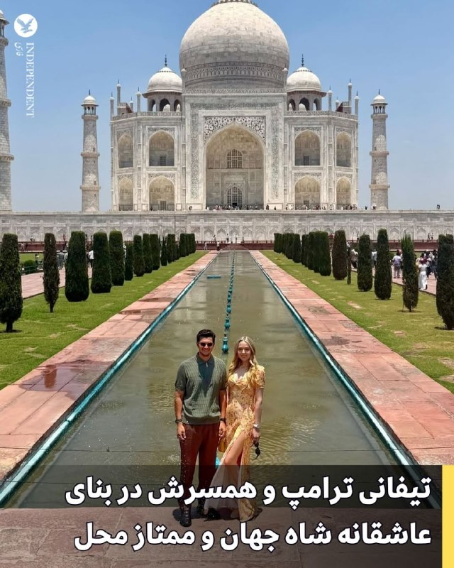

♦️ تیفانی ترامپ و همسرش مایکل بولوس تازه‌ترین چهره‌های نزدیک به خانواده دونالد ترامپ‌اند که در سفر خود به هند از تاج‌محل بازدید کردند.

این زوج که در روزهای گذشته در سفر به مقصدهای گرمسیری بودند، پس از حضور در مراسم ازدواج جزیره‌ای دونالد ترامپ جوان، برادر تیفانی، سفر خود را ادامه دادند و در ادامه به هند رفتند؛ جایی که بازدید از تاج‌محل، بنای مشهور شهر آگرا، بخشی از برنامه سفرشان بود.

چند روز پیش نیز مارکو روبیو، وزیر امور خارجه آمریکا، همراه همسرش ژانت دوسدبس، از تاج محل بازدید کرده بود.

تاج محل، از معروف‌ترین بناهای تاریخی هند، در قرن هفدهم میلادی به دستور شاه جهان، پادشاه گورکانی، ساخته شد. این آرامگاه باشکوه به یاد همسر محبوب ایرانی او، ممتاز محل، بنا شد و سال‌ها است که یکی از مهم‌ترین جاذبه‌های گردشگری هند و از شناخته‌شده‌ترین بناهای عاشقانه جهان به شمار می‌رود.
‌🇸🇦 Indypersian

🤖 @VahidOOnLine

## VahidOOnLine — post 242938

  

یدالله جوانی، معاون سیاسی سپاه پاسداران گفت: «میدان‌های ما آماده است و اگر دشمن مرتکب خطای مجددی شود، پاسخ جمهوری اسلامی محکم‌تر، قاطع‌تر و غیرقابل‌باورتر خواهد بود.»

او ادامه داد: «جمهوری اسلامی بر تنگه هرمز مسلط شده و پس از ۵۰۰ سال، به موقعیتی دست یافته که حق مسلم مردم ایران است.»

جوانی افزود: «دشمن اکنون با دو راه پیش‌رو مواجه است؛ راه بد و راه بدتر.»
‌🏁 🇬🇧 IranintlTV

🤖 @VahidOOnLine

## VahidOOnLine — post 242937

  

♦️ به گزارش نیویورک‌پست، در پی حمله موشکی جمهوری اسلامی به یک پایگاه هوایی در کویت، چند نفر از نیروهای نظامی و پیمانکاران آمریکایی مجروح شدند. این حمله در حالی رخ می‌دهد که دونالد ترامپ، رئیس‌جمهوری آمریکا، در حال ارزیابی پذیرش آخرین پیشنهاد صلح تهران یا بازگشت به شرایط جنگی است.

یک منبع مطلع روز شنبه نهم خرداد، اعلام کرد که در پی رهگیری یک موشک «فاتح-۱۱۰» توسط پدافند هوایی کویت طی ۲۴ ساعت گذشته، قطعات و ترکش‌های ناشی از انهدام موشک بر فراز پایگاه هوایی «علی السالم» فرود آمده و منجر به جراحت سطحی چند آمریکایی شده است. این حادثه همچنین خسارت شدیدی به دو پهپاد «ام‌کیو-۹ ریپر» (MQ-9 Reaper) به ارزش تقریبی ۳۰ میلیون دلار وارد کرده است.

این حمله در شرایطی صورت گرفته که دونالد ترامپ روز جمعه با تیم امنیتی خود تشکیل جلسه داد و اعلام کرد که قصد دارد تصمیم نهایی را درباره توافق با ایران اتخاذ کند؛ توافقی که شامل تمدید ۶۰ روزه آتش‌بس، بازگشایی تنگه هرمز و آغاز مذاکرات بیشتر درباره مواد هسته‌ای ایران در ازای لغو محاصره دریایی آمریکا می‌شود.
‌🇸🇦 Indypersian

🤖 @VahidOOnLine

## VahidOOnLine — post 242936

  

♦️ یک مقام مطلع آمریکایی روز شنبه نهم خرداد، به خبرگزاری اسوشیتدپرس گفت که ارتش ایالات متحده از ورود یک کشتی تجاری دیگر که قصد داشت محاصره دریایی بنادر ایران را بشکند، جلوگیری کرده است.

به گفته این مقام مسئول که خواست نامش فاش نشود، کشتی باری «لیان استار» (Lian Star) با پرچم گامبیا، بامداد امروز بدون توجه به هشدارهای مکرر نیروهای آمریکایی تلاش کرد وارد یکی از بنادر ایران شود. در پی این اقدام، جنگنده‌های ارتش آمریکا این کشتی را در دریای عمان غیرفعال (زمین‌گیر) کردند؛ این شناور اکنون بدون آنکه نیروهای آمریکایی وارد آن شده باشند، در دریا سرگردان است.

با احتساب این رویارویی جدید، ارتش آمریکا تاکنون پنج کشتی که قصد شکستن محاصره دریایی بنادر ایران را داشتند از کار انداخته‌اند.
‌🇸🇦 Indypersian

🤖 @VahidOOnLine

## VahidOOnLine — post 242935

  

مهدی محمدی، مشاور محمدباقر قالیباف نوشت: «بر خلاف عملیات روانی گسترده رسانه‌های غربی، هیچ توافقی نهایی نشده است.»
او افزود: «جمهوری اسلامی در موضع قدرت است، توافق صرفا یک تاکتیک برای خرید زمان و منابع است نه استراتژی صلح‌طلبانه، و سرنوشت نبرد را ما تعیین خواهیم کرد.»
‌🏁 🇬🇧 IranintlTV

🤖 @VahidOOnLine

## VahidOOnLine — post 242934

  

♦️ دونالد ترامپ، رئیس‌جمهوری آمریکا، روز شنبه نهم خرداد اعلام کرد که در پی انصراف تعدادی از هنرمندان، در حال بررسی لغو زنجیره کنسرت‌های گرامیداشت دویست‌وپنجاهمین سالگرد استقلال ایالات متحده و برگزاری یک سخنرانی به جای آن است.

روز جمعه، برت مایکلز، خواننده اصلی گروه راک «پویزن» (Poison)، پنجمین موسیقی‌دانی بود که از حضور در این کنسرت‌ها تحت عنوان «آزادی ۲۵۰» (Freedom 250) انصراف داد. این رویدادها قرار است از ۲۵ ژوئن تا ۱۰ ژوئیه در محوطه ملی واشنگتن برگزار شوند. پیش از این قرار بود ۹ هنرمند در این رویدادها اجرا داشته باشند اما چهار نفر از جمله مارتینا مک‌براید، بعد از آن که متوجه شدند برنامه به ترامپ مربوط است، تصمیم به انصراف گرفتند.

ترامپ در شبکه اجتماعی «تروث سوشال» نوشت که در حال بررسی گزینش یک سخنرانی و تجمع انتخاباتی به جای این کنسرت‌هاست. او خود را «جذابیت شماره یک در سراسر جهان» نامید و افزود: «من مردی هستم که جمیعت بسیار بزرگ‌تری را نسبت به دوران اوج الویس پرسلی به خود جذب می‌کند، آن هم بدون اینکه گیتاری به دست داشته باشد.»
‌🇸🇦 Indypersian

🤖 @VahidOOnLine

## VahidOOnLine — post 242933

  

♦️ قرارگاه مرکزی خاتم‌الانبیا روز شنبه، نهم خرداد، بار دیگر بر کنترل تهران بر تنگه هرمز تاکید کرد و به شناورهای تجاری و نظامی هشدار داد که از مقررات مربوط به عبور از این آبراه استراتژیک پیروی کنند.

در بیانیه این قرارگاه که در خبرگزاری تسنیم بازتاب یافت، آمده است: «مدیریت تنگه هرمز با اقتدار کامل توسط نیروهای مسلح جمهوری اسلامی ایران اعمال می‌شود.»

این قرارگاه در ادامه افزود: «تمامی کشتی‌ها، شناورهای تجاری و نفتکش‌ها موظفند صرفا از مسیرهای تعیین‌شده تردد کرده و از نیروی دریایی سپاه پاسداران انقلاب اسلامی مجوز دریافت کنند. هرگونه تخطی از این مقررات، امنیت تردد آن‌ها را به شدت به خطر خواهد انداخت.»

جمهوری اسلامی همچنین به نیروهای نظامی خارجی مستقر در منطقه هشدار داد که هرگونه تلاش برای مداخله در مدیریت دریایی یا تردد کشتیرانی، با واکنش مواجه خواهد شد.
‌🇸🇦 Indypersian

🤖 @VahidOOnLine

## WithYashar — post 12964

  

پست جدید ترامپ در تروث 🤣:

«یکی باید برای پاپ توضیح بدهد که شهردار شیکاگو کاملاً بی‌فایده است و اینکه ایران نمی‌تواند سلاح هسته‌ای داشته باشد!

رئیس‌جمهور دونالد جی. ترامپ»
@withyashar

## WithYashar — post 12963

  <a href="telegram/content/WithYashar_12963_1780173574.mp4" target="_blank">🎬 Download video</a>

شاهزاده رضا پهلوی در اودسا:
کشور من از همه طرف ضربه خورده؛ از داخل توسط همین رژیم، و از بیرون هم به خاطر پیامدهای بی‌فکری خودش. با این حال، جمهوری اسلامی هنوز سر جاشه.
بعضی‌ها توی این جمع ممکنه اینو نشونه‌ی قدرت رژیم بدونن. من اینجام بگم که اینطور نیست.
این فقط نشونه‌ی اینه که دنیا هنوز نتیجه‌ی درست از چیزی که داره می‌بینه نگرفته.
پهپاد شاهد فرقی نمی‌کنه کجا باشه؛ چه یه ساختمون مسکونی، چه یه میدان اعتراض تو تهران، چه دفترهای تجاری تو دبی.
پهپادهایی که آسمون شهرهای اوکراین رو تاریک کردن، توی همون کارخانه‌هایی ساخته شدن که زیر نظر همون رژیمی هستن که توی تهران برای شکار معترض‌ها، توی خیابون‌ها پهپادهای نظارتی فرستاد.
@withyashar

## WithYashar — post 12962

پست جدید بوگاتی شاه https://www.instagram.com/reel/DY-ObumIJEK/?igsh=MjQ5cGt6dWo0dGg= کارای اداریش رو انجام بدید 💥

## WithYashar — post 12961

در پی حملات سنگین حزب‌الله، به بیمارستانی در شهر نهاریا در شمال اسرائیل دستور داده شد تا بیماران را به تأسیسات زیرزمینی منتقل کند.
@withyashar

## WithYashar — post 12960

شاهزاده رضا پهلوی: با جمهوری اسلامی توافق نکنید، بلکه به آن پایان دهید.
@withyashar

## WithYashar — post 12959

جلسه کمپ دیوید که قرار بود امروز برگزار شود ترامپ اعلام کرد: جلسه کابینه به دلیل شرایط آب و هوایی در کاخ سفید برگزار خواهد شد، نه در کمپ دیوید! حالا صحبت‌هایی هست که کمپ دیوید یک تله برای شناسایی فردی بود که اطلاعات را نشت می‌داد ! فرد مورد نظر گیر افتاد !…

## WithYashar — post 12958

  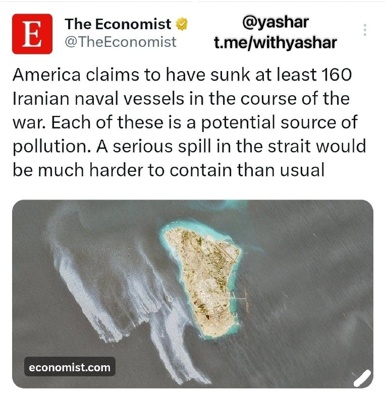

به ادعای آمریکا در جریان این جنگ، دست‌کم ۱۶۰ شناور دریایی ایران را غرق کرده است. هر یک از این شناورها می‌تواند منبعی بالقوه برای آلودگی باشد. وقوع یک نشت جدی در تنگه، مهار آن را بسیار دشوارتر از حالت معمول خواهد کرد
@withyashar

## WithYashar — post 12957

## WithYashar — post 12956

یاشار امشب ردبول رومی خوری؟

## WithYashar — post 12955

سنتکام اعلام کرد کشتی تجاری Lian Star که از یک بندر ایران خارج شده بود پس از 20 هشدار توقف و عدم توجه آن توسط یک هواپیمای آمریکایی با شلیک موشک هلفایر به اتاق موتور کشتی، آن را از کار انداخت و در دریای عمان توقیف شد.
@withyashar

## WithYashar — post 12954

پست جدید بوگاتی شاه

https://www.instagram.com/reel/DY-ObumIJEK/?igsh=MjQ5cGt6dWo0dGg=
کارای اداریش رو انجام بدید 💥

## WithYashar — post 12952

صداوسیما جزئیات غیررسمی از یادداشت تفاهم (ایران و آمریکا) را منتشر کرد
‌
یکی از مهمترین محورهای توافق (ایران و آمریکا) بازتعریف قواعد عبور و مرور در تنگه هرمز است

‌ایران مرجع انحصاری تشخیص ماهیت شناورهای عبوری است

هر شناوری که محموله آن تهدید آمیز تلقی شود یا بهره‌بردار نهایی آن در خصومت با ایران باشد به عنوان کشتی تجاری شناخته نمی‌شود و اجازه عبور از مسیرهای تعریف شده را ندارد

تعیین مسیر حرکت و تعیین هزینه خدمات ناوبری در حوزه تصمیم‌گیری ایران دیده شده
‌
هر شناور موظف است اطلاعاتش را در اختیار مرکز مرتبط با نیروی دریایی قرار دهد و فرم‌هایی شامل جزئیات محموله مالکیت و مقصد را تکمیل کند
@withyashar

## WithYashar — post 12951

الجزیره: ترامپ برای جلوگیری از جنگ با ایران پیش از جام جهانی بسیار مصمم است

او همچنان برای دستیابی به یک توافق موقت با تهران تحت فشار است، اما پیشرفت فوری بعید به نظر می‌رسد
@withyashar

## WithYashar — post 12950

شبکه ۱۴ اسرائیل : نتانیاهو، قراره به‌زودی یه جلسه امنیتی برگزار کنه تا درباره نحوه پاسخ به شدت گرفتن حملات حزب‌الله تصمیم بگیره
@withyashar

## WithYashar — post 12949

## WithYashar — post 12948

## WithYashar — post 12947

🌊

## WithYashar — post 12946

درود میشه یکم ویس بدی دلمون گرفت :)❤️

## WithYashar — post 12945

  

ترامپ: پنج مرحله سندروم ترامپ هراسی
@withyashar

## mwarmonitor — post 9923

  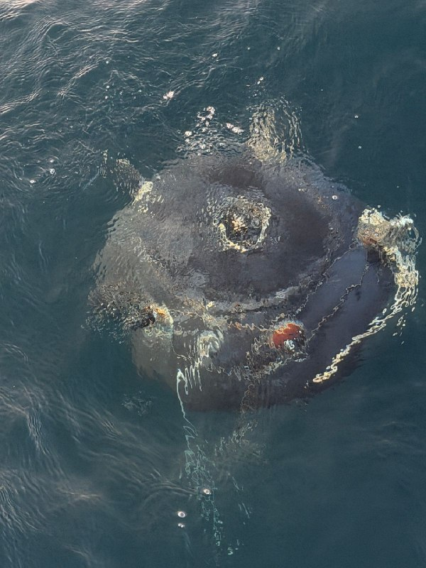

🔴یک مین دریایی در آب‌های سرزمینی عمان در Strait of Hormuz مشاهده شده است. 🔹این موضوع مسیر آبی‌ای را که آمریکا برای اسکورت مخفیانه کشتی‌ها از آن استفاده می‌کرد، مسدود می‌کند. @mwarmonitor

## mwarmonitor — post 9922

🔴 یک مقام آمریکایی: یک کشتی تجاری که تلاش داشت به سمت یک بندر ایرانی حرکت کند، متوقف شد. 🔸این نفتکش/کشتی با نام «لیان استار» هشدارهای نیروهای دریایی ما در خلیج عمان را نادیده گرفته بود. @mwarmonitor

## mwarmonitor — post 9921

🔴«جناح تندرو در ایران، گروهی حاشیه‌ای اما پرسر و صدا که اعضایی در مجلس و یک کرسی در شورای عالی امنیت ملی دارد، به‌طور علنی با هرگونه امتیازدهی به واشینگتن مخالفت کرده و با استفاده از تجمع‌ها، رسانه‌های دولتی و فشارهای پشت‌پرده تلاش می‌کند یک توافق را به شکست بکشاند.» وال‌استریت ژورنال

@mwarmonitor

## FoxNewsTwitter — post 342433

  

Fox News (Twitter/X)

Spencer Pratt keeps blasting his celebrity critics.

The Los Angeles mayoral candidate responded after 'Hacks' star Hannah Einbinder claimed money was the key issue for a lot of his supporters.

"She's in an elite minority and the rest of us want change," Pratt said.

## FoxNewsTwitter — post 342432

  <a href="telegram/content/FoxNewsTwitter_342432_1780173581.mp4" target="_blank">🎬 Download video</a>

Fox News (Twitter/X)

Grab your tissues — you're going to need them.

Footage from a high school graduation in Milwaukee captures the emotional moment a U.S. military specialist reunites with her brother after more than a year apart, as she personally hands him his diploma after serving overseas during the conflict in Iran.

## pm_afshaa — post 91913

  <a href="telegram/content/pm_afshaa_91913_1780173583.mp4" target="_blank">🎬 Download video</a>

شاهزاده رضا پهلوی در اودسا:
محور مسکو-تهران، محور خصمانه تعیین‌کننده دوران ما است. باید با همان انسجام، همان اراده و همان همبستگی فراآتلانتیکی که بهترین دوران غرب را تعریف می‌کند، با آن مقابله کرد.

اوکراین با هزینه‌ای بسیار سنگین خط مقاومت را حفظ کرده است. ایران نیز هزینه‌ای عظیم می‌پردازد تا آزاد شود. جهان آزاد دلایل اخلاقی، راهبردی و تاریخی دارد که در کنار هر دو بایستد.

با محور هرج‌ومرج مذاکره نکنید. با آن مقابله کنید.

جمهوری اسلامی را مدیریت نکنید. آن را پایان دهید. منتظر لحظه‌ای بهتر نباشید. این لحظه است. من منتظر نیستم. مردم ایران منتظر نیستند.

💧 Rainbet.com the #1 Non-KYC Crypto Casino & Sportsbook @rainbetcom

😁 @Pm_Afshaa

## pm_afshaa — post 91912

  <a href="telegram/content/pm_afshaa_91912_1780173586.mp4" target="_blank">🎬 Download video</a>

شاهزاده رضا پهلوی در اودسا:
از من پرسیده‌اند که آیا نگران دوام جمهوری اسلامی هستم یا خیر. آیا بقا ادامه‌دار رژیم باید انتظارات را تعدیل کند.

پاسخ من منفی است — من رژیمی را می‌بینم که در ژانویه از عوامل حزب‌الله و شبه‌نظامیان عراقی و افغان برای سرکوب مردم خود استفاده کرد، نه به این دلیل که قوی بود، بلکه به این دلیل که دیگر نمی‌شد به نیروهای امنیتی خود برای تیراندازی به شهروندان ایرانی اعتماد کامل داشت.

من یک مجموعه نظامی و اطلاعاتی را می‌بینم که دفاع‌های بیرونی آن در معرض آسیب و تضعیف قرار گرفته است.

جمهوری اسلامی قوی‌تر از یک سال پیش نیست. توخالی‌تر شده است. نمای ظاهری هنوز پابرجاست، اما ساختار پشت آن نیست.

آنچه اکنون لازم است، صبر با رژیم نیست. فوریت در حمایت از مردمی است که علیه آن قیام کرده‌اند.

💧Rainbet.com the #1 Non-KYC Crypto Casino & Sportsbook @rainbetcom

😁 @Pm_Afshaa

## pm_afshaa — post 91911

  <a href="telegram/content/pm_afshaa_91911_1780173589.mp4" target="_blank">🎬 Download video</a>

شاهزاده رضا پهلوی در اودسا:
اوکراین دموکراتیکی که پایدار بماند، چراغ راهی برای هر مردمی است که تحت تجاوز خارجی قرار دارند.

ایران دموکراتیکی که برخیزد، چراغ راهی برای هر مردمی است که زیر ظلم تئوکراتیک زندگی می‌کنند. هر یک از پیروزی‌های ما دیگری را تقویت می‌کند. هر یک از شکست‌های ما نیروهای مشابه را جسورتر می‌سازد.

به همین دلیل من خواستار ائتلافی فراآتلانتیکی هستم، نه فقط برای حمایت از اوکراین و نه فقط برای فشار بر جمهوری اسلامی، بلکه برای مقابله با محور مسکو-تهران به عنوان وسیله‌ای برای اجرای هماهنگ تحریم‌ها که اجازه نمی‌دهد یک طرف محور فشار بر طرف دیگر را جبران کند.

💧 Rainbet.com the #1 Non-KYC Crypto Casino & Sportsbook @rainbetcom

😁 @Pm_Afshaa

## pm_afshaa — post 91910

  <a href="telegram/content/pm_afshaa_91910_1780173591.mp4" target="_blank">🎬 Download video</a>

شاهزاده رضا پهلوی در اودسا:
تهران و مسکو تنها هم‌راستا نیستند. آن‌ها فقط شرکای موقتی راحت نیستند. آن‌ها هم‌معماران هرج‌ومرج هستند.

دکترین آن‌ها این است که نظم بین‌المللی مبتنی بر قوانین تحمیل غرب است که باید برچیده شود، مرزها صرفاً پیشنهاد هستند، حاکمیت متعلق به قدرتمندان است، هرچقدر هم شرور باشند، و نه به مردم، هرچقدر هم درستکار باشند. دموکراسی‌ها ذاتاً ضعیف هستند و می‌توان آن‌ها را مجبور به تسلیم کرد.

این محور جدیدی نیست. جمهوری اسلامی ۴۷ سال است که نسخه خود از این جنگ را علیه مردم ایران به راه انداخته است. ابتدا علیه مردم خود، سپس علیه همسایگانش، و سپس علیه هر نظمی که آن را محدود کند.

روسیه دهه‌هاست که نسخه خود از این جنگ را علیه دموکرات‌های خود، علیه گرجستان، و به طور مشترک با جمهوری اسلامی علیه سوریه و اوکراین به راه انداخته است.

آنچه تغییر کرده این است که آن‌ها دیگر به طور موازی عمل نمی‌کنند. آن‌ها با هم، هماهنگ و جسورانه عمل می‌کنند.

💧Rainbet.com the #1 Non-KYC Crypto Casino & Sportsbook @rainbetcom

😁 @Pm_Afshaa

## pm_afshaa — post 91909

  <a href="telegram/content/pm_afshaa_91909_1780173594.mp4" target="_blank">🎬 Download video</a>

شاهزاده رضا پهلوی در اودسا:
کشور من از هر سو مورد ضربه قرار گرفته است، از سوی رژیم داخلی و همچنین به دلیل پیامدهای بی‌مبالاتی خود رژیم از بیرون. و با این حال، جمهوری اسلامی هنوز پابرجاست.

برخی در این جمع ممکن است این را نشانه‌ای از مقاومت رژیم تفسیر کنند. من اینجا هستم تا به شما بگویم که اینطور نیست.

این نشانه‌ای است از شکست جهان در گرفتن نتیجه‌گیری‌های درست از آنچه می‌بیند. این نشانه‌ای است که جهان آزاد هنوز درک نکرده است که واقعاً برای چه می‌جنگد یا وقتی این جنگ پیروز شود، چه چیزی از آن به دست خواهد آورد.

💧 Rainbet.com the #1 Non-KYC Crypto Casino & Sportsbook @rainbetcom

😁 @Pm_Afshaa

## pm_afshaa — post 91908

🟠سنتکام از حمله موشکی به موتور خانه یک ابر نفتکش ایرانی حامل نفت در دریای عمان خبر داد

💧 Rainbet.com the #1 Non-KYC Crypto Casino & Sportsbook @rainbetcom

😁 @Pm_Afshaa

## pm_afshaa — post 91907

پاریسی‌ها قهرمان لیگ قهرمانان اروپا در فصل ۲۰۲۵-۲۰۲۶ شدن.
پاریسن‌ژرمن 1 - 1 آرسنال
پنالتی: 4 - 3

💧Rainbet.com the #1 Non-KYC Crypto Casino & Sportsbook @rainbetcom

😁 @Pm_Afshaa

## pm_afshaa — post 91906

  <a href="telegram/content/pm_afshaa_91906_1780173597.webm" target="_blank">🎬 Download video</a>

🔴آسوشیتدپرس:
نیروهای آمریکا یک کشتی که قصد ورود به بنادر ایران رو داشت، از کار انداختن.

💧 Rainbet.com the #1 Non-KYC Crypto Casino & Sportsbook @rainbetcom

😁 @Pm_Afshaa

## pm_afshaa — post 91905

🔴سخنگوی دولت: دولت پول بازسازی خونه هایی که تو جنگ تخریب شده رو نمیده. ولی بهتون مجوز میدیم تا خونتون رو بازسازی کنید

💧 Rainbet.com the #1 Non-KYC Crypto Casino & Sportsbook @rainbetcom

😁 @Pm_Afshaa

## pm_afshaa — post 91904

  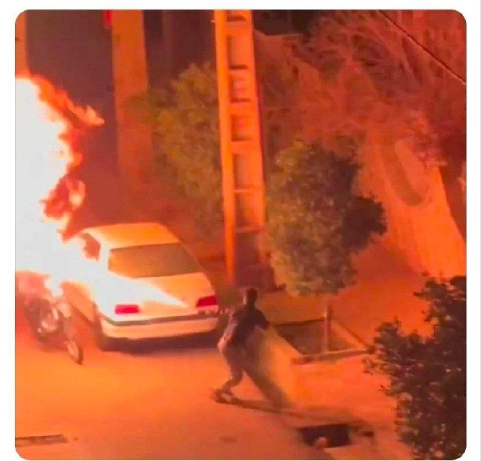

بنیامین نقدی به اعدام محکوم شد

💧 Rainbet.com the #1 Non-KYC Crypto Casino & Sportsbook @rainbetcom

😁 @Pm_Afshaa

## pm_afshaa — post 91903

🔴یک مقام ارشد آمریکایی: دیدار رئیس‌جمهور ایالات متحده دونالد ترامپ در اتاق عملیات حدود دو ساعت طول کشید، اما هنوز تصمیمی درباره توافق با ایران گرفته نشده است. در دولت معتقدند که به توافق نزدیک هستند، اما هنوز مسائل اختلافی باقی مانده

💧 Rainbet.com the #1 Non-KYC Crypto Casino & Sportsbook @rainbetcom

😁 @Pm_Afshaa

## pm_afshaa — post 91902

🔴شاهزاده رضا پهلوی:مردم ایران باید از طریق هوا حفاظت بشن و اینترنت و دیگر ابزار لازم رو داشته باشن که دست به‌کار بشن و رژیم رو به زانو بیارن

💧 Rainbet.com the #1 Non-KYC Crypto Casino & Sportsbook @rainbetcom

😁 @Pm_Afshaa

## iaghapour — post 2645

  

🚀 سرور ابری رو از هر جای دنیا و با هر ارزی که دوست داری بخر!

🌍 دیگه نیازی نیست برای خرید سرور از دیتاسنترهای معتبر جهانی دغدغه پرداخت یا محدودیت لوکیشن داشته باشی. در دوپراکس (Doprax)، بهترین زیرساخت‌های ابری دنیا در یک پنل اختصاصی زیر دست شماست!

با دوپراکس می‌تونی از غول‌های تکنولوژی مثل Google Cloud, DigitalOcean, Hetzner, Vultr و چندین پروایدر دیگر، سرور تهیه کنی.

✨ چرا دوپراکس بهترین انتخاب شماست؟
📍 تنوع لوکیشن: دسترسی به ده‌ها لوکیشن مختلف در اروپا، آمریکا، آسیا.
💳 پرداخت بدون مرز: امکان پرداخت آسان با ریال و یا رمزارز.
⏱️ پرداخت ساعتی: فقط به اندازه‌ای که مصرف می‌کنی پول بده!
🔄 امکان تعویض IP: قابلیت تغییر آی‌پی در اکثر دیتاسنترها.

همین حالا وارد سایت شو و اولین سرورت رو با کانفیگ دلخواهت بساز 👇

🌐 وب‌سایت: www.doprax.com

💬 پشتیبانی و اخبار در کانال ما:
@dopraxcloud

## iaghapour — post 2644

  <a href="https://t.me/iaghapour/2644" target="_blank">📎 Download file</a>

🟢 لیست آی‌پی ها و فایل html مربوط به ویدیو ساخت فیلترشکن پرسرعت و رایگان با ورکر کلودفلر

🆔@iaghapour

## DEJradio — post 5163

  <a href="telegram/content/DEJradio_5163_1780173600.mp4" target="_blank">🎬 Download video</a>

👑
🔺 تجمع ایرانیان مقیم کلن در آلمان در حمایت از انقلاب شیروخورشید و جاویدنامان راه آزادی

#همبستگی #جاویدنامان #کلن
@DEJradio

## DEJradio — post 5162

  <a href="telegram/content/DEJradio_5162_1780173603.mp4" target="_blank">🎬 Download video</a>

🚨🎥 پرواز جنگنده‌های نهاجا بر فراز تهران و کرج

#جنگنده #جنگ
@DEJradio

## DEJradio — post 5161

  <a href="telegram/content/DEJradio_5161_1780173605.mp4" target="_blank">🎬 Download video</a>

👑
🔺 حمایت هم‌میهنان ساکن اسپانیا از انقلاب شیر و خورشید؛
"بوی نفت ارزان نمی‌گذارد بوی خون مردم ایران به مشام شما برسد!

#همبستگی #اسپانیا
@DEJradio

## DEJradio — post 5160

  <a href="telegram/content/DEJradio_5160_1780173608.webm" target="_blank">🎬 Download video</a>

👑
🚨 ترجمه زیرنویس سخنرانی شاهزاده رضا پهلوی در نشست امنیتی «دریای سیاه» در اودسا - اوکراین

#شاهزاده_رضا_پهلوی #اودسا #نشست_امنیتی_دریای_سیاه

@DEJradio

## DEJradio — post 5159

  <a href="telegram/content/DEJradio_5159_1780173609.mp4" target="_blank">🎬 Download video</a>

🚨
🔸 خبر ۲۱
شنبه ۹ خرداد ۱۴۰۵

#خبر۲۱
@DEJradio

## DEJradio — post 5158

  <a href="telegram/content/DEJradio_5158_1780173612.webm" target="_blank">🎬 Download video</a>

🔺🎤 تکنیک های کاهش اضطراب

گفت‌وگو با دکتر مصطفی میررمضانی، روانپزشک و روان‌درمانگر

#کاهش_اضطراب #اضطراب
@DEJradio

## VahidOnline — post 75807

  

ستاد فرماندهی مرکزی ارتش آمریکا، سنتکام، اعلام کرد نیروهای این کشور یک کشتی تجاری با پرچم گامبیا را که به گفته واشینگتن در نقض محاصره دریایی به سمت یکی از بنادر ایران در حرکت بود، در خلیج عمان هدف قرار داده و از ادامه مسیر آن جلوگیری کرده‌اند.

سنتکام روز شنبه نهم خرداد در بیانیه‌ای گفت نیروهای آمریکایی روز هشتم خرداد کشتی «لیان استار» را هنگام حرکت در آب‌های بین‌المللی به سوی یکی از بنادر ایران شناسایی کردند و بیش از ۲۰ بار به خدمه آن هشدار دادند.

به گفته این نهاد نظامی، پس از آنکه خدمه کشتی به هشدارها توجه نکردند، یک هواپیمای آمریکایی با شلیک موشک هلفایر به اتاق موتور کشتی، آن را از کار انداخت.

سنتکام افزود این کشتی دیگر به سمت ایران در حرکت نیست.

در این بیانیه آمده است که از زمان اجرای محاصره دریایی علیه ایران، نیروهای آمریکایی پنج کشتی تجاری را از کار انداخته و ۱۱۶ کشتی دیگر را وادار به تغییر مسیر کرده‌اند.

سنتکام جزئیات بیشتری درباره محموله کشتی یا مقصد دقیق آن در ایران ارائه نکرده است.
@VahidHeadline

📡 @VahidOnline

## VahidOnline — post 75806

  

صداوسیمای جمهوری اسلامی در گزارشی درباره تفاهم احتمالی بین تهران و واشینگتن با عنوان «جزئیات غیررسمی»، اعلام کرد آمریکا متعهد شده در طول ۶۰ روز امکان دسترسی جمهوری اسلامی به ۱۲ میلیارد دلار از دارایی‌ها را به‌گونه‌ای فراهم کند که این منابع قابلیت انتقال و هزینه‌کرد در بانک‌های مقصد را بدون محدودیت داشته باشد.

این گزارش افزود که بر اساس این تفاهم، جمهوری اسلامی مرجع انحصاری تشخیص ماهیت شناورهای عبوری است و هر شناوری که محموله آن تهدیدآمیز شناخته شود یا بهره‌بردار نهایی آن در «خصومت» با جمهوری اسلامی باشد، به عنوان کشتی تجاری شناخته نشده و اجازه عبور از مسیرهای تعریف‌شده را ندارد.

صدا و سیما تاکید کرد که این رونوشت هنوز در حکم یک تفاهم غیررسمی است چون مسیر آن همچنان در چرخه بررسی، مذاکره و بازبینی قرار دارد.
@VahidOOnLine

📡 @VahidOnline

## VahidOnline — post 75805

  

♦️ به گزارش نیویورک‌پست، در پی حمله موشکی جمهوری اسلامی به یک پایگاه هوایی در کویت، چند نفر از نیروهای نظامی و پیمانکاران آمریکایی مجروح شدند. این حمله در حالی رخ می‌دهد که دونالد ترامپ، رئیس‌جمهوری آمریکا، در حال ارزیابی پذیرش آخرین پیشنهاد صلح تهران یا بازگشت به شرایط جنگی است.

یک منبع مطلع روز شنبه نهم خرداد، اعلام کرد که در پی رهگیری یک موشک «فاتح-۱۱۰» توسط پدافند هوایی کویت طی ۲۴ ساعت گذشته، قطعات و ترکش‌های ناشی از انهدام موشک بر فراز پایگاه هوایی «علی السالم» فرود آمده و منجر به جراحت سطحی چند آمریکایی شده است. این حادثه همچنین خسارت شدیدی به دو پهپاد «ام‌کیو-۹ ریپر» (MQ-9 Reaper) به ارزش تقریبی ۳۰ میلیون دلار وارد کرده است.

این حمله در شرایطی صورت گرفته که دونالد ترامپ روز جمعه با تیم امنیتی خود تشکیل جلسه داد و اعلام کرد که قصد دارد تصمیم نهایی را درباره توافق با ایران اتخاذ کند؛ توافقی که شامل تمدید ۶۰ روزه آتش‌بس، بازگشایی تنگه هرمز و آغاز مذاکرات بیشتر درباره مواد هسته‌ای ایران در ازای لغو محاصره دریایی آمریکا می‌شود.
@VahidOOnLine

📡 @VahidOnline

## IranIntlTV — post 339791

  

عباس گلرو، عضو کمیسیون امنیت ملی مجلس گفت: «در حال سوال اصلی این است که آیا می‌توان به آمریکا اعتماد کرد، پاسخ روشن است، خیر. آیا می‌توان با آمریکا به تفاهم پایدار رسید، پاسخ این نیز خیر است.»

او افزود: «ما همه سرنشین یک کشتی هستیم و باید به تصمیم‌های اتخاذشده در ساختار نظام اعتماد داشته باشیم.»

او ادامه داد: «هیچ مقطعی را به اندازه امروز، زمان برافراشته بودن پرچم جمهوری اسلامی در منطقه و جهان ندیده‌ام.»
https://iranintl.com/202605305812

## IranIntlTV — post 339790

  <a href="telegram/content/IranIntlTV_339790_1780173616.mp4" target="_blank">🎬 Download video</a>

سیامک آرام، برگزارکننده تجمع ایرانیان در واشینگتن، به ایران‌اینترنشنال گفت: «مبارزه یک ماراتن است و ما سنگر به سنگر پیش می‌رویم تا جمهوری اسلامی شر خود را از سرزمین ایران کم کند.»

او افزود: «در مذاکرات و تحولات سیاسی جهانی، اغلب نامی از اپوزیسیون، حقوق بشر و مطالبات مردم برده نمی‌شود و وظیفه ما این است که نگذاریم این مسائل از دستور کار افکار عمومی خارج شوند.»
@iranintltv

## IranIntlTV — post 339789

  <a href="telegram/content/IranIntlTV_339789_1780173619.mp4" target="_blank">🎬 Download video</a>

سعید آجرلو، عضو تیم رسانه‌ای مذاکره‌کننده جمهوری اسلامی، گفت در صورت تایید متن نهایی تفاهم‌ [با آمریکا]، گفت‌وگوهای ۶۰ روزه درباره جزئیات آغاز می‌شود. او افزود اگر طرف مقابل به تعهداتش، از جمله درباره ۱۲ میلیارد دلار، عمل نکند، جمهوری اسلامی می‌تواند از توافق خارج شود.

## IranIntlTV — post 339788

  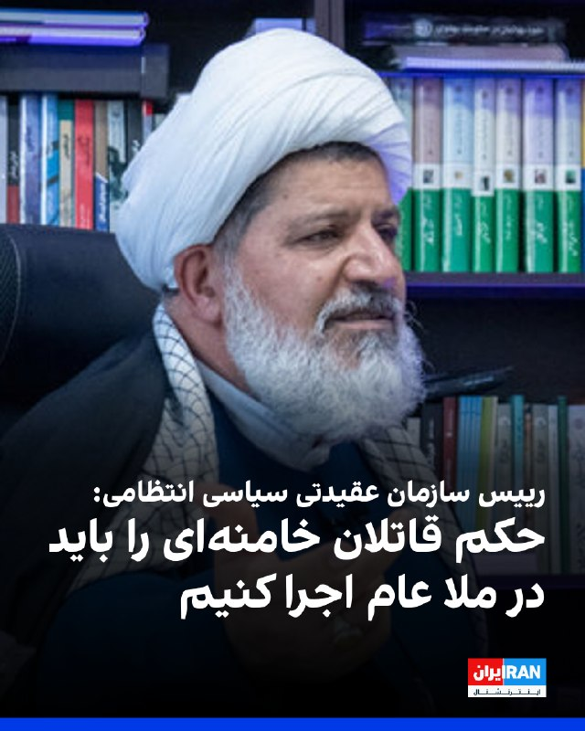

علی شیرازی، رییس سازمان عقیدتی سیاسی انتظامی گفت: «بر عهد خود برای تداوم راه ولایت و مطالبه انتقام سخت از عاملان به شهادت رساندن رهبرمان پایبندیم.»

او افزود: «نهادهای مسئول باید پیگیری حقوقی و بین‌المللی این جنایت را در اولویت قرار داده و حکم الهی برای قاتلان امام شهید را در ملاعام اجرا کنند.»

شیرازی ادامه داد: «ملت ما تا زمان قصاص قاتلان امام خود و خروج کامل استکبار از منطقه، میدان‌های مبارزه را ترک نخواهند کرد.»
https://iranintl.com/202605304918

## IranIntlTV — post 339787

  <a href="telegram/content/IranIntlTV_339787_1780173621.mp4" target="_blank">🎬 Download video</a>

بنای یادبود لینکلن در واشینگتن میزبان تجمع ایرانیان و حامیان غیرایرانی جنبش دادخواهی بود.

این گردهمایی در گرامی‌داشت جان‌باختگان و در اعتراض به ادامه اعدام‌ها و سرکوب در ایران برگزار شد.

گزارش اردوان روزبه، خبرنگار ایران‌اینترنشنال و گفت‌وگو با سیامک آرام، برگزارکننده، و یکی از شرکت‌کنندگان
@iranintltv

## IranIntlTV — post 339786

  <a href="telegram/content/IranIntlTV_339786_1780173624.mp4" target="_blank">🎬 Download video</a>

در ادامه صدور احکام سنگین برای معترضان و زندانیان سیاسی، حکم اعدام بنیامین نقدی، از معترضان دی‌ماه، به اتهام «افساد فی‌الارض» صادر شده است. هم‌زمان، گزارش‌ها از تایید حکم اعدام رئوف شیخ‌معروفی و محمد فرجی، از بازداشت‌شدگان جنبش «زن، زندگی، آزادی»، در دیوان عالی کشور حکایت دارد.

جزییات بیشتر با پگاه بنی‌هاشمی، پژوهشگر ارشد حقوق
@iranintltv

## IranIntlTV — post 339785

  

نشریه هیل نوشت ثبات واقعی در خلیج فارس مستلزم از بین بردن توانایی رژیم ایران برای تهدید تجارت جهانی، اعمال فشار بر همسایگان و گروگان گرفتن بازارهای انرژی است. هر چیزی کمتر از این، صرفا وقفه‌ای کوتاه پیش از رویارویی بسیار خطرناک‌تری خواهد بود.

آریل کوهن، پژوهشگر شورای آتلانتیک و نویسنده این تحلیل نوشته نقشه راهبردی خاورمیانه در حال تغییر است و به نظر می‌رسد نفوذ آمریکا در این منطقه رو به کاهش باشد.

او با اشاره به نزدیک شدن تهران و واشینگتن به یک توافق نوشته است برای کسانی که دهه‌هاست این منطقه را مطالعه می‌کنند، این وضعیت نمونه‌ای از «ربودن شکست از آغوش پیروزی» به نظر می‌رسد.

او در ادامه نوشته است تعیین اهداف روشن جنگی، پیش‌شرط ضروری پیروزی نظامی است. همان‌گونه که رییس‌جمهوری و وزیر خارجه آمریکا اعلام کرده‌اند، اهداف واشینگتن در این درگیری روشن بود: جلوگیری از دستیابی جمهوری اسلامی به سلاح هسته‌ای، تضعیف توان موشک‌های بالستیک ایران، و برچیدن یا دست‌کم تضعیف شبکه نیروهای نیابتی که تهران برای اعمال نفوذ در خاورمیانه ایجاد کرده است؛ از حماس در غزه و حزب‌الله در لبنان گرفته تا حوثی‌ها در یمن.
https://iranin

## IranIntlTV — post 339784

  <a href="https://t.me/IranintlTV/339784" target="_blank">📎 Download file</a>

🎧نسخه صوتی چشم‌انداز: آیا اسرائیل از توافق ترامپ و جمهوری اسلامی پیروی می‌کند؟!
@iranintlTV

## IranIntlTV — post 339783

  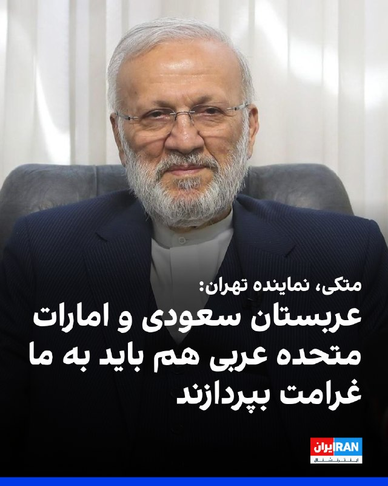

منوچهر متکی، نماینده تهران در مجلس، در یک برنامه تلویزیونی گفت که آمریکایی‌ها هیچ نشانه‌ای از پذیرفتن شروط جمهوری اسلامی از خود نشان نداده‌اند.

متکی اضافه کرد: «علاوه بر آمریکا، کشورهای عربستان سعودی و امارات متحده عربی هم باید به ما غرامت بپردازند.»

او ادامه داد: «ترامپ ممکن است در میانه ۶۰ روز هم بازی دربیارود. یکی از محورهای اصلی ما در مذاکرات، دریافت غرامت است.»

او افزود: «پاکستانی‌ها باید مراقب باشند، شاید آمریکا کاری را که با پادشاه پیشین عمان انجام داد با پاکستان هم انجام دهد. در آن زمان خواستند عمان نامه‌ای به جمهوری اسلامی تحویل دهد و بعد ادعا کردند که ما چنین نامه‌ای ندادیم.
https://iranintl.com/202605300571

## IranIntlTV — post 339782

  <a href="telegram/content/IranIntlTV_339782_1780173629.mp4" target="_blank">🎬 Download video</a>

آیا اسرائیل از توافق ترامپ و جمهوری اسلامی پیروی می‌کند؟!

«چشم‌انداز با مهدی مهدوی‌آزاد»

تماشای نسخه کامل این برنامه در یوتیوب:
https://youtu.be/QmU1ZoGEThE

@iranintltv

## IranIntlTV — post 339781

  

🔻تیم فوتبال پاری‌سن‌ژرمن در فینال لیگ قهرمانان اروپا، آرسنال را شکست داد و برای دومین فصل پیاپی، قهرمان اروپا شد. این بازی در وقت قانونی و اضافه به تساوی یک - یک رسید.

🔹تک گل آرسنال را کای هاورتز (۵) و گل پاری‌سن‌ژرمن را عثمان دمبله (۶۵) از روی نقطه پنالتی به ثمر رساندند.

🔹در نهایت پاری‌سن‌ژرمن در ضربات پنالتی، با نتیجه چهار بر سه، توپچی‌ها را شکست داد و قهرمان اروپا شد.

🔹برای اولین بار از سال ۲۰۱۶ فینال لیگ قهرمانان به وقت‌های اضافه کشیده شد.

@iranintltvsport

## IranIntlTV — post 339780

  <a href="telegram/content/IranIntlTV_339780_1780173632.mp4" target="_blank">🎬 Download video</a>

قرارگاه مرکزی خاتم‌الانبیا اعلام کرد کشتی‌ها، شناورهای تجاری و نفتکش‌ها برای عبور از تنگه هرمز باید از مسیرهای تعیین‌شده تردد کرده و مجوز نیروی دریایی سپاه پاسداران را دریافت کنند. هم‌زمان، عمان درباره یک جسم شناور مشکوک به مین دریایی در تنگه هرمز هشدار داد و بریتانیا نیز سطح تهدید دریایی در خلیج فارس، تنگه هرمز و دریای عمان را «بحرانی» توصیف کرد.
گفت‌وگو با حسین علیزاده، تحلیل‌گر مسایل بین‌الملل
@iranintltv

## IranIntlTV — post 339779

  <a href="telegram/content/IranIntlTV_339779_1780173635.mp4" target="_blank">🎬 Download video</a>

مهدی مهدوی‌آزاد در برنامه «چشم‌انداز» می‌گوید نقش اسرائیل در سرنوشت مذاکرات جمهوری اسلامی و آمریکا حتی از کشورهای عربی منطقه نیز پررنگ‌تر است.
او با طرح سناریوهای مختلف پیش روی مذاکرات، تاکید می‌کند که پرسش کلیدی این است که در صورت دستیابی تهران و واشینگتن به توافق، اسرائیل چه واکنشی نشان خواهد داد؛ آیا مسیر توافق را می‌پذیرد یا با اقداماتی مستقل، معادلات را تغییر می‌دهد؟
@iranintltv

## IranIntlTV — post 339778

  

حبیب‌الله سیاری، معاون هماهنگ‌کننده ارتش جمهوری اسلامی گفت: «امروز نیروی دریایی و دیگر نیروهای نظامی کشور از پیشرفته‌ترین تجهیزات منطبق با فناوری‌های نوین برخوردار هستند.»

او افزود: «دشمن بداند هر گونه تعرض به خاک کشور پاسخ محکم‌تر از گذشته دریافت خواهد کرد.»
https://iranintl.com/202605301314

## IranIntlTV — post 339777

  <a href="telegram/content/IranIntlTV_339777_1780173638.mp4" target="_blank">🎬 Download video</a>

🔻امیر قلعه‌نویی، سرمربی تیم ملی فوتبال، ۱۰ روز پیش از جام جهانی در گفتگویی با خبرنگاران در ترکیه گفت که هیچ کدام از برنامه‌هایش برای آماده‌سازی تیم برای حضور در جام جهانی ۲۰۲۶، انجام نشده است.

@iranintltvsport

## IranIntlTV — post 339776

  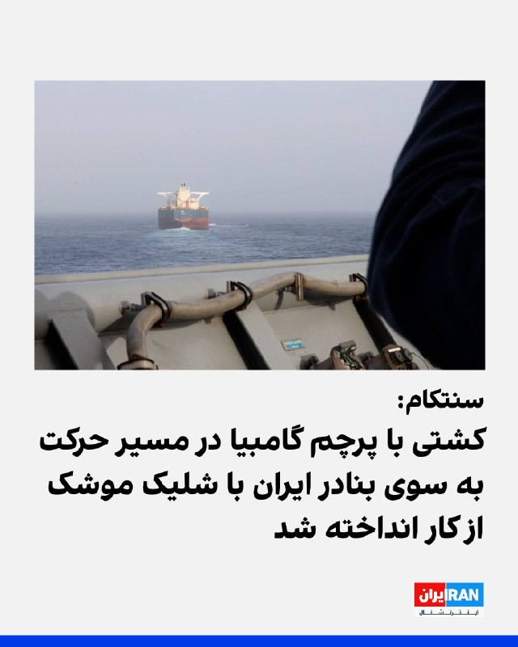

سنتکام، فرماندهی مرکزی ایالات متحده آمریکا، اعلام کرد که نیروهای ارتش آمریکا پنج‌شنبه ۸ خرداد، کشتی ام‌وی لیان استار با پرچم گامبیا را که در حال حرکت به سوی یکی از بنادر ایران بود، با شلیک موشک به موتور آن از کار انداختند.

سنتکام افزود که بیش از ۲۰ بار به این کشتی هشدار و اطلاع داده شده بود که در حال نقض محاصره اعمال‌شده از سوی ایالات متحده است.

فرماندهی مرکزی ایالات متحده نوشت: «پس از آن که خدمه «لیان استار» از تبعیت از دستورات خودداری کردند، یک جنگنده آمریکایی با شلیک یک موشک هلفایر به اتاق موتور کشتی، آن را از کار انداخت. این کشتی دیگر به مسیر خود به سمت ایران ادامه نمی‌دهد.»

سنتکام در پایان نوشت: «نیروهای آمریکایی اعلام کردند که تاکنون پنج کشتی تجاری را از کار انداخته و مسیر ۱۱۶ کشتی دیگر را برای اجرای کامل محاصره تغییر داده‌اند؛ این اقدامات در حالی انجام می‌شود که آتش‌بس با جمهوری اسلامی همچنان برقرار است.»
https://iranintl.com/202605305943

## IranIntlTV — post 339775

  

سایت هرانا گزارش داد سپیده قلیان، زندانی سیاسی، پس از پایان دوران محکومیت خود از زندان وکیل‌آباد مشهد آزاد شد. قلیان که در جریان مراسم هفتم خسرو علی‌کردی، وکیل دادگستری جان‌باخته، دستگیر شده بود، با انتشار پستی در اینستاگرام، تصویری از حضور خود بر سر مزار خسرو علی‌کردی منتشر کرد.

قلیان در این پست نوشت: «با خودم قرار گذاشته‌ام از هرچه خسته می‌شوم بشوم، اما از رسیدن به آزادی و حمل کردن این سنگ‌های سخت حقیقت «نه». برای همین رفتار داعش‌گونه جمهوری اسلامی در مراسم خسرو نباید و نمی‌تواند بگذارد که سنگ نیمه‌ تمامم در آذر ۱۴۰۱ را، زمین بگذارم.»
https://iranintl.com/202605307956

## IranIntlTV — post 339774

  <a href="https://t.me/IranintlTV/339774" target="_blank">📎 Download file</a>

🎧نسخه صوتی تیتراول با نیوشا صارمی: وزیر جنگ آمریکا:برای ازسرگیری حملات به ایران آماده‌ایم؛ تعویق در تصمیم ترامپ
@iranintlTV

## IranIntlTV — post 339773

  

صداوسیمای جمهوری اسلامی در گزارشی درباره تفاهم احتمالی بین تهران و واشینگتن با عنوان «جزئیات غیررسمی»، اعلام کرد آمریکا متعهد شده در طول ۶۰ روز امکان دسترسی جمهوری اسلامی به ۱۲ میلیارد دلار از دارایی‌ها را به‌گونه‌ای فراهم کند که این منابع قابلیت انتقال و هزینه‌کرد در بانک‌های مقصد را بدون محدودیت داشته باشد.

این گزارش افزود که بر اساس این تفاهم، جمهوری اسلامی مرجع انحصاری تشخیص ماهیت شناورهای عبوری است و هر شناوری که محموله آن تهدیدآمیز شناخته شود یا بهره‌بردار نهایی آن در «خصومت» با جمهوری اسلامی باشد، به عنوان کشتی تجاری شناخته نشده و اجازه عبور از مسیرهای تعریف‌شده را ندارد.

صدا و سیما تاکید کرد که این رونوشت هنوز در حکم یک تفاهم غیررسمی است چون مسیر آن همچنان در چرخه بررسی، مذاکره و بازبینی قرار دارد.
https://iranintl.com/202605302838

## IranIntlTV — post 339772

  

یدالله جوانی، معاون سیاسی سپاه پاسداران گفت: «میدان‌های ما آماده است و اگر دشمن مرتکب خطای مجددی شود، پاسخ جمهوری اسلامی محکم‌تر، قاطع‌تر و غیرقابل‌باورتر خواهد بود.»

او ادامه داد: «جمهوری اسلامی بر تنگه هرمز مسلط شده و پس از ۵۰۰ سال، به موقعیتی دست یافته که حق مسلم مردم ایران است.»

جوانی افزود: «دشمن اکنون با دو راه پیش‌رو مواجه است؛ راه بد و راه بدتر.»
https://iranintl.com/202605305267

## Shin_Persian — post 6321

  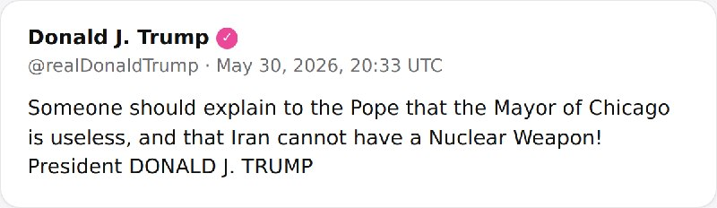

Shin ✓ @hey_itsmyturn
Sat, 30 May 2026 20:35:34 UTC

President Trump @POTUS:
"Someone should explain to the Pope that the Mayor of Chicago is useless, and that Iran cannot have a Nuclear Weapon! President DONALD J. TRUMP"

فارسی

رئیس‌جمهور ترامپ @POTUS:
«کسی باید به پاپ توضیح دهد که شهردار شیکاگو بی‌‌عرضه است، و ایران نمی‌تواند سلاح هسته‌ای داشته باشد! رئیس‌جمهور دونالد جی. ترامپ»

𝕏 · @shin_persian

## FarsiVOA — post 219124

🔺نخست وزیر لبنان از مذاکرات با اسرائیل دفاع کرد

▪️نواف سلام، نخست‌وزیر لبنان از مذاکرات با اسرائیل که روز جمعه در پنتاگون برگزار شد، دفاع کرد.

⬇️ بیشتر بخوانید:
https://ir.voanews.com/a/israel-lebanon-us-pentagon-negotiations-hezbollah-/8155608.html
@FarsiVOA

## FarsiVOA — post 219123

Farsi VOA pinned an audio file

## FarsiVOA — post 219122

🔺وزیر جنگ آمریکا می‌گوید «تنگه هرمز» باز می‌شود و عوارضی هم در کار نخواهد بود

▪️شبکه آمریکایی سی‌بی‌اس در گزارشی نوشت که موضوع بسته شدن تنگه هرمز به‌طور منظم در گفت‌وگوهای پیت هگست، وزیر دفاع آمریکا، با کشورهای دیگر در کنفرانس دفاعی شانگری‌لا در سنگاپور مطرح شد.

⬇️ بیشتر بخوانید:
https://ir.voanews.com/a/hormuz-strait-raised-in-talks/8155610.html
@FarsiVOA

## FarsiVOA — post 219121

  <a href="https://t.me/farsivoa/219121" target="_blank">📎 Download file</a>

🔴📢‌ پادکست خبری شنبه ۹ خرداد ۱۴۰۵

🛜در صورتی که با مشکل اینترنت مواجه هستید میتوانید اخبار صدای آمریکا را از نسخه‌های پادکست خبری ما روزانه دنبال کنید و یا اخبار را از نسخه سبک وب‌سایت ما پیگیر باشید:
https://ir.voanews.com/lite

📡بروزترین فرکانسهای ماهواره‌ای را نیز میتوانید از صفحه زیر پیگیری کنید:
https://ir.voanews.com/satellite

🔔دیگر شبکه‌های اجتماعی ما هم دنبال کنید:
https://linktr.ee/voafarsi

ما را به اشتراک بگذارید
@farsivoa

## FarsiVOA — post 219120

⚡️سفر قالیباف به دوحه؛ بر خلاف اصرار مقامات رژیم نشانه‌ای ازآزادسازی پول‌های بلوکه‌شده نیست
@FarsiVOA

## FarsiVOA — post 219119

⚡️زنگ خطر اجتماعی در ایران؛ جامعه بدون طبقه متوسط به کجا می‌رود؟ گفت‌وگو با فریدون رحمانی جامعه‌شناس

@FarsiVOA

## FarsiVOA — post 219118

🔺حزب‌الله با راکت و پهپاد شمال اسرائیل را هدف قرار داد؛ ارتش اسرائیل عملیات در جنوب لبنان را گسترش می‌دهد

▪️هم‌زمان با گسترش عملیات ارتش اسرائیل در جنوب لبنان، حزب‌الله لبنان روز شنبه ۹ خرداد چندین راکت و پهپاد به سوی شمال اسرائیل شلیک کرد.

⬇️ بیشتر بخوانید:
https://ir.voanews.com/a/hezbollah-rockets-target-northern-israel/8155609.html
@FarsiVOA

## FarsiVOA — post 219117

گزارش نرگس صبا در برنامه تفسیر خبر: ترور به سبک جمهوری اسلامی در اروپا

## FarsiVOA — post 219116

زنگ خطر اجتماعی در ایران؛ جامعه بدون طبقه متوسط به کجا می‌رود؟ گفت‌وگو با فریدون رحمانی جامعه‌شناس

## FarsiVOA — post 219115

آریو کنگرلو در برنامه تفسیر خبر: خامنه‌ای دشمن استقلال سیاسی، اقتصادی و تمدن ایران است

## FarsiVOA — post 219114

همن سیدی: قابل درک نیست کسی پس از کشتار دی‌ماه از خامنه‌ای دفاع کند

## FarsiVOA — post 219113

  <a href="telegram/content/FarsiVOA_219113_1780173646.mp4" target="_blank">🎬 Download video</a>

یاسمین شاه‌کرمی، خواهر امیرمحمد شاه‌کرمی، از کشته‌شدگان دی ماه ۱۴۰۴، بعد از بازگشایی محدود اینترنت در ایران، با انتشار ویدیویی از لحظه شناسایی پیکر برادرش در کهریزک نوشته است: «...ما بعد از ۶۰ روز گریه و دلتنگی و چشم به راهی صورت برادرم را دیدیم. آن لحظه انگار دنیا روی سرمان خراب شد...»

امیرمحمد شاه‌کرمی، ۱۴ ساله، بعد از شرکت در اعتراضات ۱۸ دی ناپدید شد. به رغم اینکه بعد از مدتی به خانواده او اطلاع داده شد پسرشان زنده و در بازداشت است، ۶۰ روز بعد، از پزشک قانونی برای تشخیص هویت پیکرش با خانواده تماس گرفتند. بنابر مشاهدات خانواده، بر پیکر او آثار کبودی و جای گلوله بر شقیقه مشخص بود.

## FarsiVOA — post 219112

  

سپیده قلیان، زندانی سیاسی، که روز ۹ خرداد از زندان وکیل‌آباد مشهد آزاد شد، تصویری از حضور خود بر مزار خسرو علیکردی، وکیل دادگستری، را در صفحه اینستاگرامش منتشر کرد.

سایت حقوق بشری هرانا می‌گوید که قلیان پس از پایان دوران شش ماه حبس تعزیری از زندان آزاد شده است. او ۲۱ آذر ۱۴۰۴ همزمان با مراسم هفتم خسرو علیکردی در مشهد بازداشت شده بود.

@FarsiVOA

## FarsiVOA — post 219111

چالش حقوقی علیه تلاش مشترک فرانسه و بریتانیا برای مدیریت مهاجران غیرقانونی

## FarsiVOA — post 219110

  

⚡️ستاد فرماندهی مرکزی آمریکا، سنتکام، روز شنبه اعلام کرد که نیروهای آمریکایی فعال در دریای عمان، یک کشتی با پرچم گامبیا که قصد حرکت به سمت یک بندر ایرانی را داشت، روز جمعه ۸ خرداد از کار انداختند و محاصره دریایی علیه جمهوری اسلامی را اعمال کردند.

سنتکام در بیانیه خود گفت نیروهایش کشتی «لیان استار» را در حال عبور از آب‌های بین‌المللی به سمت یک بندر ایرانی بود در دریای عمان مشاهده کردند و بیش از ۲۰ هشدار صادر کردند و به این کشتی اطلاع دادند که در حال نقض محاصره ایالات متحده است.

سنتکام گفت یک هواگرد آمریکایی پس از آنکه خدمه کشتی دستورات نیروهای آمریکایی را نادیده گرفتند، با شلیک یک موشک هل‌فایر به موتورخانه کشتی، آن را غیرفعال کرد.

سنتکام افزود این کشتی دیگر به سمت ایران در حال حرکت نیست.

سنتکام اعلام کرد که نیروهای آمریکایی پیشتر پنج کشتی تجاری را غیرفعال کرده‌اند و با اجرای کامل محاصره دریایی علیه جمهوری اسلامی، مسیر ۱۱۶ کشتی را تغییر داده‌اند.

## FarsiVOA — post 219109

در حالی که اختلاف‌ها در جمهوری اسلامی بر سر مذاکرات با آمریکا ادامه دارد، گزارش‌ها از صدور و تأیید احکام اعدام، کمبود دارو، مهاجرت پزشکان، خاموشی‌های گسترده و فشار فزاینده اقتصادی بر خانوارهای ایرانی حکایت دارد.

## FarsiVOA — post 219108

اختلاف دیدگاه‌ها در کنگره آمریکا درباره مسیر مذاکرات با جمهوری اسلامی همزمان با تحریم‌های تازه

## FarsiVOA — post 219105

پیت هگست، وزیر جنگ آمریکا، اعلام کرد با جان هیلی و ریچارد مارلز در نشست وزیران دفاع پیمان آکوس دیدار کرده است.

او گفت به دستور دونالد ترامپ، این همکاری «با تمام سرعت» در حال پیشرفت است.

@FarsiVOA

## DW_Farsi — post 125327

  

🔶 "آمریکا یک کشتی که می‌خواست وارد یک بندر ایرانی شود را ازکار انداخت"

آسوشیتدپرس به نقل از یک مقام مطلع آمریکا از وضعیت منطقه نوشت که ارتش این کشور یک کشتی تجاری دیگر را متوقف کرد که قصد شکستن محاصره بنادر ایران توسط ایالات متحده را داشت.

این مقام که نخواست نامش فاش شود به این خبرگزاری گفت، کشتی فله‌بر "لیان استار" (Lian Star) که با پرچم گامبیا حرکت می‌کرد شب گذشته هشتم خرداد (۲۹ مه) هشدارهای متعدد نیروهای آمریکایی را هنگام تلاش برای ورود به یک بندر ایرانی نادیده گرفت.

این مقام افزود که این کشتی توسط هواپیماهای آمریکایی در خلیج عمان از کار انداخته شده و در همان‌جا سرگردان است و نیروهای آمریکایی وارد عرشه نشده‌اند.

فرماندهی مرکزی ایالات متحده آمریکا (سنتکام) در پیام رسان ایکس نوشت: «پس از آنکه خدمه کشتی از تبعیت از دستورات خودداری کردند، یک هواپیمای آمریکایی با شلیک یک موشک AGM-114 Hellfire به اتاق موتور کشتی، آن را از کار انداخت. این کشتی دیگر به سمت ایران در حرکت نیست.»

@dw_farsi

## DW_Farsi — post 125326

  

🔶 سپیده قلیان، فعال مدنی از زندان وکیل‌آباد مشهد آزاد شد

سپیده قلیان، فعال مدنی زندانی که دوران محکومیت خود را در زندان وکیل‌آباد مشهد سپری می‌کرد، امروز شنبه نهم خردادماه (۳۰ مه) از این زندان آزاد شد.

خبرگزاری هرانا مطابق اطلاعات دریافتی خود نوشت که آزادی قلیان پس از پایان دوران شش ماه محکومیت حبس تعزیری او صورت گرفته است.

قلیان در ۲۱ آذرماه سال گذشته در جریان مراسم هفتم خسرو علیکردی، وکیل دادگستری در مشهد توسط نیروهای امنیتی بازداشت شد.

این فعال مدنی که بارها سابقه زندان دارد امروز ساعاتی پس از آزادی با انتشار تصویری از حضور خود بر مزار خسرو علیکردی در شبکه ایکس نوشت: «دوباره سلام خسرو! چطور سعی کردند چشم‌های حقیقت را با قتل تو ببندند. اگر ما خاموش شویم پس کدام شهرزاد قصه تو را بگوید.»

خسرو علیکردی وکالت تعدادی از زندانیان سیاسی، معترضان و خانواده‌های دادخواه را بر عهده داشت. پیدا شدن پیکر بی‌جان این وکیل دادگستری در دفتر کارش در مشهد در آذرماه سال ۱۴۰۴ موجی از واکنش‌ها را برانگیخت و بسیاری آن را "مشکوک" دانستند.

@dw_farsi

## DW_Farsi — post 125325

  

🔶 نخست‌وزیر لبنان با تأکید بر لزوم آتش‌بس عملیات اسرائيل را محکوم کرد

نواف سلام، نخست‌وزیر لبنان آن چه که تشدید تنش "خطرناک و بی‌سابقه" از سوی اسرائیل در جنوب این کشور خواند را به شدت محکوم کرد.

به گزارش خبرگزاری فرانسه، او ضمن تاکید بر لزوم برقراری یک آتش‌بس فوری، تصریح کرد که پیش گرفتن "سیاست زمین سوخته" هرگز امنیت اسرائیل را تضمین نخواهد کرد.

سلام در یک سخنرانی تلویزیونی با دفاع از دموکراسی و ورود دولت خود به مذاکرات مستقیم با اسرائیل گفت که این گفت‌وگوها در شرایط کنونی، "کم‌هزینه‌ترین مسیر» برای لبنان است.

این در حالی است که پیش از این مقام‌های لبنانی از روند گفت‌وگوها با اسرائيل که با میزبانی وزارت دفاع آمریکا (پنتاگون) برگزار شد ابراز ناامیدی کرده بودند.

به گزارش تایمز اسرائیل، روزنامه العربی الجدید به نقل از چند مقام آگاه نوشت که نشست پنتاگون "هیچ‌گونه پیشرفتی به‌ویژه در رابطه با برقراری آتش‌بس جامع و فراگیر دربر نداشت."

شبکه الحدث نیز به نقل از یک منبع نظامی گزارش داد که این نشست "نتایج عملی و ملموسی که مورد نظر و مطلوب لبنان بود را به بار نیاورد."

@dw_farsi

## DW_Farsi — post 125324

  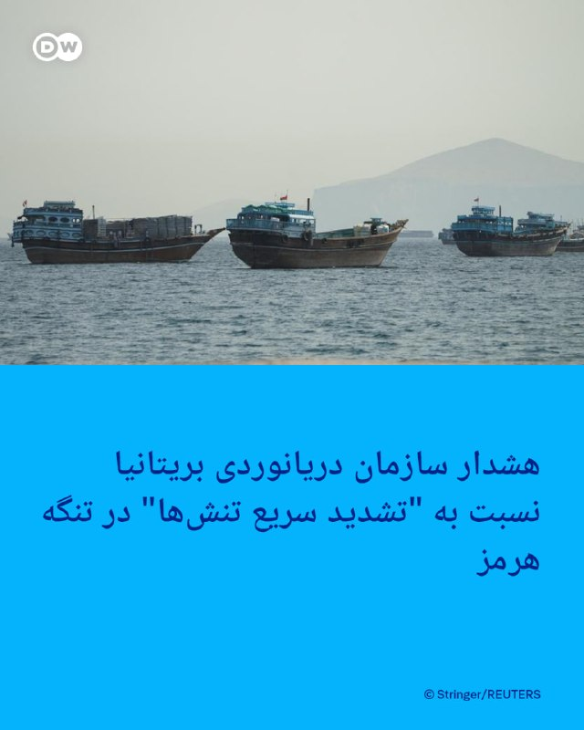

🔶 هشدار سازمان دریانوردی بریتانیا نسبت به "تشدید سریع تنش‌ها" در تنگه هرمز

آژانس امنیت تجارت دریایی بریتانیا (UKMTO) در بیانیه‌ای وضعیت امنیتی در تنگه هرمز را "همچنان بحرانی" خواند و اعلام کرد که محاصره دریایی بنادر ایران توسط ایالات متحده بدون تغییر باقی مانده است.

خبرگزاری آلمان در گزارش خود در روز شنبه ۳۰ مه (۹ خرداد) نوشت، در این بیانیه با اشاره به این که "کشتی‌هایی که مشمول این محاصره هستند باید کماکان از دستورات نیروهای محاصره‌کننده پیروی کنند" آمده است که عدم پایبندی به این دستورات می‌تواند منجر به "تشدید سریع تنش‌ها" شود.

مذاکرات ایران و آمریکا که هدف از آن پایان دادن به مناقشه هسته‌ای و جنگ است هنوز به نتیجه‌ نهایی نرسیده است.

آخرین خبرها در روزهای گذشته دستیابی به توافق را باورپذیر کرده بود اما به رغم مذاکرات فشرده هنوز گشایش نهایی در این مسیر به دست نیامده است.

به گفته مقا‌م‌های ایرانی، ظرف ۲۴ ساعت گذشته در مجموع ۲۰ فروند کشتی از تنگه هرمز عبور کرده‌اند.

@dw_farsi

## Persian_Trend_Official — post 15353

https://youtube.com/live/wwFLAgT9TwI?feature=share

## Persian_Trend_Official — post 15352

  <a href="telegram/content/Persian_Trend_Official_15352_1780173653.webm" target="_blank">🎬 Download video</a>

با تموم شدن فینال جام باشگاه ها و تبریک به طرفداران پاریسن ژرمن حدود 30 دقیقه دیگه لایو رو آغاز میکنیم

## Persian_Trend_Official — post 15351

  

نخست‌وزیر لبنان، نواف سلام: می‌خواهم با صداقت کامل با مردم لبنان صحبت کنم.

آیا مذاکرات تضمین شده است که موفق شود؟ قطعاً نه. اما این کم‌هزینه‌ترین مسیر برای کشور و مردم ما است، در مقایسه با گزینه‌های دیگر موجود امروز.

این مسیر آسان نیست و کوتاه هم نخواهد بود، اما وقتی همه تلاش‌ها زیر سقف دولت لبنان متحد شوند، کوتاه‌تر می‌شود و ما در آن قوی‌تر می‌شویم.

و این مستلزم کنار گذاشتن انحصارطلبی و توقف لجاجت است. زیرا دولت امروز به نمایندگی از همه لبنانی‌ها مذاکرات را انجام می‌دهد و بر همه آنها واجب است که زیر پرچم آن متحد شوند، تا تصمیم جنگ و صلح یک تصمیم ملی لبنانی باقی بماند، نه در دست یک جناح بر دیگری، و نه خارج از مرزها.

📝 Amir

📌 @persian_trend_official
پرشین ترند | متفاوت‌ترین کانال نظامی

## Persian_Trend_Official — post 15350

یک مقام آمریکایی آگاه به خبرگزاری آسوشیتدپرس گفت که ارتش آمریکا یک کشتی تجاری دیگر را که سعی داشت از محاصره بنادر ایران توسط آمریکا عبور کند، متوقف کرده است. 📝 Amir 📌 @persian_trend_official پرشین ترند | متفاوت‌ترین کانال نظامی

## Persian_Trend_Official — post 15349

  

ناو آبی خاکی باکسر به خاورمیانه نمی آید!

به نظر می‌رسد که ناو آبی خاکی یو‌اس‌اس باکسر (LHD-4) قرار نیست در حوزه مسئولیت سنتکام مستقر شود. ناو آبی‌خاکی کلاس وسپ نیز امروز از بندر سمبانوان در سنگاپور حرکت کرد؛ اگرچه اکنون به سمت شرق در حرکت است.

📝 Amir

📌 @persian_trend_official
پرشین ترند | متفاوت‌ترین کانال نظامی

## Persian_Trend_Official — post 15348

  <a href="telegram/content/Persian_Trend_Official_15348_1780173655.webm" target="_blank">🎬 Download video</a>

کانال 12 اسرائیل: نخست وزیر نتانیاهو، وزیر دفاع کاتز، رئیس ستاد ارتش اسرائیل و مقامات ارشد امنیتی عصر امروز یک ارزیابی امنیتی برگزار خواهند کرد.

بحث‌ها بر تشدید تنش در شمال اسرائیل و تشدید دستورالعمل‌های فرماندهی جبهه داخلی متمرکز خواهد بود.

📝 Amir

📌 @persian_trend_official
پرشین ترند | متفاوت‌ترین کانال نظامی

## RadioFarda — post 157729

  

🔸خبرگزاری بلومبرگ روز شنبه گزارش داد که حمله موشکی ایران به یک پایگاه هوایی در کویت باعث زخمی شدن چند آمریکایی شده است.

🔸یک منبع به این رسانه گفته است که در ۲۴ ساعت گذشته پنج آمریکایی، از جمله پیمانکاران و نیروهای نظامی، در پی رهگیری و انهدام یک موشک ایرانی از نوع «فاتح ۱۱۰» توسط سامانه پدافند هوایی کویت دچار «جراحات جزئی» شده‌اند.

🔸این اتفاق بر اثر سقوط بقایای موشک ایرانی بر روی پایگاه هوایی علی السالم کویت که محل استقرار نیروهای آمریکایی است، رخ داد.

🔸بلومبرگ می‌گوید در این حادثه، یک فروند پهپاد ام‌کیو-۹ ریپر آمریکایی نابود شد و یک پهپاد دیگر از همین نوع در همین پایگاه «آسیب جدی» دید.

🔸ارتش آمریکا درباره این گزارش هنوز اظهارنظر نکرده است.

🔸پایگاه هوایی علی السالم در حدود ۳۲ کیلومتری مرز عراق قرار دارد و در جریان جنگ اخیر آمریکا و اسرائیل با ایران نیز تحت حملات پهپادی و موشکی ایران قرار گرفته بود.

@RadioFarda

## RadioFarda — post 157728

  

🔸ستاد فرماندهی مرکزی ارتش آمریکا، سنتکام، اعلام کرد نیروهای این کشور یک کشتی تجاری با پرچم گامبیا را که به گفته واشینگتن در نقض محاصره دریایی به سمت یکی از بنادر ایران در حرکت بود، در خلیج عمان هدف قرار داده و از ادامه مسیر آن جلوگیری کرده‌اند.

🔸سنتکام روز شنبه نهم خرداد در بیانیه‌ای گفت نیروهای آمریکایی روز هشتم خرداد کشتی «لیان استار» را هنگام حرکت در آب‌های بین‌المللی به سوی یکی از بنادر ایران شناسایی کردند و بیش از ۲۰ بار به خدمه آن هشدار دادند.

🔸به گفته این نهاد نظامی، پس از آنکه خدمه کشتی به هشدارها توجه نکردند، یک هواپیمای آمریکایی با شلیک موشک هلفایر به اتاق موتور کشتی، آن را از کار انداخت.

🔸سنتکام افزود این کشتی دیگر به سمت ایران در حرکت نیست.

🔸در این بیانیه آمده است که از زمان اجرای محاصره دریایی علیه ایران، نیروهای آمریکایی پنج کشتی تجاری را از کار انداخته و ۱۱۶ کشتی دیگر را وادار به تغییر مسیر کرده‌اند.

🔸سنتکام جزئیات بیشتری درباره محموله کشتی یا مقصد دقیق آن در ایران ارائه نکرده است.

@RadioFarda

## IranianMinds — post 21091

  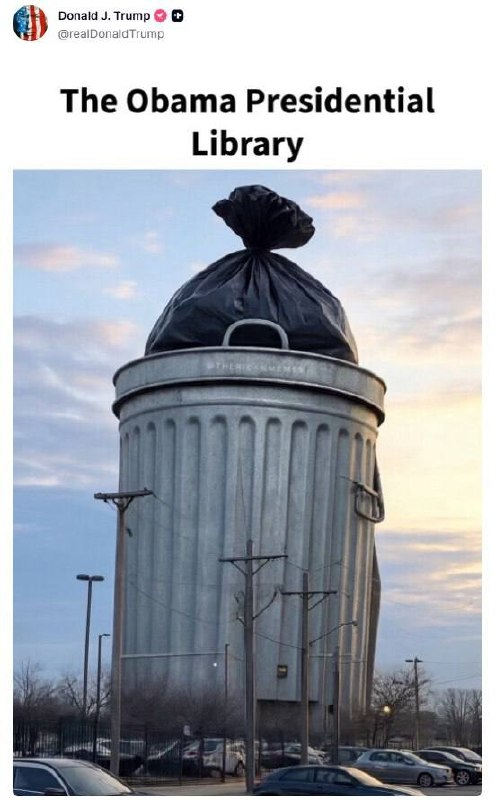

🔴پست جدید ترامپ، باز هم به اوباما گیر داد.

@IranianMinds

## IranianMinds — post 21090

  <a href="telegram/content/IranianMinds_21090_1780173658.mp4" target="_blank">🎬 Download video</a>

کنسرت امشب کانیه وست
در فاصله ی ۲ ساعتیه ایران
ترکیه

- بختتو ایرانی

@IranianMinds

## IranianMinds — post 21089

  <a href="telegram/content/IranianMinds_21089_1780173660.mp4" target="_blank">🎬 Download video</a>

عادی ترین فن جمهوری اسلامی :

احمد ایراندوست : مشروبمو میخورم، کاباره‌مو میرم؛ دستبوس حاج قاسمم هستم

@IranianMinds

## IranianMinds — post 21088

  

🏆 پاریس سنت ژرمن قهرمان لیگ قهرمانان اروپا ۲۰۲۵/۲۰۲۶ شد.

@IranianMinds

## IranianMinds — post 21087

🔴 سنتکام :

نیروهای آمریکایی فعال در خلیج عمان با از کار انداختن یک کشتی دریایی با پرچم گامبیا که قصد حرکت به سمت بندر ایران را داشت، در 29 مه، اقدامات محاصره ای را اعمال کردند.

نیروهای فرماندهی مرکزی ایالات متحده (CENTCOM) M/V Lian Star را در حال عبور از آب‌های بین‌المللی به سمت یک بندر ایرانی در خلیج عمان مشاهده کردند و بیش از 20 اخطار صادر کردند و در عین حال به کشتی اطلاع دادند که محاصره ایالات متحده را نقض می‌کند.

یک هواپیمای آمریکایی با شلیک موشک هلفایر به داخل موتور کشتی، کشتی را از کار انداخت، زیرا خدمه لیان استار از رعایت این مقررات ناکام ماندند. این کشتی دیگر به ایران ترانزیت نمی کند.

نیروهای ایالات متحده پنج کشتی تجاری را از کار انداخته و 116 کشتی را برای اجرای کامل محاصره هدایت کرده اند، زیرا آتش بس با ایران همچنان به قوت خود باقی است.

@IranianMinds

## IranianMinds — post 21086

یعنی میشه مام یه روزی به آزادی برسیم از دست آخوند راحت شیم ؟ یا برا ما قفله …

@IranianMinds

## IranianMinds — post 21085

  

@IranianMinds

## IranianMinds — post 21084

  <a href="telegram/content/IranianMinds_21084_1780173664.mp4" target="_blank">🎬 Download video</a>

🔴 کارشناس صداوسیما :

ما اصلا آریایی نیستیم و اینکه بعضیا میگن ما آریایی هستیم نژاد‌ پرستیه ، آریایی ها همشون قاتل بودن و همه رو‌ کشتن تا به قدرت برسن اینکه بگیم ما آریایی هستیم یعنی ما فرزندان کسانی هستیم که نسل کشی کردن.

@IranianMinds

## IranianMinds — post 21083

  

@IranianMinds

## IranianMinds — post 21082

  

😤دنبال یه سایت شرط بندی بین المللی بودی که به ایرانیا خدمات بده؟!
⛔

👍دربی بت همون انتخاب  100%

💎ویژگی های سایت جهانی Derby Bet:

⬅️امکان شارژ امن با کارت بانکی

⬅️واریز اول دوبل شارژ می شوید(بونوس۱۰۰٪)

⬅️پر اپشن ترین سایت فعال در ایران

⬅️تسویه حساب کمتر از 5 دقیقه

⬅️برگشت بخشی از باخت به صورت هفتگی

🚨کد هدیه ثبت نام:GG007

⚠️برای دانلود اپلکیشن کلیک کنید
👉

🔔کانال دربی بت G9:

🪙https://t.me/+aCbq7yy8QY80NzQ0

## IranianMinds — post 21081

  

🔴 پست جدید ترامپ :

۵ مرحله از سندرم ترامپ هراسی.

@IranianMinds

## IranianMinds — post 21080

  

پست جدید ترامپ :

@IranianMinds

## BBCPersian — post 282447

  <a href="telegram/content/BBCPersian_282447_1780173671.mp4" target="_blank">🎬 Download video</a>

🔻آخرین خبرهای مهم روز شنبه ۹ خرداد ۱۴۰۵

@BBCPersian

## BBCPersian — post 282446

  

🔸پاری‌سن‌ژرمن با پیروزی مقابل آرسنال در فینال لیگ قهرمانان اروپا از عنوان قهرمانی‌اش در این مسابقات دفاع کرد.

کای هاورتز، که در فینال ۲۰۲۱ گل پیروزی‌بخش چلسی مقابل منچسترسیتی را زده بود، در دقیقه ششم بازی به طور اتفاقی از جناح چپ پا به توپ شد و پس از فراری طولانی وارد محوطه جریمه شد و توپ را به سقف دروازه پاری‌سن‌ژرمن ‌کوبید.

عثمان دمبله، برنده توپ طلا، نیز روی یک ضربه پنالتی در دقیقه ۶۵ با یک ضربه دقیق و خلاف جهت حرکت داوید رایا توپ را به گوشه دروازه آرسنال دوخت.

تلاش دو تیم در ادامه برای زدن گل بی‌ثمر ماند و در ضربات پنالتی این پاریس بود که حریفش را ۴-۳ شکست داد. گابریل، مدافع برزیلی آرسنال، پنالتی آخر این تیم را از دست داد.

پاری‌سن‌ژرمن تا کنون دو بار قهرمان لیگ قهرمانان اروپا شده است که هر دو نیز با هدایت لوئیس انریکه، سرمربی اسپانیایی این تیم بوده است. این دومین حضور آرسنال در فینال این مسابقات بود که با ناکامی همراه شد.

📸 UEFA/UEFA via Getty Images
@BBCPersian

## BBCPersian — post 282445

🔻ایالات متحده، بریتانیا و استرالیا می‌گویند که قصد دارند در چارچوب پیمان نظامی سه‌جانبه خود، موسوم به آکوس، فناوری شناور‌های هدایت‌پذیر (شهپاد) را توسعه دهند؛ هدف از این اقدام، محافظت از کابل‌های زیرآبی و تقویت دفاعی عنوان شده است.

انتظار می‌رود که فناوری خودروی زیرآبی بدون سرنشین تا سال آینده آماده شود. هزینه کل این پروژه اعلام نشده است، اما جان هیلی، وزیر دفاع بریتانیا، گفت که این کشور ۲۰۱ میلیون دلار به این پروژه کمک خواهد کرد.

وزرای دفاع آمریکا، بریتانیا و استرالیا این تصمیم را در اجلاس امنیتی مجمع شانگری-لا در سنگاپوراعلام کردند؛ در حالی که پیش از آن انتقادهایی در مورد پیشرفت کند پروژه‌های آکوس منتشر شده بود.

آقای هیلی با اذعان به این انتقادات گفت: «ما مدتی طولانی در آکوس، زیاد صحبت می‌کردیم و خیلی کم عمل می‌کردیم اما این وضعیت اکنون تغییر کرده است».

بر اساس پیمان دفاعی آکوس که در سال ۲۰۲۱ آغاز شد، سه عضو پیمان، فناوری زیردریایی‌های هسته‌ای را توسعه می‌دهند و تخصص‌های نظامی خود را به اشتراک می‌گذارند.
https://trib.al/fq96NVF

@BBCPersian

## BBCPersian — post 282444

  <a href="telegram/content/BBCPersian_282444_1780173674.mp4" target="_blank">🎬 Download video</a>

🔻‌نشست «امنیت دریای سیاه» در حساب رسمی خود در شبکه ایکس اعلام کرده که شاهزاده رضا پهلوی به این نشست که در اودسا در جنوب اوکراین برگزار می‌شود رفته است و او را «میهمان ویژه» خوانده است.

این نهاد رضا پهلوی را «ریاست سلسله پهلوی و وارث سلطنت در ایران» توصیف کرده است.

این نشست در حساب کاربری خود در شبکه ایکس گفته است:«امروز، رضا پهلوی یکی از برجسته‌ترین چهره‌های اپوزیسیون ایران و از مدافعان برجسته تغییرات دموکراتیک در ایران است.»
آقای پهلوی در بخشی از سخنان خود گفت ایستادن جامعه جهانی در کنار مردم ایران «در راستای منافع همه کشورها خواهد بود.»

نشست امنیت دریای سیاه در سال ۲۰۲۴ توسط گروهی از نمایندگان پارلمان اوکراین در اودسا آغاز به کار کرد و در جلسات سالانه خود به بررسی چالش‌های امنیتی و ژئوپلیتیک در منطقه دریای سیاه و فراتر از آن می‌پردازد.

@‌‌BBCPersian

## BBCPersian — post 282443

🔻سپاه پاسداران درباره هرگونه مداخله نظامی در مدیریت تنگه هرمز هشدار داد

قرارگاه مرکزی خاتم الانبیا که نقش اصلی در مدیریت جنگ از سوی ایران دارد، امروز هشدار داد که «هرگونه اقدام شناورهای نظامی جهت مداخله در مدیریت تنگۀ هرمز یا ایجاد اختلال در تردد، مورد هدف نیروهای مسلح جمهوری اسلامی ایران قرار خواهد گرفت.»

این قرارگاه گفته است که «کلیه کشتی‌ها، شناورهای تجاری و نفتکش‌ها صرفا ملزم به تردد از مسیرهای تعیین‌شده و اخذ مجوز از نیروی دریایی سپاه پاسداران انقلاب اسلامی هستند» و «هرگونه تخلف از این ضوابط، امنیت تردد آنها را با مخاطره جدی مواجه خواهد کرد.»

ایران از زمان حمله آمریکا و اسرائیل کنترل عبور و مرور کشتی‌ها در تنگه هرمز را در اختیار گرفته است.

برخی از گزارش‌های تایید نشده حاکی از این بود که برخی از شناورها در صدد عبور از بخشی از تنگه هرمز هستند که در آب‌های عمان قرار دارد.

ساعاتی پیش از این گزارش داده بودیم که عمان پس از مشاهده شیئی مشابه مین دریایی در آب‌های خود، به دریانوردان هشدار داده است.

@BBCPersian

## BBCPersian — post 282442

  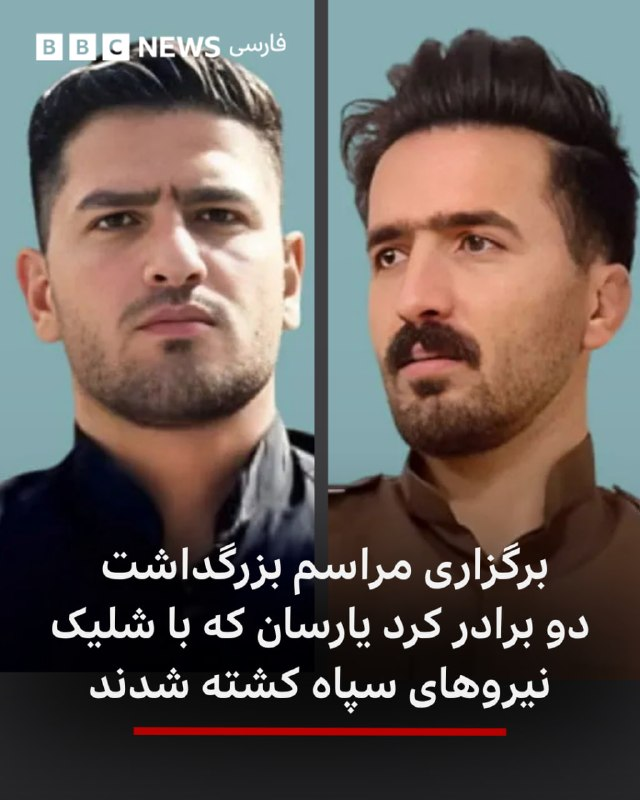

🔻دو روز پس از کشته‌شدن مجتبی و میثم ویسی، دو برادر کُردِ یارسان، با شلیک نیروهای سپاه پاسداران انقلاب اسلامی در دالاهوی کرمانشاه، مراسم بزرگداشت آنها در محله دره دریژ این شهر برگزار شد.

یک منبع نزدیک به خانواده ویسی به بی‌بی‌سی گفت: « پیکر این دو برادر هنوز به خانواده‌شان تحویل داده نشده است.»

خبرگزاری فارس مجتبی و میثم ویسی را از «عناصر اصلی آشوب‌های دی‌ماه سال گذشته» در دره‌ دریژ کرمانشاه خوانده است.

شبکه حقوق بشر کردستان گزارش داده است که این دو برادر از نگرانی بازداشت شدن، طی ماه‌های اخیر محل سکونت خود در شهرک ده‌ره‌دریژ کرمانشاه را ترک کرده و به‌صورت مخفیانه زندگی می‌کردند.

هم‌زمان، دو عضو دیگر این خانواده نیز که در پی اعتراضات دی‌ماه بازداشت شده بودند با اتهام محاربه روبه‌رو شده‌اند.

سجاد ویسی، برادر آنها، و شایان ویسی، پسرعمویشان، اکنون در خطر صدور حکم اعدام قرار دارند.

سجاد ویسی روز سوم اسفند ۱۴۰۴ بازداشت شد. شایان نیز از بازداشت‌شدگان اعتراضات دی‌ماه ۱۴۰۴ است.

📸کانون حقوق بشر ایران
https://trib.al/574RX4P
@BBCPersian

## BBCPersian — post 282441

🔻‌ این تصاویر از تجمع گروهی از مخالفان حکومت ایران در استرالیا و آلمان به دست بی‌بی‌سی فارسی رسیده است.

در هامبورگ آلمان، تجمع‌کنندگان با در دست داشتن تصاویر بازداشت‌شدگان اعتراضات دی‌ماه ۱۴۰۴، خواستار توقف اعدام‌ها در ایران شدند.

همچنین در بریزبن استرالیا، حاضران در حمایت از مردم ایران و در اعتراض به مشکلات اقتصادی و اجتماعی سخنرانی کردند و شعارهایی در حمایت از شاهزاده رضا پهلوی سر دادند.

در فرانکفورت هم تجمعی با عنوان «۴۷ ایستگاه دادخواهی» به نشانه ۴۷ سال اعتراض و مبارزات مردم ایران برگزار شد. حاضران در این تجمع با تشکیل زنجیره‌انسانی و در دست داشتن پلاکاردهایی درباره شرایط ایران اطلاع رسانی و همچنین سخنرانی کردند.  

از شروع اعتراضات در دی‌ماه ۱۴۰۴ و سرکوب و کشتار گسترده معترضان توسط حکومت، بسیاری از ایرانیان خارج از کشور در شهرهای مختلف جهان تجمعات هفتگی برگزار کرده‌اند.

بر اساس آمارهای منتشرشده، از زمان آغاز جنگ آمریکا و اسرائیل با ایران، بیش از ۳۰ نفر در ارتباط با پرونده‌های سیاسی و امنیتی اعدام شده‌اند.
@BBCPersian

## BBCPersian — post 282440

  <a href="https://t.me/bbcpersian/282440" target="_blank">📎 Download file</a>

پادکست برنامه جام جهان‌نما، شنبه ۹ خرداد ۱۴۰۵

این برنامه رادیویی رامی‌توانید هرشب ساعت ۲۰ به وقت ایران، روی موج متوسط ۷۰۲ کیلوهرتز و موج کوتاه۹۴۶۵ کیلوهرتز بشنوید. تکرار برنامه را هم می‌توانید ساعت ۲۱:۳۰ روی موج متوسط ۷۰۲ کیلوهرتز و موج کوتاه۵۳۹۵ کیلوهرتز گوش کنید.
@BBCPersian

## BBCPersian — post 282439

فینال لیگ قهرمانان اروپا در بوداپست بین پاری‌سن‌ژرمن و آرسنال امروز شنبه ۹ خرداد برگزار می‌شود. باشگاه آرسنال اسکرین بزرگی را در ورزشگاه خانگی این تیم، ورزشگاه امارات لندن آماده کرده است تا طرفدارانش بازی را در این ورزشگاه تماشا کنند.

این بازی برای آرسنال که حدود یک هفته پیش توانست بعد از ۲۲ سال در لیگ برتر انگلستان قهرمان شود، بسیار مهم است.

اگر آرسنال بتواند امروز به قهرمانی لیگ قهرمانان اروپا برسد، سالی استثنایی برای طرفدارانش رقم خواهد زد.
@BBCPersian

## BBCPersian — post 282438

  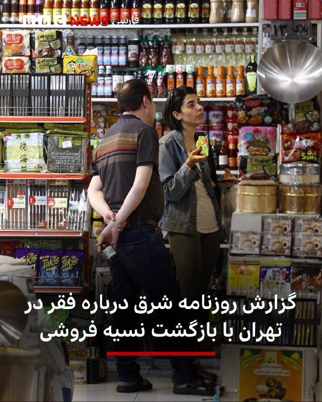

🔻روزنامه شرق در گزارشی میدانی به موج فزاینده گرانی و کاهش قدرت خرید شهروندان ایرانی پرداخته است.

این گزارش که با عنوان «تهران؛ شهر جیب‌های خالی» منتشر شده است، به فقر در تهران با بازگشت نسیه‌ فروشی پرداخته و در آن گفته شده که موج گرانی و بی‌ثباتی اقتصادی، بسیاری از شهروندان را وادار کرده است که هزینه بعضی از کالاهای خوراکی را هم به طور قسطی بپردازند.

روزنامه شرق می‌گوید که طبقه متوسط جامعه به دلیل تورم فزاینده و موج گسترده تعدیل نیرو، «در حال فروپاشی تدریجی است.»

بر اساس این گزارش، یک زوج کارمند به این روزنامه گفته‌اند: «دو حقوق کارمندی عملا تنها تا هفته دوم ماه دوام می‌آورد.»

یک دختر جوان هم که به همراه دو نفر دیگر در خانه‌ای اشتراکی زندگی می‌کنند، می‌گوید: «با جهش ناگهانی اجاره‌بها در سال جدید و افزایش‌نیافتن دستمزدها، رسما وارد بحران شده‌اند.»

در این گزارش یک مغازه‌دار در شرق تهران روایت می‌کند‌ که آمار سرقت اقلام کوچک خوراکی نظیر تن ماهی به‌شدت بالا رفته است.

خرید دانه‌ای میوه و درخواست نصف نان از دیگر مواردی بوده که در این گزارش آمده است.

@BBCPersian
📷 REUTERS

## Dirty_Kids — post 390594

  <a href="telegram/content/Dirty_Kids_390594_1780173680.mp4" target="_blank">🎬 Download video</a>

تنها امید شیرابه‌های بجا مانده از زباله‌ی جمهوری اسلامی، یاُس و ناامیدی ماست!
تراپی کنید ✌🏻

@Dirty_Kids 👻

## Dirty_Kids — post 390593

  

‏نام اثر؛
جدایی مجتبی از رهبر :))

@Dirty_Kids 👻

## Dirty_Kids — post 390592

  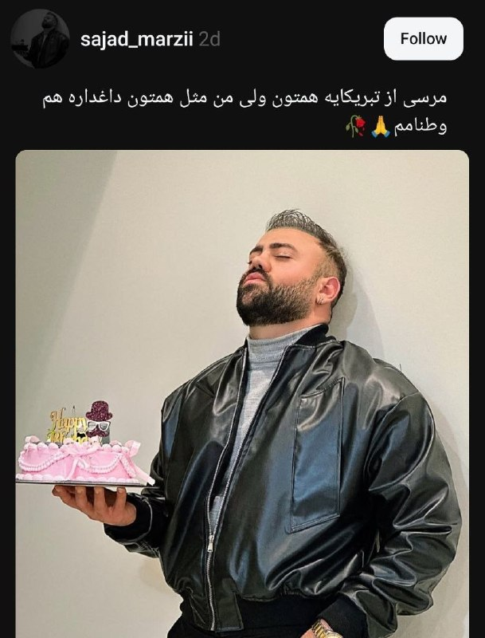

نمیزارم اینو فراموش کنید

@Dirty_Kids 👻

## Dirty_Kids — post 390591

  

خطاب به سمت چپی: لاقل قبل اومدن به تجمعات سیبیلاتو بزن😂😂
سمت راستی‌هم که سیبیلاشو قایم کرده😂

@Dirty_Kids 👻

## Dirty_Kids — post 390590

خب دیگه فوتبالتونم دیدید، حالا جدی یکی بگه چجوری قراره با این قیمتا زندگی کنیم؟

@Dirty_Kids 👻

## Dirty_Kids — post 390589

  

آرسنال رید و پارررریس قهرمان شد 🏆

• PSG: ✅✅❌✅✅
• Arsenal: ✅❌✅✅❌

@Dirty_Kids 👻

## Dirty_Kids — post 390588

  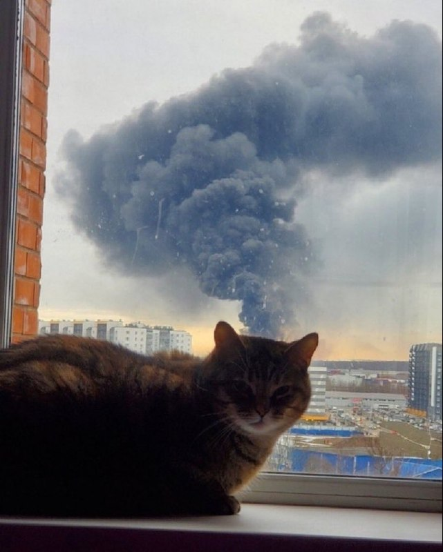

وضعیت من وقتی قیمت ها رو می‌بینم:

@Dirty_Kids 👻

## Dirty_Kids — post 390587

از بس بی‌اینترنتی کشیدیم، وبگردی بهم حس «کار مفید» می‌ده. کل روز یوتیوب می‌بینم و حس نمی‌کنم دارم وقت تلف می‌کنم.

@Dirty_Kids 👻

## Dirty_Kids — post 390586

  

اگر در جنگل گم شدید، گاوها رو دنبال کنید. گاوها همیشه بر می‌گردند.

@Dirty_Kids 👻

## Dirty_Kids — post 390585

  <a href="telegram/content/Dirty_Kids_390585_1780173686.mp4" target="_blank">🎬 Download video</a>

گل اول پاریس به ارسنال

@Dirty_Kids 👻

## Dirty_Kids — post 390584

میگن اسرائیل رو موشکایی که واسه سوراخ ضحاک تدارک دیده بود نوشته بوده؛

"خامنه‌ای ۲۵ ثانیه‌‌ آینده را نخواهد دید" :)))

@Dirty_Kids 👻

## Dirty_Kids — post 390583

  <a href="telegram/content/Dirty_Kids_390583_1780173688.mp4" target="_blank">🎬 Download video</a>

تحلیل بسیار مهم اتفاقات افتاده تو نیمه اول بازی

@Dirty_Kids 👻

## Dirty_Kids — post 390582

گل اول ارسنال به پاریسس گل سکسی هاورتززز @Dirty_Kids 👻

## Hranews — post 113256

  

گزارشی از «سوئیت ۳۵» زندان قزل‌حصار؛ از ازدحام جمعیت تا محرومیت زندانیان از حقوق اولیه

❗️
❗️
❗️
❗️
❗️– «سوئیت ۳۵» در واحد ۳ زندان قزل‌حصار کرج، بخشی که پیش‌تر عمدتاً برای نگهداری زندانیان در شرایط انفرادی، قرنطینه و پیش از اجرای حکم اعدام مورد استفاده قرار می‌گرفت، در ماه‌های اخیر به محل نگهداری شمار زیادی از بازداشت‌شدگان تبدیل شده است. گزارش‌های دریافتی هرانا از تراکم جمعیت، محرومیت زندانیان از برخی حقوق، گزارش‌هایی از ضرب و شتم و نامناسب بودن شرایط نگهداری در این بخش حکایت دارد.

به گزارش خبرگزاری هرانا، ارگان خبری مجموعه فعالان حقوق بشر در ایران، افزایش شمار بازداشت‌ها به‌ویژه پس از اعتراضات و تحولات ماه‌های اخیر، به انتقال گسترده بازداشت‌شدگان به «سوییت ۳۵» #زندان_قزلحصار_کرج منجر شده است. گزارش‌های دریافتی هرانا از زندانیان سابق، خانواده‌ها و منابع مطلع، از تراکم شدید جمعیت، محرومیت از حقوق اولیه، برخوردهای خشونت‌آمیز و شرایط نامناسب نگهداری در این بند حکایت دارد.

یک زندانی که به‌تازگی از این بند آزاد شده، در گفت‌وگو با هرانا اظهار داشت: «پیش از این، سوییت‌ها عمدتاً برای نگهداری محدود یا انفرادی پیش از اجرای حکم اعدام مورد استفاده قرار می‌گرفت، اما با افزایش بازداشت‌ها، در برخی موارد بیش از ۱۰ نفر در سلول‌هایی با مساحت حدود ۱۲ متر مربع نگهداری می‌شدند؛ به‌گونه‌ای که #زندانیان به سختی امکان استراحت داشتند.»

ادامه مطلب

↘️
@hranews_bot تماس ✉️ - @Hranews کانال هرانا 🆑

## Hranews — post 113255

گزارشی از تجمع اعتراضی پرستاران در یزد

❗️
❗️
❗️
❗️
❗️– امروز شنبه، شماری از #پرستاران ساکن در یزد با برگزاری تجمع اعتراضی خواستار رسیدگی به مطالبات خود شدند.

ادامه مطلب

↘️
@hranews_bot تماس ✉️ - @Hranews کانال هرانا 🆑

## Hranews — post 113254

در هشتمین روز بازداشت؛ تداوم بی خبری از وضعیت زهرا محمدولی در دهلران

❗️
❗️
❗️
❗️
❗️– زهرا محمدولی، شهروند ساکن دهلران، هشت روز است که توسط نیروهای امنیتی در این شهرستان #بازداشت شده‌ و کماکان از محل نگهداری وی اطلاعی حاصل نشده است. بی‌خبری از سرنوشت این شهروند، افزایش نگرانی‌های خانواده و بستگان او را در پی داشته است.

ادامه مطلب

#زهرا_محمدولی

↘️
@hranews_bot تماس ✉️ - @Hranews کانال هرانا 🆑

## Hranews — post 113253

صدور حکم اعدام برای یک متهم در تهران/ رهایی ۳ زندانی از چوبه دار

❗️
❗️
❗️
❗️
❗️– یک متهم به قتل در تهران توسط شعبه ۱۳ دادگاه کیفری این استان به اعدام محکوم شد. از سوی دیگر، سه زندانی محکوم به #اعدام در شهرستان‌های کهنوج، اردبیل و تایباد با کسب رضایت اولیای دم از چوبه دار رهایی یافتند.

ادامه مطلب

↘️
@hranews_bot تماس ✉️ - @Hranews کانال هرانا 🆑

## Hranews — post 113252

مصدومیت دو کارگر در سایه فقدان ایمنی کار

❗️
❗️
❗️
❗️
❗️– در سایه فقدان ایمنی محیط و شرایط نامناسب کار، دو #کارگر در شهرهای کرمانشاه و قزوین، طی حوادثی حین انجام کار مصدوم شدند.

ادامه مطلب

↘️
@hranews_bot تماس ✉️ - @Hranews کانال هرانا 🆑

## Hranews — post 113251

اجرای حکم اعدام یک زندانی در زندان سنندج

❗️
❗️
❗️
❗️
❗️– سحرگاه روز یکشنبه ۴ خردادماه، حکم یک زندانی که پیشتر از بابت اتهام قتل به اعدام محکوم شده بود، در زندان سنندج اجرا شد.

ادامه مطلب

#فرهنگ_شیخله

↘️
@hranews_bot تماس ✉️ - @Hranews کانال هرانا 🆑

## Hranews — post 113250

گزارشی از بازداشت ۵ شهروند در شهرستان‌های مهرستان و سیب و سوران

❗️
❗️
❗️
❗️
❗️– روز پنجشنبه ۷ خردادماه، پنج شهروند ساکن شهرستان‌های سیب‌ و سوران و مهرستان توسط نیروهای امنیتی #بازداشت و به مکان‌های نامعلومی منتقل شدند.

ادامه مطلب

↘️
@hranews_bot تماس ✉️ - @Hranews کانال هرانا 🆑

## alonews — post 123828

  <a href="telegram/content/alonews_123828_1780173690.webm" target="_blank">🎬 Download video</a>

👈حملات هوایی اسرائیل بر کفرجوز و شوکین در جنوب لبنان انجام شده است

✅ @AloNews خبر جنگ

## alonews — post 123827

  <a href="telegram/content/alonews_123827_1780173691.webm" target="_blank">🎬 Download video</a>

👈مدارس شمال اسرائیل فردا تعطیل اند و بنظر می‌رسد اسرائیل خودش را برای موج جدید و مرگبارتری از درگیری با حزب‌الله آماده می‌کند!

✅ @AloNews خبر جنگ

## alonews — post 123826

  <a href="telegram/content/alonews_123826_1780173691.webm" target="_blank">🎬 Download video</a>

👈به حداقل ۵ جهت به سمت فضای هوایی اوکراین، پهپادهای روسی Geran-2 پرتاب شده‌اند.

✅ @AloNews خبر جنگ

## alonews — post 123825

  <a href="telegram/content/alonews_123825_1780173691.webm" target="_blank">🎬 Download video</a>

👈 تصویری جدید و پربازدید از دونالد ترامپ درحال عزیمت به زمین گلف

✅ @AloNews خبر جنگ

## alonews — post 123824

  <a href="telegram/content/alonews_123824_1780173691.webm" target="_blank">🎬 Download video</a>

👈کابینه جنگ اسرائیل در ساعت ۲۲:۳۰ (به وقت محلی) تشکیل جلسه خواهد داد. در حال حاضر ارزیابی وضعیت در دفتر نخست‌وزیر است.

✅ @AloNews خبر جنگ

## alonews — post 123823

  <a href="telegram/content/alonews_123823_1780173692.webm" target="_blank">🎬 Download video</a>

👈معاون سیاسی سپاه: ایران بر تنگه هرمز مسلط شده و پس از ۵۰۰ سال، به موقعیتی دست یافته که حق مسلم مردم ایران است

✅ @AloNews خبر جنگ

## alonews — post 123822

  <a href="telegram/content/alonews_123822_1780173692.webm" target="_blank">🎬 Download video</a>

👈سخنگوی وزارت خارجه: میدان و دیپلماسی دوشادوش هم آماده برای هر وضعیتی

🔴 سخنگوی ارتش: امروز دیپلماسی و میدان نزدیک‌تر و هماهنگ‌تر از هر زمانی در مسیر تحقق منافع و عزت ملی کشور می‌کوشند

✅ @AloNews خبر جنگ

## alonews — post 123820

  <a href="telegram/content/alonews_123820_1780173692.mp4" target="_blank">🎬 Download video</a>

👈امروز یه مین دریایی ایرانی نزدیک سواحل عمان تو تنگه هرمز پیدا شده

✅ @AloNews خبر جنگ

## alonews — post 123819

  <a href="telegram/content/alonews_123819_1780173695.webm" target="_blank">🎬 Download video</a>

👈سخنگوی کمیسیون امنیت ملی:
پیشرفت‌هایی در مذاکرات وجود دارد و ما این را انکار نمی‌کنیم، اما باید مراقب باشیم

✅ @AloNews خبر جنگ

## alonews — post 123818

  <a href="telegram/content/alonews_123818_1780173695.webm" target="_blank">🎬 Download video</a>

👈ترامپ در تروث‌سوشال: موزه ریاست جمهوری اوباما

✅ @AloNews خبر جنگ

## alonews — post 123817

  <a href="telegram/content/alonews_123817_1780173695.mp4" target="_blank">🎬 Download video</a>

💔جاویدنام حديثه اكبرزاده ، 18 دی در فرديس كرج با شليک مستقیم گلوله به سينه‌اش آسمانی شد.

🤔عرزشی حرام زاده این دختر ایرانی تروریست بود؟ ظلم پایدار نیست به وقتش سر عزیزان شما هم میاد.

✅@AloNews

## alonews — post 123816

  <a href="telegram/content/alonews_123816_1780173697.mp4" target="_blank">🎬 Download video</a>

👈بن گویر، وزیر امنیت ملی اسرائیل:
«باید بیروت را صاف کنیم!»

✅ @AloNews خبر جنگ

## alonews — post 123815

  <a href="telegram/content/alonews_123815_1780173701.webm" target="_blank">🎬 Download video</a>

👈سخنگوی کمیسیون امنیت ملی: محاصره دریایی یا با زور یا با مذاکره پایان خواهد یافت

✅ @AloNews خبر جنگ

## alonews — post 123814

سخنگوی کمیسیون امنیت ملی: محاصره دریایی یا با زور یا با مذاکره پایان خواهد یافت

## alonews — post 123813

  <a href="telegram/content/alonews_123813_1780173701.webm" target="_blank">🎬 Download video</a>

👈ارتش: هرگونه تعرض به خاک کشور پاسخ محکم‌تر از گذشته را دارد

✅ @AloNews خبر جنگ

## alonews — post 123812

  <a href="telegram/content/alonews_123812_1780173702.webm" target="_blank">🎬 Download video</a>

👈خبرنگار الحدث: درگیری‌های شدید بین حزب‌الله و نیروهای اسرائیلی در داخل شهرک دبین در جنوب لبنان

✅ @AloNews خبر جنگ

## alonews — post 123811

  <a href="telegram/content/alonews_123811_1780173702.mp4" target="_blank">🎬 Download video</a>

👈وضعیت سد کرج طی سه ماه اخیر

✅ @AloNews خبر جنگ

## alonews — post 123810

  <a href="telegram/content/alonews_123810_1780173704.webm" target="_blank">🎬 Download video</a>

👈 اظهارات عجیب مشاور قالیباف درباره مذاکرات ایران و آمریک

🔴توافق صرفاً یک تاکتیک برای خرید زمان و منابع است نه استراتژی صلح‌طلبانه

🔴توافقی وجود ندارد!

✅ @AloNews خبر جنگ

<!-- MSG END -->

<!-- NAV START -->

<a href="https://github.com/boghsani-hub/aio-downloader/blob/main/telegram/content/archive_1.md" style="display:inline-block; padding:6px 12px; margin:0 4px; background-color:#2ea44f; color:white; text-decoration:none; border-radius:4px; font-weight:bold;">صفحه بعد</a>

<!-- NAV END -->
